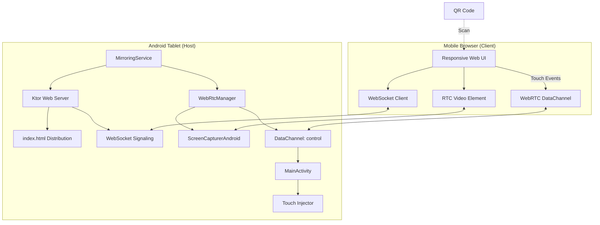
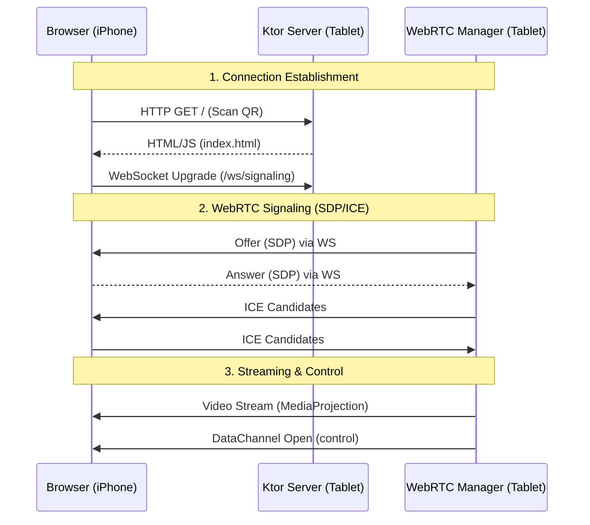
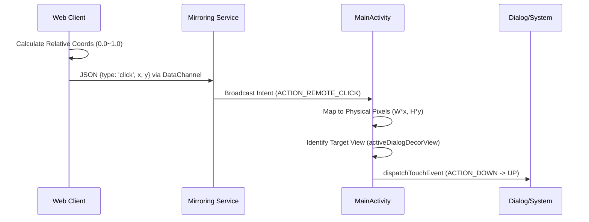

# 안드로이드 태블릿 미러링 및 원격 제어 상세 설계서 (v1.4)

본 문서는 실시간 미러링 및 원격 제어 시스템의 최종 구현 사양과 기술적 메커니즘을 정의합니다.

## 1. 시스템 아키텍처 (System Architecture)

본 시스템은 외부 중계 서버 없이 태블릿을 호스트(Server)로, 모바일 브라우저를 클라이언트(Client)로 사용하는 **P2P 기반 임베디드 아키텍처**입니다.

### 1.1 컴포넌트 구조도

## 2. 데이터 흐름 및 시퀀스 (Data Flow)

### 2.1 연결 및 시그널링 시퀀스

### 2.2 원격 제어 시퀀스 (Touch Injection)

## 3. 상세 기술 명세

### 3.1 좌표 변환 (Coordinate Mapping) 설계

웹 브라우저의 비디오 요소는 `object-fit: contain` 속성을 사용하므로, 실제 영상 주위의 레터박스(Letterbox)를 제외한 **유효 영상 영역** 내에서의 좌표 계산이 필수적입니다.

- **변환 공식**:
  1. `ElementRatio = ElementWidth / ElementHeight`
  2. `VideoRatio = 1280 / 720` (HD 고정)
  3. `ElementRatio > VideoRatio` 인 경우 (가로 여백 발생):
     - `ActualWidth = ElementHeight * VideoRatio`
     - `OffsetX = (ElementWidth - ActualWidth) / 2`
  4. `X_relative = (TouchX - OffsetX) / ActualWidth` (Y도 동일 방식 적용)

### 3.2 최상위 윈도우 추적 (Active Window Tracking)

일반적인 `dispatchTouchEvent`는 Activity의 기본 윈도우에만 이벤트를 전달합니다. `AlertDialog`와 같은 별도 윈도우 제어를 위해 다음 설계를 적용했습니다.

- **동적 타겟팅**: `MainActivity`에 `activeDialogDecorView` 전역 변수를 유지.
- **라이프사이클 연동**:
  - Fragment에서 다이얼로그 `onShow` 시 해당 다이얼로그의 `DecorView`를 등록.
  - `onDismiss` 시 다시 부모(BottomSheet 등) 또는 `null`로 복구.

## 4. UI/UX 최적화 설계

- **동적 뷰포트 대응**: `100dvh` 단위를 사용하여 iOS Safari/Chrome의 하단 툴바 변화에도 화면 잘림 없이 전체 높이 유지.
- **가로 모드 최적화**:
  - `statusBar`(상단 연결 정보) 높이를 최소화(`padding: 2px`).
  - 로그 창을 우측 사이드 바(`140px`)로 이동시켜 태블릿 화면 시인성 극대화.
- **자동 리셋**: WebRTC `connectionState` 감지를 통해 연결 끊김 시 즉시 UI 초기화 및 재접속 버튼 노출.

## 5. 단계별 구현 현황

1.  **Phase 1 — 인프라 구축** ✅ 완료
    - Ktor 서버 엔진 및 로컬 IP 탐지/QR 생성 로직.
2.  **Phase 2 — WebRTC 시그널링** ✅ 완료
    - WebSocket 기반의 안정적인 SDP/ICE 교환 프로세스.
3.  **Phase 3 — 영상 스트리밍** ✅ 완료
    - `TextureView` 강제 설정을 통한 CameraX 프리뷰 캡처 해결.
4.  **Phase 4 — 원격 제어 및 UX** ✅ 완료
    - 정밀 좌표 변환 및 다계층 윈도우 터치 주입 구현.
5.  **Phase 5 — 향후 고도화** 🔄 진행 예정
    - 드래그/롱클릭 지원을 위한 `MotionEvent` 시퀀스 자동 생성기.
    - 스트리밍 지연 시간(Latency) 최소화를 위한 비트레이트 적응형 제어.
