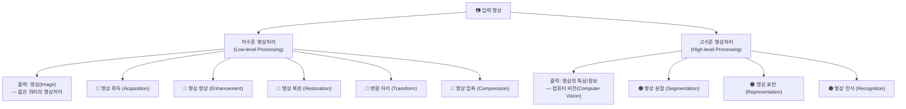
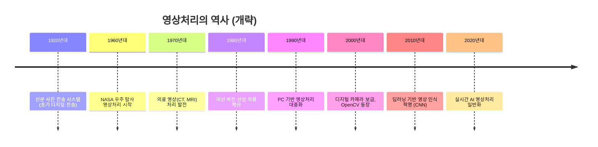
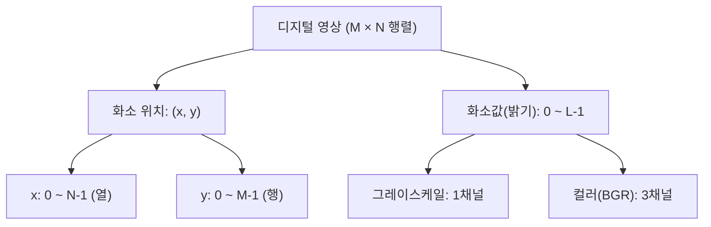
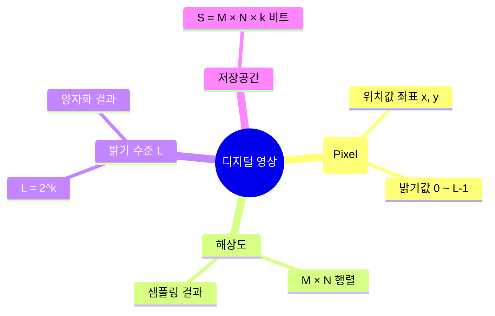

[← OpenCV-Python 학습 목차로 돌아가기](../README.md)

# 1. 영상처리 개요 (Introduction to Image Processing)

## 목차

- [1.1 영상처리란?](#11-영상처리란)
- [1.2 영상처리의 수준](#12-영상처리의-수준)
- [1.3 영상처리의 역사](#13-영상처리의-역사)
- [1.4 영상처리 관련 분야](#14-영상처리-관련-분야)
- [1.5 영상의 형성 과정](#15-영상의-형성-과정)
- [1.6 디지털 영상의 표현과 영상 처리](#16-디지털-영상의-표현과-영상-처리)

---

## 1.1 영상처리란?

> 영상(Image)을 입력으로 받아 특정 목적에 맞게 처리하고, 그 결과를 출력하는 일련의 과정이다.

- **입력**: 카메라, 스캐너, 의료기기 등에서 획득한 영상 데이터
- **처리**: 알고리즘을 통한 변환, 분석, 인식
- **출력**: 처리된 영상 또는 영상에서 추출한 정보

---

## 1.2 영상처리의 수준



| 구분 | 처리 결과 | 주요 작업 |
|------|-----------|-----------|
| **저수준** | 영상 → 영상 | 획득, 향상, 복원, 변환, 압축 |
| **고수준** | 영상 → 정보 | 분할, 표현, 인식 (컴퓨터 비전) |

---

## 1.3 영상처리의 역사

> 영상의 형성은 **광원(Light Source)** 으로부터 물체에 비친 빛이 **카메라 센서**를 통해 영상을 형성한다.



---

## 1.4 영상처리 관련 분야


| 분야 | 방향 | 설명 |
|------|------|------|
| **컴퓨터 비전** | 영상 → 서술 | 영상에서 정보·의미를 추출 |
| **컴퓨터 그래픽스** | 서술 → 영상 | 정보·수식으로 영상을 생성 |
| **영상처리** | 영상 → 영상 | 영상을 변환·개선 |
| **패턴 인식** | 영상 → 분류 | 특징을 추출하여 패턴 분류 |

---

## 1.5 영상의 형성 과정

### 수식 표현

$$f(x, y) = i(x, y) \times r(x, y)$$

| 기호 | 의미 | 범위 |
|------|------|------|
| `f(x, y)` | 최종 영상 화소값 | 0 ~ ∞ |
| `i(x, y)` | 조명의 세기 (illumination) | 0 < i < ∞ |
| `r(x, y)` | 반사 계수 (reflectance) | 0 < r < 1 |

### 아날로그 → 디지털 영상 변환 과정


### 표본화 (Sampling)

- 연속 영상을 **유한 개의 화소(pixel)** 로 분할하는 과정
- 해상도: **M × N** (행 × 열) 개의 화소
- 해상도가 높을수록 정밀하지만 데이터 용량 증가

### 양자화 (Quantization)

- 각 화소의 연속적인 밝기값을 **이산적인 정수값**으로 변환하는 과정
- `k` 비트로 양자화하면 밝기 수준 $L = 2^k$

```
k = 8비트  →  L = 2^8 = 256단계 (0 ~ 255)  ← 일반적인 그레이스케일 영상
k = 1비트  →  L = 2^1 = 2단계 (0, 1)       ← 이진(Binary) 영상
```

---

## 1.6 디지털 영상의 표현과 영상 처리

### 디지털 영상 구조



### 저장 공간 계산

$$S = M \times N \times k \text{ (bits)}$$

| 조건 | 예시 계산 |
|------|-----------|
| 해상도 M × N, k비트 양자화 | $S = M \times N \times k$ bits |
| 1920 × 1080, 8비트(그레이) | $1920 \times 1080 \times 8 = 16,588,800$ bits ≈ **1.98 MB** |
| 1920 × 1080, 24비트(컬러) | $1920 \times 1080 \times 24 = 49,766,400$ bits ≈ **5.93 MB** |

### 밝기 수준 시각화

```
8비트 그레이스케일 (256단계)
■ 0                          → 완전한 검정 (Black)
████████████ 128             → 중간 회색 (Gray)
████████████████████████ 255 → 완전한 흰색 (White)
```

### 핵심 개념 요약



---

## 핵심 공식 정리

| 공식 | 의미 |
|------|------|
| $f(x,y) = i(x,y) \times r(x,y)$ | 영상 화소값 = 조명 × 반사계수 |
| $L = 2^k$ | 양자화 k비트일 때 밝기 수준 수 |
| $S = M \times N \times k$ | 영상 저장에 필요한 비트 수 |
