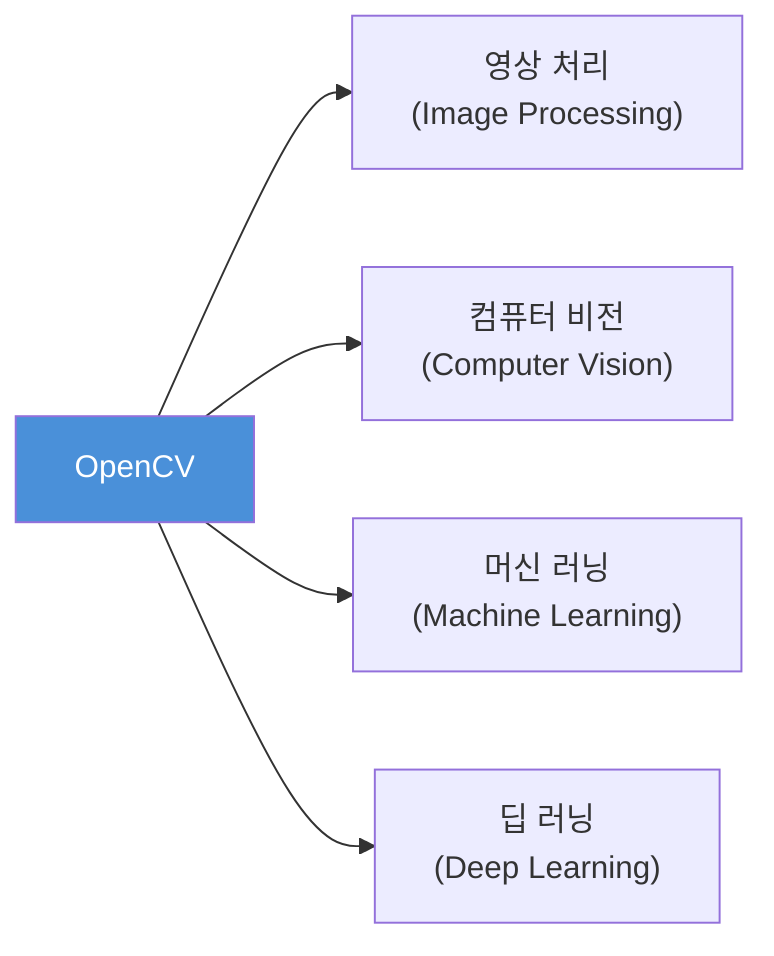
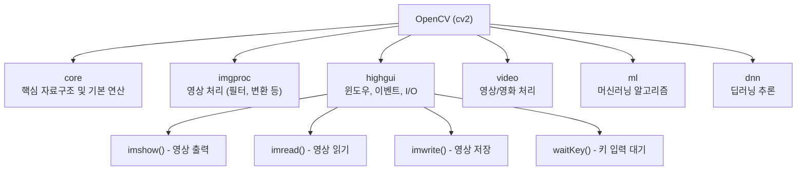
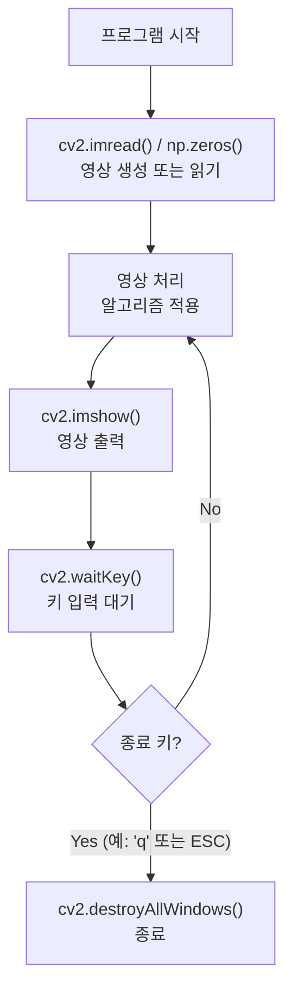
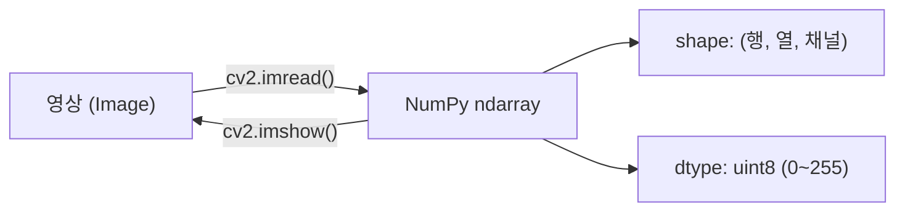

# 2. OpenCV-Python 환경 설정 및 기초

## 목차

- [2.1 OpenCV란?](#21-opencv란)
- [2.2 환경 설치](#22-환경-설치)
- [2.3 OpenCV 기본 구조](#23-opencv-기본-구조)
- [2.4 기본 사용법](#24-기본-사용법)
- [2.5 NumPy와 OpenCV](#25-numpy와-opencv)

---

## 2.1 OpenCV란?

> **Open Source Computer Vision Library**
> Intel이 개발하고 오픈소스로 공개된 컴퓨터 비전 및 영상처리 라이브러리



| 항목 | 내용 |
|------|------|
| 최초 배포 | 2000년 (Intel) |
| 언어 지원 | C++, Python, Java, MATLAB |
| 주요 모듈 | core, imgproc, highgui, video, ml, dnn |
| 라이선스 | Apache 2.0 (상업적 이용 가능) |

---

## 2.2 환경 설치

### 설치 방법

```bash
# 가상환경 생성 (권장)
python -m venv .venv
source .venv/bin/activate  # macOS/Linux
.venv\Scripts\activate     # Windows

# OpenCV 설치
pip install opencv-python       # 기본 패키지 (highgui 포함)
pip install opencv-python-headless  # 서버 환경 (GUI 없음)

# 필수 의존 패키지
pip install numpy
```

### 설치 확인

```python
import cv2
import numpy as np

print(f"OpenCV 버전: {cv2.__version__}")
print(f"NumPy 버전: {np.__version__}")
```

---

## 2.3 OpenCV 기본 구조



### OpenCV 좌표 시스템

```
(0,0) ──────────────→ x축 (열, col)
  │  ┌─────────────────┐
  │  │                 │
  │  │   영상(Image)   │
  │  │                 │
  ↓  └─────────────────┘
 y축
(행, row)
```

> OpenCV에서 좌표는 **(x, y) = (열, 행)** 순서이지만,
> NumPy 배열은 **(row, col) = (행, 열)** 순서임에 주의!

---

## 2.4 기본 사용법

### 영상 읽기 / 출력 / 저장

```python
import cv2

# 영상 읽기
img = cv2.imread('image.jpg')           # 컬러 (BGR)
img_gray = cv2.imread('image.jpg', 0)   # 그레이스케일
img_alpha = cv2.imread('image.png', -1) # 알파 채널 포함

# 영상 출력 (윈도우)
cv2.imshow('Window Title', img)
cv2.waitKey(0)          # 0: 키 입력 무한 대기, n: n ms 대기
cv2.destroyAllWindows() # 모든 윈도우 닫기

# 영상 저장
cv2.imwrite('output.jpg', img)
```

### `imread()` 플래그

| 플래그 | 값 | 설명 |
|--------|----|------|
| `cv2.IMREAD_COLOR` | 1 (기본값) | 컬러 BGR로 읽기 |
| `cv2.IMREAD_GRAYSCALE` | 0 | 그레이스케일로 읽기 |
| `cv2.IMREAD_UNCHANGED` | -1 | 원본 그대로 (알파 포함) |

### OpenCV 기본 영상 프로그램 패턴



### Hello OpenCV (02.opencvtest.py 기반)

```python
import numpy as np
import cv2

# 검은 배경 영상 생성 (300행 × 400열, uint8 타입)
image = np.zeros((300, 400), np.uint8)
image.fill(200)  # 밝기값 200으로 채우기 (밝은 회색)

cv2.imshow("Window title", image)
cv2.waitKey(0)
cv2.destroyAllWindows()
```

---

## 2.5 NumPy와 OpenCV

> OpenCV의 영상 데이터는 내부적으로 **NumPy ndarray**로 표현된다.

### 영상과 NumPy 배열의 관계



### 주요 속성 확인

```python
import cv2

img = cv2.imread('image.jpg')

print(img.shape)   # (height, width, channels) → 예: (480, 640, 3)
print(img.dtype)   # uint8
print(img.size)    # 전체 원소 수 = height × width × channels
```

### 그레이스케일 vs 컬러

| 구분 | shape | dtype | 채널 |
|------|-------|-------|------|
| 그레이스케일 | `(H, W)` | uint8 | 1 (밝기) |
| 컬러 (BGR) | `(H, W, 3)` | uint8 | 3 (Blue, Green, Red) |
| 알파 포함 | `(H, W, 4)` | uint8 | 4 (BGR + Alpha) |

> OpenCV는 RGB가 아닌 **BGR** 순서로 채널을 저장한다!

### 자주 사용하는 NumPy 영상 생성

```python
import numpy as np

# 검은 영상 (300 × 400, 그레이스케일)
black = np.zeros((300, 400), np.uint8)

# 흰 영상 (300 × 400, 컬러)
white = np.ones((300, 400, 3), np.uint8) * 255

# 특정 밝기값으로 채운 영상
gray = np.full((300, 400), 128, np.uint8)
```

---

## 핵심 함수 정리

| 함수 | 용도 | 주요 인수 |
|------|------|-----------|
| `cv2.imread(path, flag)` | 영상 파일 읽기 | path, flag (0/1/-1) |
| `cv2.imshow(winname, img)` | 윈도우에 영상 출력 | 윈도우 이름, ndarray |
| `cv2.imwrite(path, img)` | 영상 파일 저장 | 저장 경로, ndarray |
| `cv2.waitKey(delay)` | 키 입력 대기 | delay(ms), 0=무한 |
| `cv2.destroyAllWindows()` | 모든 윈도우 닫기 | — |
