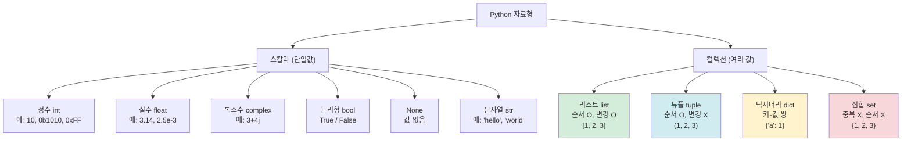
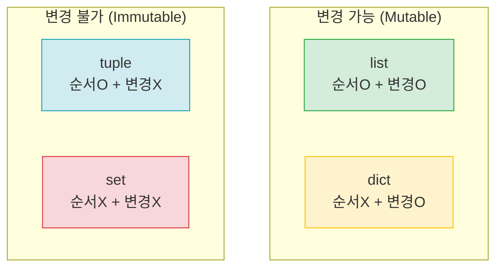
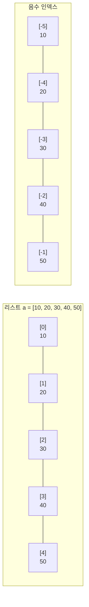
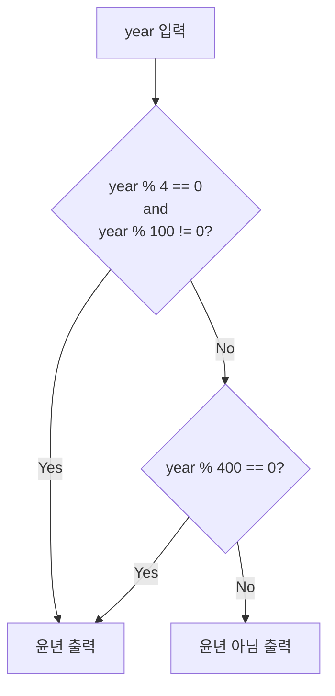
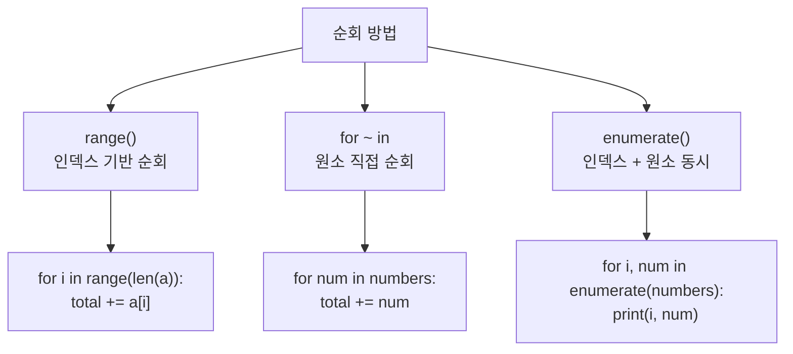
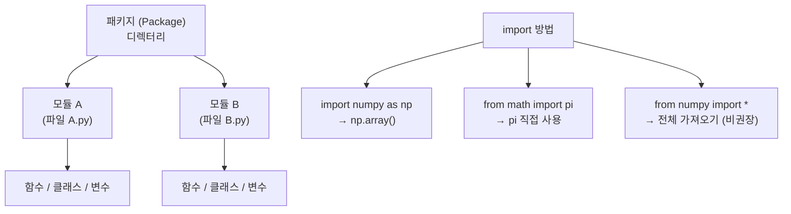
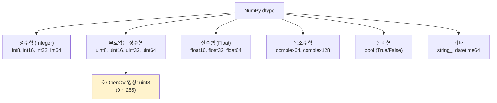
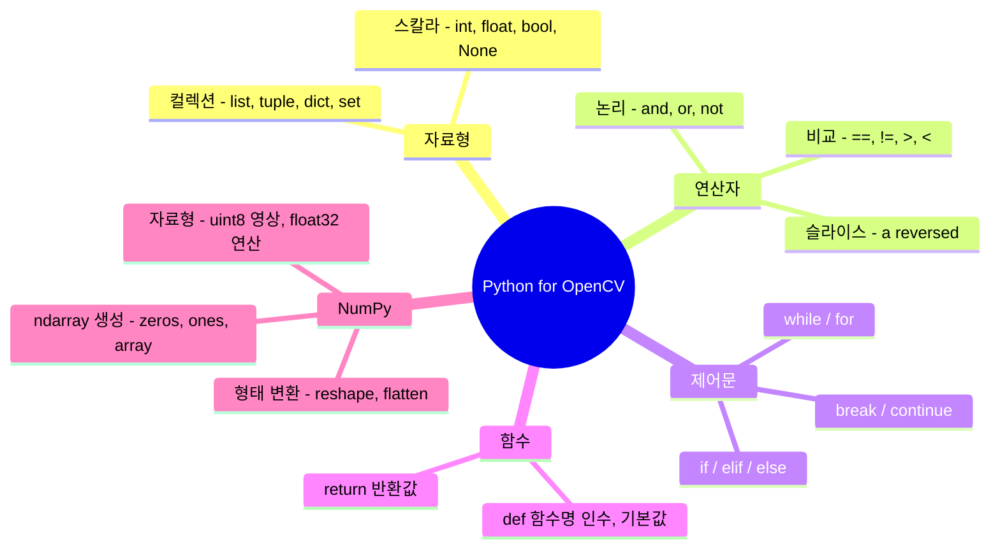

[← OpenCV-Python 학습 목차로 돌아가기](../README.md)

# 3. 파이썬 둘러보기 (Python Basics for OpenCV)

## 목차

- [3.1 파이썬 자료 구조](#31-파이썬-자료-구조)
- [3.2 물리적/논리적 명령행](#32-물리적논리적-명령행)
- [3.3 연산자](#33-연산자)
- [3.4 기본 명령문](#34-기본-명령문)
- [3.5 함수와 라이브러리](#35-함수와-라이브러리)
- [연습문제](#연습문제)

---

## 3.1 파이썬 자료 구조

### 파이썬 자료형 전체 구조



### 리터럴 종류 요약

| 리터럴 종류 | 설명 | 예시 |
|-------------|------|------|
| 정수 | 10진수, 2진수, 8진수, 16진수 | `10`, `0b1010`, `0o12`, `0xA` |
| 실수 | 부동소수점 숫자 | `3.14`, `2.5e-3`, `1.0` |
| 복소수 | 실수부 + 허수부 | `3+4j`, `1.5+2.5j` |
| 문자열 | 따옴표로 표현 | `'hello'`, `"world"`, `'''multi line'''` |
| 불린 | 참/거짓 | `True`, `False` |
| None | 값 없음 | `None` |
| 리스트 | 순서 있는 변경 가능 컬렉션 | `[1, 2, 3]` |
| 튜플 | 순서 있는 변경 불가 컬렉션 | `(1, 2, 3)` |
| 딕셔너리 | 키-값 쌍 컬렉션 | `{'name': 'John', 'age': 30}` |
| 집합 | 중복 없는 컬렉션 | `{1, 2, 3}` |

### 컬렉션 비교



| | 순서 O | 순서 X |
|---|---|---|
| **변경 가능** | `list` | `dict`, `set` |
| **변경 불가** | `tuple` | — |

---

## 3.2 물리적/논리적 명령행

| 구분 | 설명 | 예시 |
|------|------|------|
| **물리적 명령행** | 소스코드에서 눈으로 보이는 한 줄 | 파일 내 1개의 줄 |
| **논리적 명령행** | 파이썬 인터프리터가 처리하는 단위 | `;`으로 여러 문장, `\`로 한 줄 연속 |

```python
# 한 물리적 행에 여러 논리적 명령행 (;로 구분)
x = 1; y = 2; z = 3

# 한 논리적 명령행을 여러 물리적 행으로 (\로 연결)
result = 1 + 2 + \
         3 + 4
```

---

## 3.3 연산자

### 3.3.1 기본 연산자와 우선순위

| 우선순위 | 연산자 | 명칭 | 예시 → 결과 |
|----------|--------|------|-------------|
| 1 (최고) | `()` | 괄호 | `(2 + 3) * 4` → `20` |
| 2 | `**` | 거듭제곱 | `2 ** 3` → `8` |
| 3 | `+x`, `-x`, `~x` | 단항 연산자 | `-5` → `-5` |
| 4 | `*`, `/`, `//`, `%` | 산술 | `10 // 3` → `3`, `10 % 3` → `1` |
| 5 | `+`, `-` | 덧셈, 뺄셈 | `5 + 3` → `8` |
| 6 | `<<`, `>>` | 비트 시프트 | `4 << 2` → `16` |
| 7 | `&` | 비트 AND | `5 & 3` → `1` |
| 8 | `^` | 비트 XOR | `5 ^ 3` → `6` |
| 9 | `\|` | 비트 OR | `5 \| 3` → `7` |
| 10 | `==`, `!=`, `>`, `>=`, `<`, `<=` | 비교 | `5 > 3` → `True` |
| 10 | `is`, `is not` | 동일성 | `x is None` |
| 10 | `in`, `not in` | 멤버십 | `3 in [1,2,3]` → `True` |
| 11 | `not` | 논리 NOT | `not True` → `False` |
| 12 | `and` | 논리 AND | `True and False` → `False` |
| 13 | `or` | 논리 OR | `True or False` → `True` |
| 14 (최저) | `=`, `+=`, `-=` 등 | 대입 | `x = 5`, `x += 3` |

### 3.3.2 슬라이스(`:`) 연산자

> 열거형 객체(list, tuple, str 등)의 일부를 잘라서 가져온다.

```python
# 기본 형식
열거형_객체[시작:종료:증가폭]

# 주요 패턴
a[:]      # 전체
a[2:]     # 인덱스 2부터 끝까지
a[:5]     # 처음부터 인덱스 4까지
a[1:6:2]  # 인덱스 1부터 5까지 2칸씩
a[::-1]   # 전체 역순 ← 자주 사용!
```



---

## 3.4 기본 명령문

### 3.4.1 조건문 (if / elif / else)

```python
year = 2020

if (year % 4 == 0) and (year % 100 != 0):  # 4년마다 윤년, 100년마다 예외
    print(year, "는 윤년입니다.")
elif year % 400 == 0:
    print(year, "는 윤년입니다.")
else:
    print(year, "는 윤년이 아닙니다.")
```



### 3.4.2 반복문 (while / for)

```python
# while 예시: 0이 입력될 때까지 반복 (최대 4번)
n = 3
while n >= 0:
    m = input("Enter a integer: ")
    if int(m) == 0:
        break
    n = n - 1
else:
    print('4 inputs.')
```

### 3.4.3 순회하기 (Iteration Patterns)



```python
numbers = [10, 20, 30, 40, 50]

# 방법 1: range() - 인덱스 기반
for i in range(len(numbers)):
    print(numbers[i])

# 방법 2: for ~ in - 원소 직접 순회 (권장)
for num in numbers:
    print(num)

# 방법 3: enumerate() - 인덱스 + 원소 동시
for index, num in enumerate(numbers):
    print(f"인덱스 {index}: {num}")
```

---

## 3.5 함수와 라이브러리

### 3.5.1 함수 (Function)

```python
import math

def calc_area(type, a, b=None, c=None):
    """
    다양한 도형의 넓이를 계산하는 함수
    Args:
        type: 도형 종류 ('rectangle', 'triangle', 'circle')
        a   : 가로 / 밑변 / 반지름
        b   : 세로 / 높이 (선택)
    Returns:
        float: 계산된 넓이
    """
    if type == 'rectangle':
        if b is None:
            return "직사각형은 가로와 세로가 필요합니다."
        area = a * b
        print(f"직사각형 넓이: {a} × {b} = {area}")
        return area

    elif type == 'triangle':
        if b is None:
            return "삼각형은 밑변과 높이가 필요합니다."
        area = (a * b) / 2
        print(f"삼각형 넓이: ({a} × {b}) / 2 = {area}")
        return area

    elif type == 'circle':
        area = math.pi * (a ** 2)
        print(f"원의 넓이: π × {a}² = {area:.2f}")
        return area

    else:
        return f"지원하지 않는 도형 타입: {type}"
```

### 3.5.2 모듈(Module)과 패키지(Package)

> 파이썬에서 **모듈**이란 함수, 변수, 클래스를 모아 놓은 **파일(.py)** 이다.
> **패키지**는 모듈들을 디렉터리 구조로 묶어 놓은 것이다.



---

## 연습문제

### 문제 4. 슬라이스 연산자 - 역순으로 가져오기

```python
# 10개 원소를 갖는 리스트에서 8번째 ~ 2번째 원소를 역순으로
a = list(range(1, 11))  # [1, 2, 3, 4, 5, 6, 7, 8, 9, 10]

# 인덱스 7(8번째) ~ 인덱스 2(3번째)까지 역순, 인덱스 1(2번째)은 미포함
result = a[7:1:-1]  # [8, 7, 6, 5, 4, 3]
```

> 슬라이스 `[시작:종료:증가폭]`에서 **종료 인덱스는 포함되지 않는다**.

---

### 문제 5. NumPy ndarray 선언 함수

```python
import numpy as np

list1, list2 = [1, 2, 3], [4, 5, 6]
a = np.array(list1)               # 리스트 → ndarray 변환
b = np.array(list2)

c = np.zeros((2, 3), int)         # 0으로 채운 2×3 행렬 (32비트 정수)
d = np.ones((3, 4), np.uint8)     # 1로 채운 3×4 행렬 (부호없는 8비트 정수)
e = np.empty((1, 5), float)       # 초기화 없는 1×5 행렬 (64비트 실수)
f = np.full(5, 15, np.float32)    # 값 15로 채운 1차원 5개 행렬 (32비트 실수)
```

| 함수 | 설명 | 예시 |
|------|------|------|
| `np.array()` | 리스트 → ndarray 변환 | `np.array([1,2,3])` |
| `np.zeros()` | 0으로 채워진 행렬 | `np.zeros((2,3))` |
| `np.ones()` | 1로 채워진 행렬 | `np.ones((3,4))` |
| `np.empty()` | 초기화 없는 행렬 | `np.empty((1,5))` |
| `np.full()` | 지정값으로 채워진 행렬 | `np.full(5, 15)` |
| `np.eye()` | 단위 행렬 (대각선 1) | `np.eye(3)` |
| `np.arange()` | 범위 기반 1차원 배열 | `np.arange(0, 10, 2)` |
| `np.linspace()` | 균등 간격 배열 | `np.linspace(0, 1, 5)` |

---

### 문제 6. 다차원 행렬 → 1차원 변환 방법

```python
import numpy as np

np.random.seed(10)
a = np.random.rand(2, 3)  # 2×3 균일분포 난수

print('다차원 → 1차원 변환 방법')
print('flatten :', a.flatten())          # 방법1: 복사본 반환
print('ravel   :', np.ravel(a))          # 방법2: 가능하면 뷰(view) 반환
print('reshape :', np.reshape(a, (-1,))) # 방법3: reshape(-1,)
print('reshape2:', a.reshape(-1,))       # 방법4: 인스턴스 메서드
```

| 방법 | 함수 | 복사 여부 | 설명 |
|------|------|-----------|------|
| 방법 1 | `a.flatten()` | 복사 O | 항상 새 배열 반환 |
| 방법 2 | `np.ravel(a)` | 복사 X (가능하면) | 뷰(view) 반환 |
| 방법 3 | `np.reshape(a, (-1,))` | 복사 X (가능하면) | reshape 활용 |
| 방법 4 | `a.reshape(-1,)` | 복사 X (가능하면) | 인스턴스 메서드 |

> `-1`은 "나머지 크기를 자동 계산" 을 의미한다.

---

### 문제 8. NumPy 행렬 자료형 종류



| 자료형 | 범위 | OpenCV 활용 |
|--------|------|-------------|
| `uint8` | 0 ~ 255 | 영상 화소값 (가장 많이 사용) |
| `float32` | 단정도 실수 | 연산 결과 저장, 딥러닝 |
| `float64` | 배정도 실수 | 고정밀 연산 |
| `int32` | -2^31 ~ 2^31-1 | 좌표, 인덱스 |

---

### 문제 9. ndarray 합계·평균 계산 (소수점 둘째 자리)

```python
import numpy as np

nd = np.random.rand(10)  # 실수형 원소 10개

print(f"합계: {nd.sum():.2f}")
print(f"평균: {nd.mean():.2f}")

# 또는
print("{:.2f}".format(nd.sum()))
print(round(nd.mean(), 2))
```

---

### 문제 10. 가장 많이 나온 원소 3개 찾기

```python
import numpy as np

class NumCnt:
    def __init__(self, num):
        self.num = num
        self.cnt = 0

    def addCnt(self):
        self.cnt += 1

    def __repr__(self):
        return f"NumCnt(num={self.num}, cnt={self.cnt})"


# 0~50 사이 정수 500개 생성 (중복 가능)
a = np.random.randint(0, 50, 500)

# 0~50까지 카운트 객체 생성
num_objs = [NumCnt(i) for i in range(51)]

# 카운트 업데이트
for val in a:
    num_objs[val].addCnt()

# 가장 많이 나온 3개
top3 = sorted(num_objs, key=lambda x: x.cnt, reverse=True)[:3]

for obj in top3:
    print(f"숫자 {obj.num}: {obj.cnt}회")
```

> **더 간단한 방법** - `np.unique()` 활용

```python
import numpy as np

a = np.random.randint(0, 50, 500)
values, counts = np.unique(a, return_counts=True)

# 상위 3개
top3_idx = np.argsort(counts)[::-1][:3]
for i in top3_idx:
    print(f"숫자 {values[i]}: {counts[i]}회")
```

---

## 핵심 개념 요약


