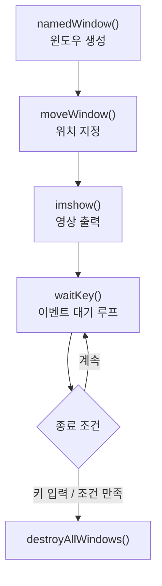
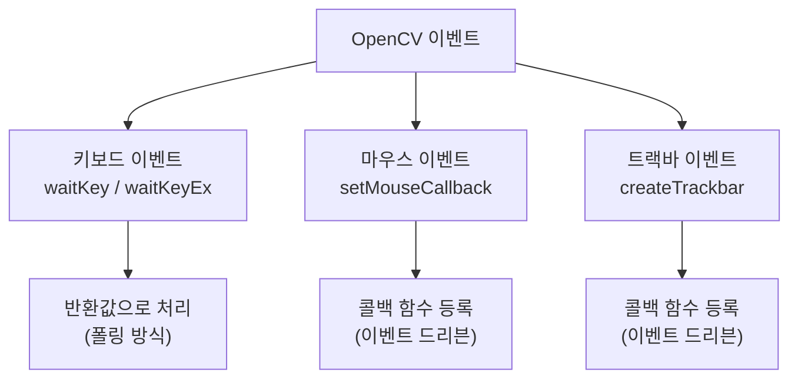
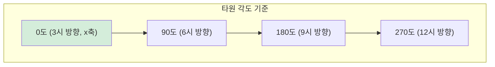
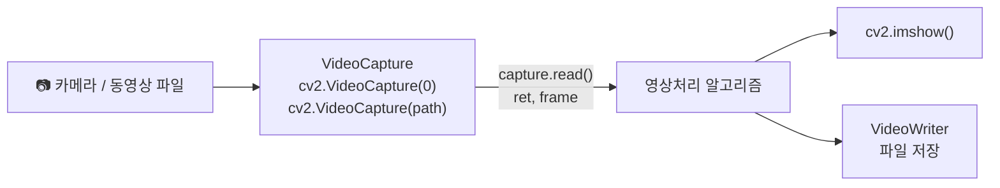
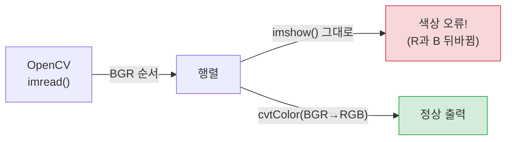
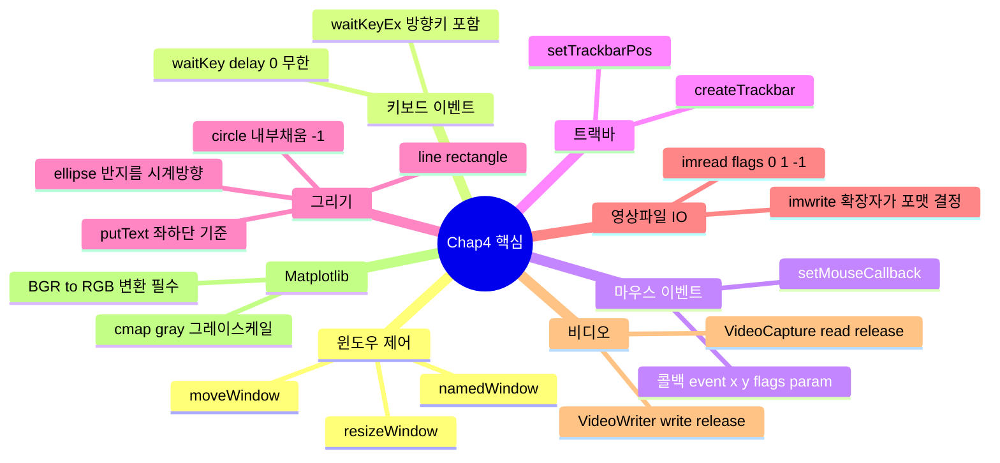

[← OpenCV-Python 학습 목차로 돌아가기](../README.md)

# 4. OpenCV 인터페이스 기초 — 사용자 인터페이스 및 I/O 처리

## 목차

- [4.1 윈도우 제어](#41-윈도우-제어)
- [4.2 이벤트 처리 함수](#42-이벤트-처리-함수)
- [4.3 그리기 함수](#43-그리기-함수)
- [4.4 영상파일 처리](#44-영상파일-처리)
- [4.5 비디오 처리](#45-비디오-처리)
- [4.6 Matplotlib 패키지 활용](#46-matplotlib-패키지-활용)
- [연습문제](#연습문제)

---

## 4.1 윈도우 제어

> OpenCV에서는 **윈도우가 활성화된 상태에서만** 마우스/키보드 이벤트를 감지할 수 있다.
> 따라서 이벤트를 처리하려면 먼저 윈도우를 생성하고 제어할 수 있어야 한다.

### 주요 함수

| 함수 | 설명 |
|------|------|
| `cv2.namedWindow(winname, flags)` | 윈도우 생성 |
| `cv2.moveWindow(winname, x, y)` | 윈도우 위치 이동 |
| `cv2.resizeWindow(winname, w, h)` | 윈도우 크기 변경 |
| `cv2.destroyWindow(winname)` | 특정 윈도우 제거 |
| `cv2.destroyAllWindows()` | 모든 윈도우 제거 |

### `namedWindow()` flags

| 플래그 | 동작 |
|--------|------|
| `cv2.WINDOW_AUTOSIZE` (기본값) | 영상 크기에 맞게 자동 고정, 사용자가 크기 변경 불가 |
| `cv2.WINDOW_NORMAL` | 사용자가 자유롭게 크기 변경 가능 |

```python
# 01.move_window.py
import numpy as np, cv2

image = np.zeros((500, 500, 3), np.uint8)
image[:] = 200  # 밝은 회색

title1, title2 = 'Position1', 'Position2'
cv2.namedWindow(title1, cv2.WINDOW_AUTOSIZE)  # 크기 고정
cv2.namedWindow(title2)
cv2.moveWindow(title1, 100, 100)  # 화면 좌상단 기준 (x, y)
cv2.moveWindow(title2, 400, 50)

cv2.imshow(title1, image)
cv2.imshow(title2, image)
cv2.waitKey(0)
cv2.destroyAllWindows()
```



---

## 4.2 이벤트 처리 함수



### 4.2.1 키보드 이벤트 제어

> `cv2.waitKey()` / `cv2.waitKeyEx()` — 키 이벤트 대기 후 키 코드 반환

| 함수 | 반환값 |
|------|--------|
| `cv2.waitKey(delay)` | 하위 8비트 키 코드 |
| `cv2.waitKeyEx(delay)` | 전체 키 코드 (특수키·방향키 포함) |

| delay 값 | 동작 |
|----------|------|
| `delay <= 0` | 키 입력까지 **무한 대기** |
| `delay > 0` | delay(ms)만큼 대기 후 `-1` 반환 (키 없으면) |

```python
# 03.event_key.py
switch_case = {
    ord('a'): "a키 입력",
    ord('b'): "b키 입력",
    0x41:     "A키 입력",
    2424832:  "왼쪽 화살표",
    2490368:  "위쪽 화살표",
    2555904:  "오른쪽 화살표",
    2621440:  "아래쪽 화살표",
}

while True:
    key = cv2.waitKeyEx(100)   # 100ms 대기
    if key == 27: break        # ESC → 종료
    result = switch_case.get(key, -1)
    if result != -1:
        print(result)
```

> `ord('a')` : 문자 → 아스키코드 변환 (a=97, A=65)
> 방향키는 `waitKeyEx()`로만 전체 코드를 받을 수 있다.

---

### 4.2.2 마우스 이벤트 제어

> 콜백 함수를 작성하고 `cv2.setMouseCallback()`로 시스템에 등록한다.
> 이벤트 발생 시 시스템이 자동으로 콜백 함수를 호출한다.

```
cv2.setMouseCallback(windowName, onMouse [, param])
```

| 인수 | 설명 |
|------|------|
| `windowName` | 이벤트를 받을 윈도우 이름 |
| `onMouse` | 마우스 이벤트 콜백 함수 |
| `param` | 콜백 함수에 전달할 사용자 데이터 (기본값 None) |

**콜백 함수 서명:** `onMouse(event, x, y, flags, param)`

| 인수 | 설명 |
|------|------|
| `event` | 이벤트 종류 상수 |
| `x, y` | 마우스 커서 위치 (윈도우 기준) |
| `flags` | 키보드/버튼 상태 플래그 |
| `param` | setMouseCallback에서 전달한 데이터 |

**주요 마우스 이벤트 상수**

| 상수 | 이벤트 |
|------|--------|
| `EVENT_LBUTTONDOWN` | 왼쪽 버튼 누름 |
| `EVENT_LBUTTONUP` | 왼쪽 버튼 뗌 |
| `EVENT_LBUTTONDBLCLK` | 왼쪽 버튼 더블클릭 |
| `EVENT_RBUTTONDOWN` | 오른쪽 버튼 누름 |
| `EVENT_RBUTTONUP` | 오른쪽 버튼 뗌 |
| `EVENT_MOUSEMOVE` | 마우스 이동 |

```python
# 04.event_mouse.py
def onMouse(event, x, y, flags, param):
    if event == cv2.EVENT_LBUTTONDOWN:
        print("마우스 왼쪽 버튼 누르기")
    elif event == cv2.EVENT_RBUTTONDOWN:
        print("마우스 오른쪽 버튼 누르기")
    elif event == cv2.EVENT_LBUTTONDBLCLK:
        print("마우스 왼쪽 버튼 더블클릭")

cv2.setMouseCallback("Mouse Event1", onMouse)
cv2.waitKey(0)
```

---

### 4.2.3 트랙바 이벤트 제어

> 트랙바(Trackbar) = 일정 범위에서 값을 선택하는 슬라이더 바
> `cv2.createTrackbar()`로 생성, 값 변경 시 콜백 함수 자동 호출

```
cv2.createTrackbar(trackbarname, winname, value, count, onChange)
```

| 인수 | 설명 |
|------|------|
| `trackbarname` | 트랙바 이름 |
| `winname` | 트랙바가 붙을 윈도우 이름 |
| `value` | 트랙바 초기값 |
| `count` | 트랙바 최댓값 |
| `onChange` | 값 변경 시 호출될 콜백 함수 |

```
cv2.setTrackbarPos(trackbarname, winname, pos)  # 트랙바 위치 직접 설정
cv2.getTrackbarPos(trackbarname, winname)        # 현재 트랙바 값 읽기
```

```python
# 05.event_trackbar.py
def onChange(value):
    global image, title
    add_value = value - int(image[0][0])
    image[:] = image + add_value  # 행렬 + 스칼라 → 밝기 조절
    cv2.imshow(title, image)

image = np.zeros((300, 500), np.uint8)
title = 'Trackbar Event'
cv2.imshow(title, image)
cv2.createTrackbar('Brightness', title, image[0][0], 255, onChange)
cv2.waitKey(0)
```

**마우스 + 트랙바 연동 패턴 (`06.event_mouse_trackbar.py`)**

```python
# 오른쪽 버튼: 밝기 +10, 왼쪽 버튼: 밝기 -10
# setTrackbarPos()로 트랙바 UI도 동기화
cv2.setTrackbarPos(bar_name, title, image[0][0])
```

---

## 4.3 그리기 함수

> 영상처리 알고리즘의 결과(얼굴 검출 영역, 차선 등)를 영상 위에 시각적으로 표시할 때 사용

### 공통 인수

| 인수 | 설명 |
|------|------|
| `img` | 그려질 대상 행렬 (in-place 변경) |
| `color` | BGR 튜플 — 예: `(255, 0, 0)` = 파란색 |
| `thickness` | 선 두께 (px), `-1` 또는 `cv2.FILLED` = 내부 채움 |
| `lineType` | 선 종류 |

**lineType 종류**

| 상수 | 설명 |
|------|------|
| `cv2.LINE_4` | 4방향 연결선 |
| `cv2.LINE_8` (기본값) | 8방향 연결선 |
| `cv2.LINE_AA` | 안티앨리어싱 (계단 현상 감소) |

---

### 4.3.1 직선 및 사각형 그리기

```
cv2.line(img, pt1, pt2, color [, thickness [, lineType]])
cv2.rectangle(img, pt1, pt2, color [, thickness [, lineType]])
cv2.rectangle(img, roi, color [, thickness [, lineType]])  # roi: (x, y, w, h) 튜플
```

> 좌표(`pt1`, `pt2`)와 색상은 반드시 **정수형 튜플**이어야 한다.

```python
# 07.draw_line_rect.py
blue, green, red = (255, 0, 0), (0, 255, 0), (0, 0, 255)
image = np.zeros((400, 600, 3), np.uint8)
image[:] = (255, 255, 255)

pt1, pt2 = (50, 50), (250, 150)
roi = (50, 200, 200, 100)  # ROI: (x, y, width, height)

cv2.line(image, pt1, pt2, red)
cv2.line(image, pt3, pt4, green, 3, cv2.LINE_AA)       # 안티앨리어싱
cv2.rectangle(image, pt1, pt2, blue, 3, cv2.LINE_4)
cv2.rectangle(image, roi, red, 3, cv2.LINE_8)
cv2.rectangle(image, (400, 200, 100, 100), green, cv2.FILLED)  # 내부 채움
```

---

### 4.3.2 글자 쓰기

```
cv2.putText(img, text, org, fontFace, fontScale, color [, thickness])
```

| 인수 | 설명 |
|------|------|
| `text` | 출력할 문자열 |
| `org` | 문자열 **좌하단** 기준 좌표 (x, y) |
| `fontFace` | 글꼴 상수 |
| `fontScale` | 글자 크기 배율 |

> 주의: `org`는 문자열의 **좌하단** 좌표이다! (좌상단이 아님)

**폰트 종류**

| 상수 | 설명 |
|------|------|
| `cv2.FONT_HERSHEY_SIMPLEX` | 기본 산세리프체 |
| `cv2.FONT_HERSHEY_PLAIN` | 작은 산세리프체 |
| `cv2.FONT_HERSHEY_DUPLEX` | 두 선 산세리프체 |
| `cv2.FONT_HERSHEY_COMPLEX` | 세리프체 |
| `cv2.FONT_ITALIC` | 이탤릭 (OR 연산으로 조합) |

```python
# 08.put_text.py
cv2.putText(image, 'SIMPLEX', (50, 50), cv2.FONT_HERSHEY_SIMPLEX, 2, brown)
# 이탤릭 조합: | 연산 사용
fontFace = cv2.FONT_HERSHEY_PLAIN | cv2.FONT_ITALIC
cv2.putText(image, 'ITALIC', pt2, fontFace, 4, violet)
```

**그림자 효과 패턴** (배경 텍스트를 살짝 이동해서 표시)

```python
shade = (pt[0] + 2, pt[1] + 2)
cv2.putText(img, text, shade, font, scale, (0,0,0), 2)  # 검은 그림자
cv2.putText(img, text, pt,    font, scale, color,   1)  # 원본 색상
```

---

### 4.3.3 원 그리기

```
cv2.circle(img, center, radius, color [, thickness [, lineType]])
```

| 인수 | 설명 |
|------|------|
| `center` | 원의 중심 좌표 `(x, y)` |
| `radius` | 반지름 (px) |
| `thickness` | `-1` 또는 `FILLED` → 원 내부 채움 |

```python
# 09.draw_circle.py
center = (image.shape[1]//2, image.shape[0]//2)  # shape은 (행, 열) → x=열, y=행

cv2.circle(image, center, 100, blue)           # 외곽선만
cv2.circle(image, pt1,   50, orange, 2)
cv2.circle(image, pt2,   70, cyan, -1)         # 내부 채움
```

> `image.shape` → `(height, width, channel)` 이므로
> 중심 좌표 계산 시 `shape[1]`이 x(열), `shape[0]`이 y(행)임에 주의!

---

### 4.3.4 타원 그리기

```
cv2.ellipse(img, center, axes, angle, startAngle, endAngle, color [, thickness])
```

| 인수 | 설명 |
|------|------|
| `center` | 타원 중심 좌표 `(x, y)` |
| `axes` | 주축/수직축 **반지름** `(rx, ry)` (지름 아님!) |
| `angle` | 타원 전체 기울기 각도 (x축 기준, 시계방향) |
| `startAngle` | 호 시작 각도 |
| `endAngle` | 호 종료 각도 |

**각도 기준**



```
0도  = 3시 방향 (x축 양의 방향)
90도 = 6시 방향 (시계 방향으로 증가)
startAngle=0, endAngle=360 → 완전한 타원
startAngle=0, endAngle=180 → 아랫쪽 반원 (호)
```

```python
# 10.draw_ellipse.py
size = (120, 60)  # (x축 반지름, y축 반지름)

cv2.ellipse(image, pt1, size, 0, 0, 360, blue, 1)      # 완전한 타원
cv2.ellipse(image, pt2, size, 90, 0, 360, blue, 1)     # 90도 기울어진 타원
cv2.ellipse(image, pt1, size, 0, 30, 270, orange, 4)   # 호(arc) 그리기
```

---

## 4.4 영상파일 처리

> 영상파일을 읽어 행렬에 저장하고, 행렬을 다시 영상파일로 저장한다.

### 4.4.1 영상파일 읽기

```
cv2.imread(filename [, flags])
```

| flags | 상수 | 설명 |
|-------|------|------|
| 1 (기본값) | `IMREAD_COLOR` | 컬러 BGR, 3채널 uint8 |
| 0 | `IMREAD_GRAYSCALE` | 그레이스케일, 1채널 uint8 |
| -1 | `IMREAD_UNCHANGED` | 원본 그대로 (알파, 16/32비트 유지) |

**비트 깊이별 행렬 자료형**

| 파일 | flags | 반환 dtype |
|------|-------|------------|
| 8비트 JPG/PNG | IMREAD_COLOR | `uint8` |
| 8비트 JPG/PNG | IMREAD_GRAYSCALE | `uint8` |
| 16비트 TIF | IMREAD_UNCHANGED | `uint16` |
| 32비트 TIF | IMREAD_UNCHANGED | `float32` |

```python
# 12.read_image1.py - 읽기 및 행렬 정보 확인
gray2gray  = cv2.imread("images/read_gray.jpg", cv2.IMREAD_GRAYSCALE)
gray2color = cv2.imread("images/read_gray.jpg", cv2.IMREAD_COLOR)

# 필수: 읽기 실패 예외처리
if gray2gray is None:
    raise Exception("영상파일 읽기 에러")

print(gray2gray.shape)   # (H, W)       ← 그레이스케일
print(gray2color.shape)  # (H, W, 3)    ← 컬러
print(gray2gray[100, 100])     # 화소값 확인 (스칼라)
print(gray2color[100, 100])    # 화소값 확인 (BGR 3원소 배열)
```

> imread() 실패 시 None 반환 → **반드시 None 체크** 필요

---

### 4.4.2 행렬을 영상파일로 저장

```
cv2.imwrite(filename, img [, params])
```

| 인수 | 설명 |
|------|------|
| `filename` | 저장 경로 + 이름 (확장자가 포맷 결정) |
| `img` | 저장할 행렬 |
| `params` | 압축 파라미터 쌍 `(paramId, value)` |

**포맷별 params 예시**

```python
# 15.write_image1.py
params_jpg = (cv2.IMWRITE_JPEG_QUALITY, 10)   # JPEG 화질 0~100 (기본 95)
params_png = [cv2.IMWRITE_PNG_COMPRESSION, 9] # PNG 압축 레벨 0~9

cv2.imwrite("output.jpg", image)               # 기본 화질
cv2.imwrite("output.jpg", image, params_jpg)   # 화질 10 (저화질 저용량)
cv2.imwrite("output.png", image, params_png)   # 최대 압축
```

**비트 깊이 변환 저장 (`16.write_image2.py`)**

```python
image8  = cv2.imread("image.jpg")
image16 = np.uint16(image8 * (65535/255))   # 8비트 → 16비트 스케일
image32 = np.float32(image8 * (1/255))      # 8비트 → 0.0~1.0 float32

cv2.imwrite('output_16.tif', image16)   # 16비트 TIF 저장
cv2.imwrite('output_32.tif', image32)   # 32비트 TIF 저장
```

---

## 4.5 비디오 처리

> 비디오 파일은 코덱(Codec)으로 압축 저장된다.
> `VideoCapture` → 압축 해제하여 프레임 읽기
> `VideoWriter` → 프레임을 코덱으로 압축하여 파일 저장



### VideoCapture 주요 메서드

| 메서드 | 설명 |
|--------|------|
| `VideoCapture(0)` | 0번 카메라 연결 |
| `VideoCapture(path)` | 동영상 파일 열기 |
| `isOpened()` | 연결 성공 여부 확인 |
| `read()` | `(ret, frame)` 반환, 프레임 읽기 |
| `get(propId)` | 속성값 읽기 |
| `set(propId, value)` | 속성값 변경 |
| `release()` | 리소스 해제 (반드시 호출) |

**주요 CAP_PROP 속성**

| 속성 상수 | 설명 |
|-----------|------|
| `CAP_PROP_FRAME_WIDTH` | 프레임 너비 |
| `CAP_PROP_FRAME_HEIGHT` | 프레임 높이 |
| `CAP_PROP_FPS` | 초당 프레임 수 |
| `CAP_PROP_EXPOSURE` | 노출값 |
| `CAP_PROP_BRIGHTNESS` | 밝기 |
| `CAP_PROP_ZOOM` | 줌 |
| `CAP_PROP_FOCUS` | 초점 |
| `CAP_PROP_AUTOFOCUS` | 자동초점 (0=끄기) |

### VideoWriter 주요 인수

```
cv2.VideoWriter(filename, fourcc, fps, frameSize [, isColor])
```

| 인수 | 설명 |
|------|------|
| `filename` | 저장할 동영상 파일 이름 |
| `fourcc` | 코덱 4문자 코드 |
| `fps` | 초당 프레임 수 |
| `frameSize` | 프레임 크기 `(width, height)` |
| `isColor` | True=컬러, False=그레이스케일 |

> 코덱 목록: https://fourcc.org/codecs.php

---

### 4.5.1 카메라에서 프레임 읽기

```python
# 17.read_pccamera.py
capture = cv2.VideoCapture(0)  # 0번 카메라
if not capture.isOpened():
    raise Exception("카메라 연결 실패")

while True:
    ret, frame = capture.read()
    if not ret: break
    if cv2.waitKey(30) >= 0: break  # 아무 키나 누르면 종료

    cv2.imshow("Camera", frame)

capture.release()  # 리소스 해제 필수
cv2.destroyAllWindows()
```

---

### 4.5.2 카메라 속성 설정하기

```python
# 18.set_camera_attr.py
capture.set(cv2.CAP_PROP_FRAME_WIDTH, 640)
capture.set(cv2.CAP_PROP_FRAME_HEIGHT, 480)
capture.set(cv2.CAP_PROP_AUTOFOCUS, 0)   # 자동초점 OFF → 수동 초점 조절 가능
capture.set(cv2.CAP_PROP_BRIGHTNESS, 100)

# 트랙바로 줌/초점 실시간 조절
def zoom_bar(value):
    capture.set(cv2.CAP_PROP_ZOOM, value)
def focus_bar(value):
    capture.set(cv2.CAP_PROP_FOCUS, value)

cv2.createTrackbar('zoom',  title, 0, 10, zoom_bar)
cv2.createTrackbar('focus', title, 0, 40, focus_bar)
```

> 초점 값: **크면 가까운 곳**, **작으면 먼 곳**에 초점

---

### 4.5.3 카메라 프레임을 동영상 파일로 저장

```python
# 19.write_camera_frame.py
fps    = 29.97
delay  = round(1000 / fps)                     # 프레임 간 지연(ms)
fourcc = cv2.VideoWriter.fourcc(*'DX50')        # 코덱 설정

writer = cv2.VideoWriter("output.avi", fourcc, fps, (640, 480))
if not writer.isOpened():
    raise Exception("동영상 파일 생성 실패")

while True:
    ret, frame = capture.read()
    if not ret or cv2.waitKey(delay) >= 0: break
    writer.write(frame)              # 프레임을 동영상으로 저장
    cv2.imshow("Recording", frame)

writer.release()    # 저장 완료 → 해제 필수
capture.release()
```

---

### 4.5.4 동영상 파일 읽기

```python
# 20.read_video_file.py
capture = cv2.VideoCapture("video_file.avi")
frame_rate = capture.get(cv2.CAP_PROP_FPS)
delay = int(1000 / frame_rate)  # 원본 fps에 맞게 재생
frame_cnt = 0

while True:
    ret, frame = capture.read()
    if not ret or cv2.waitKey(delay) >= 0: break

    # 채널 분리 → 처리 → 합성
    blue, green, red = cv2.split(frame)
    if 100 <= frame_cnt < 200:
        cv2.add(blue, 100, blue)       # blue 채널 밝기 +100
    frame = cv2.merge([blue, green, red])

    frame_cnt += 1
    cv2.imshow('Video', frame)

capture.release()
```

---

## 4.6 Matplotlib 패키지 활용

> Matplotlib은 파이썬 데이터 시각화 라이브러리로, Jupyter/Colab 환경에서 `cv2.imshow()` 대신 편리하게 사용한다.

### OpenCV와 Matplotlib의 색상 채널 차이



> OpenCV는 **BGR**, Matplotlib은 **RGB** 순서를 사용한다.
> Matplotlib에서 컬러 영상을 올바르게 표시하려면 채널 변환이 필요하다.

```python
# 21.matplotlib.py
import cv2
import matplotlib.pyplot as plt

image    = cv2.imread("image.jpg", cv2.IMREAD_COLOR)
rgb_img  = cv2.cvtColor(image, cv2.COLOR_BGR2RGB)   # BGR → RGB 변환 필수
gray_img = cv2.cvtColor(image, cv2.COLOR_BGR2GRAY)

# 단일 이미지
plt.figure(figsize=(3, 4))
plt.imshow(rgb_img)
plt.title('RGB Image')
plt.axis('off')

# 서브플롯
fig = plt.figure(figsize=(6, 4))
plt.suptitle('subplot example')
plt.subplot(1, 2, 1), plt.imshow(rgb_img),             plt.title('color')
plt.subplot(1, 2, 2), plt.imshow(gray_img, cmap='gray'), plt.title('gray')
plt.show()
```

**보간법(Interpolation) 비교 (`22.interploation.py`)**

```python
methods = ['none', 'nearest', 'bilinear', 'bicubic', 'spline16', 'spline36']
# imshow의 interpolation 인수로 지정
ax.imshow(grid, interpolation=method, cmap='gray')
```

| 보간법 | 특징 |
|--------|------|
| `none` | 보간 없음 (픽셀 그대로) |
| `nearest` | 최근접 이웃 (빠름, 계단 현상) |
| `bilinear` | 선형 보간 (부드러움) |
| `bicubic` | 3차 보간 (더 부드러움) |
| `spline16/36` | 스플라인 보간 (고품질) |

---

## 핵심 함수 정리



---

## 연습문제

### 문제 1 — 콜백 함수란 무엇인가?

> **나의 답변**: 함수의 인자(argument)로 들어가는 함수
>
> **정답**: 개발자가 함수를 직접 호출하는 것이 아니라, 어떤 이벤트가 발생하거나 특정 시점에 도달했을 때, 시스템에서 개발자가 등록한 함수를 호출하는 방식으로 정의되는 함수

**보완:**
- 콜백은 "인자로 전달"보다 **"호출 주체가 시스템"** 이라는 점이 핵심
- OpenCV에서 `setMouseCallback`, `createTrackbar`에 넘기는 함수가 대표적인 콜백

---

### 문제 2 — `cv2.WINDOW_NORMAL` vs `cv2.WINDOW_AUTOSIZE`

| 플래그 | 동작 |
|--------|------|
| `cv2.WINDOW_NORMAL` | 사용자가 자유롭게 창의 크기를 수정할 수 있음 |
| `cv2.WINDOW_AUTOSIZE` | 이미지 해상도에 따라 자동으로 크기가 결정됨 (사용자 크기 변경 불가) |

---

### 문제 3 — `cv2.ellipse()` 인수 설명

```
cv2.ellipse(image, center, axes, angle, startAngle, endAngle, color, thickness)
```

| 인수 | 설명 |
|------|------|
| `image` | 타원이 그려질 이미지 행렬 |
| `center` | 타원의 중심 좌표 `(x, y)` |
| `axes` | 주축·수직축의 **반지름** 길이 `(rx, ry)` (지름 아님) |
| `angle` | 타원 전체의 기울기 각도 (x축 기준, 시계방향) |
| `startAngle` | 호(arc)의 시작 각도 |
| `endAngle` | 호의 끝 각도 |
| `color` | BGR 색 튜플 |
| `thickness` | 테두리 두께 (`-1` = 내부 채움) |

---

### 문제 4 — 마우스 & 트랙바 콜백 등록 함수

**마우스 이벤트 콜백 등록**

```
cv2.setMouseCallback(windowName, onMouse [, param])
```

| 인수 | 설명 |
|------|------|
| `windowName` | 이벤트를 받을 윈도우 이름 |
| `onMouse` | 마우스 이벤트 발생 시 호출될 콜백 함수 |
| `param` | 콜백 함수에 전달할 사용자 데이터 (기본값 `None`) |

콜백 함수 형태: `onMouse(event, x, y, flags, param)`

| 인수 | 설명 |
|------|------|
| `event` | 이벤트 종류 (`EVENT_LBUTTONDOWN` 등) |
| `x, y` | 마우스 커서 위치 (윈도우 기준) |
| `flags` | 키보드·마우스 버튼 상태 플래그 |
| `param` | `setMouseCallback`에서 전달한 사용자 데이터 |

**트랙바 이벤트 콜백 등록**

```
cv2.createTrackbar(trackbarname, winname, value, count, onChange)
```

| 인수 | 설명 |
|------|------|
| `trackbarname` | 트랙바 이름 |
| `winname` | 트랙바가 붙을 윈도우 이름 |
| `value` | 초기값 |
| `count` | 최댓값 |
| `onChange` | 값 변경 시 호출될 콜백 함수 |

콜백 함수 형태: `onChange(value)` — 변경된 트랙바 값을 인수로 받음

---

### 문제 5 — 윈도우 제어 + 직선/사각형 그리기

**파일:** [prob5.py](prob5.py)

```python
# Part 1: 300x400 그레이 이미지를 WINDOW_NORMAL로 (100, 200)에 표시
image = np.zeros((300, 400), np.uint8)
image[:] = 100  # 중간 밝기 회색

title = 'Window'
cv2.namedWindow(title, cv2.WINDOW_NORMAL)
cv2.moveWindow(title, 100, 200)
cv2.imshow(title, image)

# Part 2: 흰 배경에 초록 선과 빨간 채움 사각형 그리기
image = np.zeros((400, 600, 3), np.uint8)
image[:] = (255, 255, 255)

pt1, pt2 = (50, 100), (200, 300)
cv2.line(image, pt1, pt2, (0, 255, 0), 5)
cv2.rectangle(image, pt2, (300, 400), (0, 0, 255), -1, cv2.LINE_4, 1)  # 내부 채움

cv2.imshow("Line & Rectangle", image)
cv2.waitKey(0)
cv2.destroyAllWindows()
```

**포인트:**
- `WINDOW_NORMAL` → 사용자가 윈도우 크기를 직접 조절 가능
- `rectangle()`의 `thickness=-1` → 내부 채움 (`cv2.FILLED`와 동일)

---

### 문제 6 — 300×400 행렬을 500×600 윈도우에 표시

> 300행, 400열의 행렬을 회색 바탕색으로 생성해서 500행, 600열의 윈도우에 표시하시오.

**파일:** [prob6.py](prob6.py)

```python
image = np.zeros((300, 400), dtype=np.uint8)
image.fill(100)  # 회색

title = 'PROBLEM6'
cv2.namedWindow(title, cv2.WINDOW_AUTOSIZE)
cv2.imshow(title, image)
cv2.resizeWindow(title, 500, 600)  # 윈도우 크기 강제 지정

cv2.waitKey(0)
cv2.destroyAllWindows()
```

**포인트:**
- `resizeWindow()`는 `WINDOW_NORMAL`에서만 완전히 동작함
- `WINDOW_AUTOSIZE`에서는 영상 크기에 맞게 고정되어 크기 변경 불가
- **영상 크기(행렬)와 윈도우 크기는 별개**로 제어 가능

---

### 문제 7 — 에러 발생 코드 수정

> 다음 예시 코드는 컴파일 혹은 런타임 에러가 발생한다. 에러가 발생하는 부분을 수정하고 실행 결과를 적으시오.

#### 7-1. 직선/사각형 코드 에러

**파일:** [prob7-1.py](prob7-1.py)

| 에러 코드 | 에러 원인 | 수정 |
|-----------|-----------|------|
| `cv2.line(image, pt1, (100, 200))` | `color` 인수 누락 | `(255, 0, 0)` 추가 |
| `cv2.line(image, pt2, (100, 100, 100))` | 끝점 좌표에 3원소 튜플 전달 (좌표는 2원소) | `(100, 100)` + `(255, 0, 255)` 로 분리 |

```python
# 수정 후
cv2.line(image, pt1, (100, 200), (255, 0, 0))     # color 인수 추가
cv2.line(image, pt2, (100, 100), (255, 0, 255))   # 끝점과 color 분리
```

#### 7-2. 마우스 콜백 코드 에러

**파일:** [prob7-2.py](prob7-2.py)

| 에러 코드 | 에러 원인 | 수정 |
|-----------|-----------|------|
| `cv2.circle(image, pt, 5, 100, 1)` | 미정의 변수 `pt` 사용 | 콜백 인수 `(x, y)` 로 변경 |
| `cv2.rectangle(image, pt, pt+(30,30), ...)` | 튜플은 `+` 연산으로 좌표 이동 불가 | `(x+30, y+30)` 으로 직접 계산 |
| `LBUTTONDOWN` 분기에 `cv2.imshow()` 누락 | 원을 그려도 화면에 반영 안 됨 | `imshow()` 추가 |

```python
# 수정 후
def onMouse(event, x, y, flags, params):
    global title, image                           # image도 global 선언 필요
    if event == cv2.EVENT_LBUTTONDOWN:
        cv2.circle(image, (x, y), 5, 100, 1)     # pt → (x, y)
        cv2.imshow(title, image)                  # 갱신 누락 추가
    elif event == cv2.EVENT_RBUTTONDOWN:
        cv2.rectangle(image, (x, y), (x+30, y+30), 100, 2)  # 튜플 연산 수정
        cv2.imshow(title, image)
```

---

### 문제 8 — 200×300 행렬 2개 배치

> 200행, 300열의 행렬 2개를 만들어서 다음과 같이 배치하시오.

**파일:** [prob8.py](prob8.py)

```python
image = np.zeros((200, 300), np.uint8)

title1, title2 = "win mode1", "win mode2"

cv2.namedWindow(title1)
cv2.namedWindow(title2)
cv2.moveWindow(title1, 0, 0)        # 화면 좌상단
cv2.moveWindow(title2, 300, 200)    # 오른쪽 + 아래

cv2.imshow(title1, image)
cv2.imshow(title2, image)

cv2.waitKey(0)
cv2.destroyAllWindows()
```

**포인트:**
- `moveWindow(title, x, y)` — 화면 좌상단 기준 절대 좌표로 윈도우 배치
- 두 윈도우가 겹치지 않도록 x, y 오프셋을 다르게 설정

---

### 문제 9 — 600×400 윈도우에 빨간 사각형 그리기

> 600행, 400열의 윈도우를 만들고, 영상 안의 (100, 100) 좌표에 200×300 크기의 빨간 사각형을 그리시오.

**파일:** [prob9.py](prob9.py)

```python
# 600행(height), 400열(width) → np.zeros((행, 열, 채널))
image = np.zeros((600, 400, 3), np.uint8)
image[:] = 255  # 흰색 배경

# pt1=(100,100), pt2=(100+200, 100+300) = (300, 400)
cv2.rectangle(image, (100, 100), (300, 400), (0, 0, 255), cv2.FILLED)

cv2.imshow("OpenCV Image", image)
cv2.waitKey(0)
cv2.destroyAllWindows()
```

**포인트:**
- `np.zeros((행, 열))` = `(height, width)` 순서 — `(600, 400)`은 세로 600, 가로 400
- 컬러 도형을 그리려면 반드시 **3채널 행렬** 필요
- `pt2 = (pt1.x + width, pt1.y + height)` → `(100+200, 100+300)` = `(300, 400)`

---

### 문제 10 — 마우스 이벤트로 도형 그리기

> 1) 마우스 오른쪽 버튼 클릭 시 원(클릭 좌표에서 반지름 20화소)을 그린다.
> 2) 마우스 왼쪽 버튼 클릭 시 사각형(크기 30×30)을 그린다.

**파일:** [prob10.py](prob10.py)

```python
def onMouse(event, x, y, flags, param):
    global title, image
    if event == cv2.EVENT_LBUTTONDOWN:
        cv2.rectangle(image, (x, y), (x + 30, y + 30), (255, 0, 0), 2)
        cv2.imshow(title, image)
    elif event == cv2.EVENT_RBUTTONDOWN:
        cv2.circle(image, (x, y), 20, (255, 0, 255), 2)
        cv2.imshow(title, image)

title = "OpenCV Image"
image = np.ones((300, 300, 3), np.uint8) * 255  # 흰색 배경

cv2.namedWindow(title, cv2.WINDOW_AUTOSIZE)
cv2.setMouseCallback(title, onMouse)
cv2.imshow(title, image)
cv2.waitKey(0)
cv2.destroyAllWindows()
```

**포인트:**
- 콜백 내부에서 `global image` 선언 필요 — 없으면 수정이 로컬 변수에만 적용됨
- 도형을 그린 후 반드시 `cv2.imshow()` 재호출해야 화면에 반영
- 클릭 좌표 `(x, y)`는 콜백 인수로 자동 전달

---

### 문제 11 — 트랙바로 굵기/반지름 조절 (문제 10 확장)

> 문제 10에 다음을 추가하여 프로그램을 작성하시오.
> 1) 트랙바를 추가해서 선의 굵기를 1~10픽셀로 조절한다.
> 2) 트랙바를 추가해서 원의 반지름을 1~50픽셀로 조절한다.

**파일:** [prob11.py](prob11.py)

```python
def onMouse(event, x, y, flags, param):
    global title, image
    thickness = cv2.getTrackbarPos('Line Thickness', title)
    radius    = cv2.getTrackbarPos('Circle Radius', title)

    if event == cv2.EVENT_LBUTTONDOWN:
        cv2.rectangle(image, (x, y), (x + 30, y + 30), (255, 0, 0), thickness)
        cv2.imshow(title, image)
    elif event == cv2.EVENT_RBUTTONDOWN:
        cv2.circle(image, (x, y), radius, (255, 0, 255), thickness)
        cv2.imshow(title, image)

def nothing(x): pass   # createTrackbar는 콜백 필수 → 빈 함수로 대응

title = "OpenCV Image"
image = np.ones((300, 300, 3), np.uint8) * 255

cv2.namedWindow(title, cv2.WINDOW_NORMAL)  # 트랙바 포함 시 NORMAL 권장
cv2.setMouseCallback(title, onMouse)
cv2.createTrackbar('Line Thickness', title, 1, 10, nothing)
cv2.createTrackbar('Circle Radius',  title, 1, 50, nothing)

cv2.imshow(title, image)
cv2.waitKey(0)
cv2.destroyAllWindows()
```

**포인트:**
- `getTrackbarPos()`를 콜백 호출 시점마다 실행해 **항상 최신 값** 사용
- `createTrackbar`의 콜백은 필수 인수 → 동작이 없으면 `def nothing(x): pass` 패턴
- 트랙바가 있는 윈도우는 `WINDOW_NORMAL` 사용 권장

---

### 문제 12 — 화살표 키로 트랙바 이동

> `05.event_trackbar.py`에서 화살표 키로 트랙바를 이동하는 코드를 추가하시오.

**파일:** [prob12.py](prob12.py)

```python
def onChange(value):
    global image, original, title
    image[:] = original + value
    cv2.imshow(title, image)

original = np.zeros((300, 500), np.uint8)
image    = original.copy()
title    = 'Trackbar Event'

cv2.imshow(title, image)
cv2.createTrackbar('Brightness', title, 0, 255, onChange)

while True:
    key = cv2.waitKeyEx(0)  # 특수키(방향키) 처리를 위해 waitKeyEx 사용
    pos = cv2.getTrackbarPos('Brightness', title)

    if key == 27:           # ESC → 종료
        break
    elif key == 2424832:    # ← 왼쪽 화살표
        if pos > 0:
            cv2.setTrackbarPos('Brightness', title, pos - 1)
    elif key == 2555904:    # → 오른쪽 화살표
        if pos < 255:
            cv2.setTrackbarPos('Brightness', title, pos + 1)

cv2.destroyAllWindows()
```

**포인트:**
- 방향키 코드는 `waitKeyEx()`로만 정확히 읽을 수 있음 (`waitKey()`는 하위 8비트만 반환)
- `setTrackbarPos()`로 위치를 변경하면 **`onChange` 콜백이 자동 호출**됨
- 경계값 체크 필수 — `pos > 0` (왼쪽), `pos < 255` (오른쪽)

| 키 | 코드값 (Windows 기준) |
|----|----------------------|
| ← 왼쪽 화살표 | `2424832` |
| → 오른쪽 화살표 | `2555904` |

---

### 문제 13 — 태극기 그리기 + 최고 화질로 저장

> 컬러 영상파일을 적재하여 `test.jpg`와 `test.png` 파일로 각각 저장하시오.
> 이때 영상 파일을 가장 좋은 화질로 압축하시오.

**파일:** [prob13.py](prob13.py)

```python
image = np.ones((512, 512, 3), np.uint8) * 255  # 흰색 배경

# 태극 문양 (타원 4개 조합)
cv2.ellipse(image, (256, 256),    (100, 100), 0, 0,  -180, (0, 0, 255), -1)  # 위쪽 반원 → 빨강
cv2.ellipse(image, (256, 256),    (100, 100), 0, 0,   180, (255, 0, 0), -1)  # 아래쪽 반원 → 파랑
cv2.ellipse(image, (256-50, 256), (50, 50),   0, 0,   180, (0, 0, 255), -1)  # 위쪽 소원 → 빨강
cv2.ellipse(image, (256+50, 256), (50, 50),   0, 0,  -180, (255, 0, 0), -1)  # 아래쪽 소원 → 파랑

# 최고 화질로 저장
params_jpg = (cv2.IMWRITE_JPEG_QUALITY, 100)   # JPG: 0~100, 100 = 최고 화질
params_png = (cv2.IMWRITE_PNG_COMPRESSION, 9)  # PNG: 0~9, 9 = 최고 압축 (무손실)

ret_jpg = cv2.imwrite("images/koreaFlag.jpg", image, params_jpg)
ret_png = cv2.imwrite("images/koreaFlag.png", image, params_png)

print(f"JPG 저장 성공 여부: {ret_jpg}")
print(f"PNG 저장 성공 여부: {ret_png}")
```

**포인트:**
- JPG는 **손실 압축** → `IMWRITE_JPEG_QUALITY=100`이 최고 화질 (파일 크기 큼)
- PNG는 **무손실 압축** → `IMWRITE_PNG_COMPRESSION=9`는 압축률 최대지만 화질 손실 없음
- `imwrite()` 반환값 `True/False`로 저장 성공 여부 확인 가능

**태극 문양 구성 원리:**

```
전체 원 center=(256, 256), 반지름=100
  ├─ 위쪽 절반 (0° → -180°) : 빨강
  └─ 아래쪽 절반 (0° → 180°) : 파랑

소원 반지름=50
  ├─ 위쪽 소원 center=(206, 256), 아래쪽 절반(0°→180°) : 빨강 (위 반원과 시각적 연결)
  └─ 아래쪽 소원 center=(306, 256), 위쪽 절반(0°→-180°) : 파랑 (아래 반원과 시각적 연결)
```

