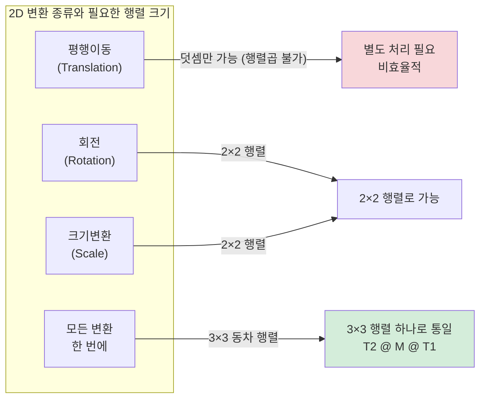
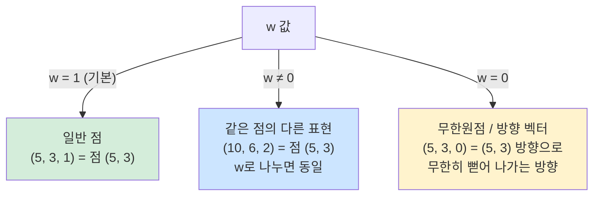
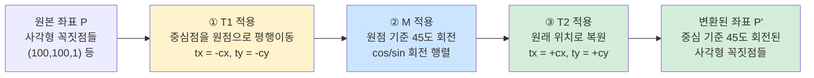
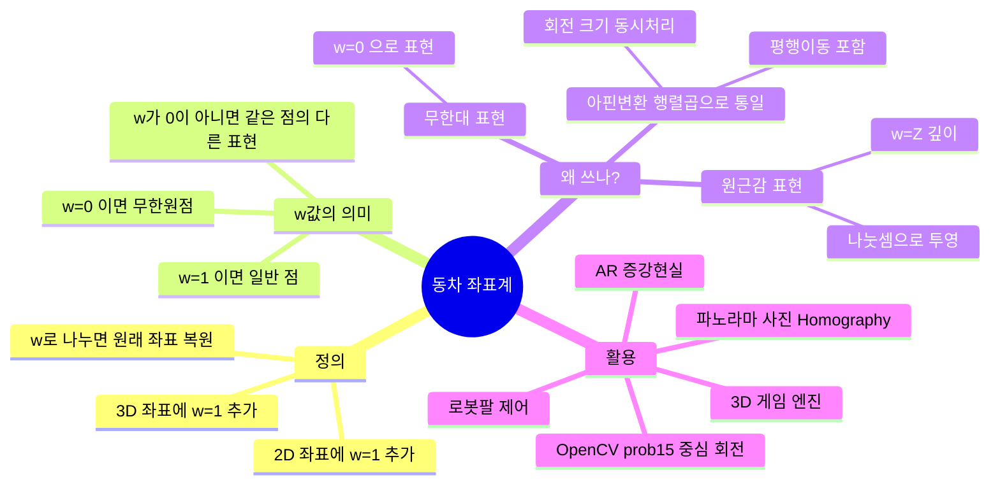

# 동차 좌표계(Homogeneous Coordinates)

---

### 1. 동차 좌표계란? (정의)

동차 좌표계는 **원래의 차원에 차원(숫자)을 하나 더 추가해서 좌표를 표현하는 방식**입니다.

- **2차원 좌표:** $(x, y) \rightarrow$ **동차 좌표계:** $(x, y, w)$
- **3차원 좌표:** $(x, y, z) \rightarrow$ **동차 좌표계:** $(x, y, z, w)$

일반적으로 추가되는 마지막 숫자 $w$는 **1**을 사용합니다.
즉, 2차원의 점 $(5, 3)$은 동차 좌표계에서 $(5, 3, 1)$이 됩니다.

**[핵심 규칙]**
만약 $w$가 1이 아닌 다른 숫자라면, 원래 좌표로 돌아올 때 **모든 성분을 $w$로 나누어 줍니다.**

- $(10, 6, 2) \rightarrow (10/2, 6/2, 2/2) \rightarrow (5, 3, 1) \rightarrow$ 원래 좌표는 $(5, 3)$
- 즉, $(5, 3, 1)$이나 $(10, 6, 2)$나 $(50, 30, 10)$은 모두 **같은 점 $(5, 3)$**을 의미합니다. (이래서 '같을 동(同)'을 써서 동차 좌표계라고 부릅니다.)

#### 좌표 표현 비교

```
일반 좌표 (2D)         동차 좌표 (Homogeneous)         원래 좌표 복원
─────────────────    ──────────────────────────    ─────────────────
   (5, 3)        →       (5,  3,  1)    w=1    →    ( 5/1,  3/1) = (5, 3)
                   →      (10,  6,  2)   w=2    →    (10/2,  6/2) = (5, 3) ← 같은 점!
                   →      (50, 30, 10)   w=10   →   (50/10,30/10) = (5, 3) ← 같은 점!
                   →       (5,  3,  0)   w=0    →       ∞ (무한원점 — 방향 벡터)
```

| w 값 | 의미 | 비고 |
|------|------|------|
| `w = 1` | 일반적인 점 | 가장 기본적인 표현 |
| `w ≠ 0` | 동일한 점의 다른 표현 | 모든 성분을 w로 나누면 동일 좌표 |
| `w = 0` | 무한원점 (방향 벡터) | 특정 점이 아닌 방향 그 자체 |

---

### 2. 왜 차원을 하나 더 늘리는 귀찮은 짓을 할까? (도입 이유)

### ① 모든 변환을 '행렬 곱셈 하나'로 통일하기 위해 (아핀 변환; affine)

이전 답변에서 설명해 드린 가장 큰 이유입니다.
순수하게 $x, y$만 있는 2차원에서는 회전과 크기 조절은 '곱셈'으로 되지만, **평행이동은 무조건 '덧셈'**을 해야 합니다.
하지만 끝에 $1$을 붙여 $(x, y, 1)$로 만들면, 3x3 행렬 곱셈 한 번으로 **회전, 크기 조절, 평행이동을 동시에 처리**할 수 있습니다. 계산 속도가 생명인 컴퓨터에게 이는 엄청난 축복입니다.

#### 아핀 변환 행렬의 구조

```
2×2 행렬 (평행이동 불가)      3×3 행렬 (평행이동 포함, 동차 좌표계)
──────────────────────       ──────────────────────────────────────────
┌             ┐              ┌                              ┐
│  cos θ  -sin θ  │   →    │  cos θ   -sin θ   tx (이동X) │
│  sin θ   cos θ  │         │  sin θ    cos θ   ty (이동Y) │
└             ┘              │    0        0       1        │
  회전만 가능                 └                              ┘
                               ↑ 회전/크기 성분  ↑ 평행이동 성분
                              (곱셈으로 처리)   (동차좌표 덕에 가능!)
```



### ② '원근감(Perspective)'을 표현하기 위해

멀리 있는 물체는 작게 보이고, 가까운 물체는 크게 보이죠?
동차 좌표계의 마지막 숫자 **$w$를 물체와의 거리(깊이)에 따라 다르게 설정**하면, 나중에 $w$로 나눌 때 자연스럽게 $x, y$ 좌표가 작아지거나 커집니다. 즉, 나눗셈 한 번으로 3D 공간을 2D 화면에 그릴 때 완벽한 원근감을 만들어냅니다.

#### 원근 투영 시각화

```
실제 물체 크기가 모두 같아도 거리(Z)에 따라 화면에 다르게 보인다

거리(Z)    3D 동차 좌표 (x, y, w=Z)     나누기 w     화면 좌표    체감 크기
───────   ────────────────────────    ─────────   ─────────   ────────
  1m      (1.0,  1.0, 1)          ÷  1   →   (1.0, 1.0)    크게 보임 👀
  2m      (2.0,  2.0, 2)          ÷  2   →   (1.0, 1.0)    절반 크기 👁
  4m      (4.0,  4.0, 4)          ÷  4   →   (1.0, 1.0)    1/4 크기  ·

→ w(깊이)가 클수록 화면 좌표가 작아짐 → 원근감이 자동으로 표현됨!
```

### ③ '무한대(Infinity)'를 숫자로 표현하기 위해

기차 선로를 보면 평행한 두 선이 저 멀리 수평선 끝(무한대)에서 만나는 것처럼 보입니다.
일반 좌표계에서는 $(x, y)$로 무한대를 표현할 수 없지만, 동차 좌표계에서는 **마지막 $w$를 0으로** 만들면 됩니다.
예를 들어 $(5, 3, 0)$은 특정한 '점'이 아니라, $(5, 3)$ 방향으로 뻗어 나가는 **'무한히 먼 방향'** 그 자체를 의미하게 됩니다.

#### w값에 따른 좌표 의미 정리



---

### 3. 동차 좌표계의 핵심 활용 예시

### 🌟 예시 1: 3D 게임 엔진 (언리얼, 유니티)

3D 게임 속 캐릭터(수만 개의 점으로 이루어짐)가 앞으로 걸어가면서(평행이동), 고개를 돌리고(회전), 마법을 맞아 크기가 작아진다고(크기 변환) 상상해 보세요.

- 컴퓨터는 이 캐릭터의 모든 좌표를 $(x, y, z, 1)$의 동차 좌표계로 가지고 있습니다.
- 이동, 회전, 크기 변환을 담당하는 4x4 행렬들을 하나로 싹 다 곱해서 **'슈퍼 마법 행렬' 1개**를 만듭니다.
- 캐릭터의 수만 개의 점에 이 행렬을 한 번씩만 곱해주면 화면 갱신(초당 60프레임)이 순식간에 끝납니다.

### 🌟 예시 2: 컴퓨터 비전의 '파노라마 사진' (OpenCV)

스마트폰으로 파노라마 사진을 찍을 때, 여러 장의 사진을 하나로 자연스럽게 이어 붙이죠?

- 카메라를 돌려가며 찍었기 때문에, 사진들을 기울이고 찌그러뜨려야(원근 변환, Homography) 딱 맞게 이어집니다.
- 이때 동차 좌표계를 활용한 3x3 투영 변환 행렬을 사용하여 1번 사진의 좌표를 2번 사진의 시점으로 감쪽같이 일치시킵니다. (OpenCV의 `cv2.warpPerspective` 함수가 이 역할을 합니다.)

### 🌟 예시 3: AR (증강현실)

카메라로 현실의 명함을 비추면, 그 명함 위에 3D 몬스터가 서 있는 AR 앱을 생각해 보세요.

- 카메라는 명함이 화면에서 얼마나 비스듬하게 보이는지 계산합니다.
- 이때 계산되는 것이 동차 좌표계를 이용한 변환 행렬입니다. 이 행렬을 통해 3D 몬스터도 명함의 기울기와 완벽하게 똑같은 원근감을 갖도록 화면에 렌더링 됩니다.

### 🌟 예시 4: 로봇 공학 (로봇 팔 제어)

공장에서 자동차를 조립하는 다관절 로봇 팔이 있습니다.

어깨 → 팔꿈치 → 손목 → 손가락으로 이어지는 관절들의 위치를 계산해야 합니다.

- 각 관절이 꺾인 각도와 길이를 동차 좌표계 변환 행렬로 표현합니다.
- 어깨 행렬  $\times$ 팔꿈치 행렬 $\times$ 손목 행렬을 차례대로 곱하기만 하면, 복잡한 삼각함수 계산 없이 최종적으로 **로봇 손가락 끝의 정확한 3차원 좌표**를 얻어낼 수 있습니다.

---

### 4. 합성 변환 — T2 @ M @ T1 시각화

`prob15.py`에서 사각형을 중심점 기준으로 회전할 때 사용한 핵심 패턴입니다.

#### 왜 3단계가 필요한가?

```
❌ 원점 기준 회전 (잘못된 결과)
┌──────────────────────────────────────────┐
│  원점(0,0)                               │
│  ×                 사각형이 원점 주변을  │
│                    크게 돌아버림!        │
│                  ┌────────┐              │
│                  │사각형  │ ─── 회전 ──> │
│                  └────────┘        ↗    │
└──────────────────────────────────────────┘

✅ 중심점 기준 회전 (올바른 결과): T2 @ M @ T1
┌──────────────────────────────────────────┐
│  1단계 T1      2단계 M       3단계 T2    │
│  중심→원점     원점 회전     원점→중심   │
│                                          │
│  ┌──────┐      ┌──────┐      ┌──────┐   │
│  │      │  →   │      │  →   │  /   │   │
│  │  □   │  →   │  □   │  →   │ □    │   │
│  └──────┘      └──────┘      └──────┘   │
│  (이동)        (회전)         (복원)     │
└──────────────────────────────────────────┘
```



#### 3단계 행렬 수식

$$\text{변환 결과} = T_2 \cdot M \cdot T_1 \cdot P$$

$$m_2 = T_2 \cdot M \cdot T_1 \quad \text{(미리 합쳐두면 한 번만 곱해도 됨)}$$

```python
# 각 행렬 정의
t1[0,2] = -cx   # T1: 중심을 원점으로
t1[1,2] = -cy

t2[0,2] = +cx   # T2: 원래 위치로 복원
t2[1,2] = +cy

m = [[cos θ, -sin θ, 0],   # M: 원점 기준 회전
     [sin θ,  cos θ, 0],
     [0,      0,     1]]

# 3단계를 하나의 행렬로 합성 (오른쪽→왼쪽 순서로 적용)
m2 = t2 @ m @ t1

# 모든 꼭짓점에 한 번에 적용
pts2 = cv2.gemm(pts1, m2, 1, None, 1, flags=cv2.GEMM_2_T)
```

#### 동차 좌표계의 평행이동 행렬 작동 원리

```
단위 행렬(np.eye)에 tx, ty를 끼워 넣는 이유:

┌ 1  0  tx ┐   ┌ x ┐   ┌ 1·x + 0·y + tx·1 ┐   ┌ x + tx ┐
│ 0  1  ty │ × │ y │ = │ 0·x + 1·y + ty·1 │ = │ y + ty │
└ 0  0   1 ┘   └ 1 ┘   └ 0·x + 0·y +  1·1 ┘   └   1    ┘

→ 오직 '곱셈'만 했는데, x와 y에 tx, ty가 '더해진' 것과 같은 결과!
→ 이것이 동차 좌표계로 평행이동을 행렬 곱셈으로 표현하는 핵심 트릭!
```

---

### 5. 종합 정리



| 변환 종류 | 2D 행렬 | 3D 동차 행렬 | 동차 필요? |
|-----------|---------|------------|-----------|
| 크기 변환 | 2×2 | 3×3 | 선택 |
| 회전 | 2×2 | 3×3 | 선택 |
| **평행이동** | **불가** | **3×3** | **필수** |
| 원근 투영 | 불가 | 3×3 (w 활용) | 필수 |
| 모든 변환 합성 | 불가 | **3×3 하나로 통일** | **필수** |
