# 5. 기본 배열 연산 (Operations on Arrays)

## 목차

- [5.1 기본 배열 처리 함수](#51-기본-배열-처리-함수)
- [5.2 채널 처리 함수](#52-채널-처리-함수)
- [5.3 산술 연산 함수](#53-산술-연산-함수)
  - [5.3.1 사칙 연산](#531-사칙-연산)
  - [5.3.2 지수·로그·제곱근 관련 함수](#532-지수로그제곱근-관련-함수)
  - [5.3.3 논리(비트) 연산 함수](#533-논리비트-연산-함수)
- [5.4 절댓값 연산](#54-절댓값-연산)
  - [5.4.1 원소의 최솟값과 최댓값](#541-원소의-최솟값과-최댓값)
- [5.5 통계 관련 함수](#55-통계-관련-함수)
- [5.6 행렬 연산 함수](#56-행렬-연산-함수)

---

## Chapter 5 전체 구조

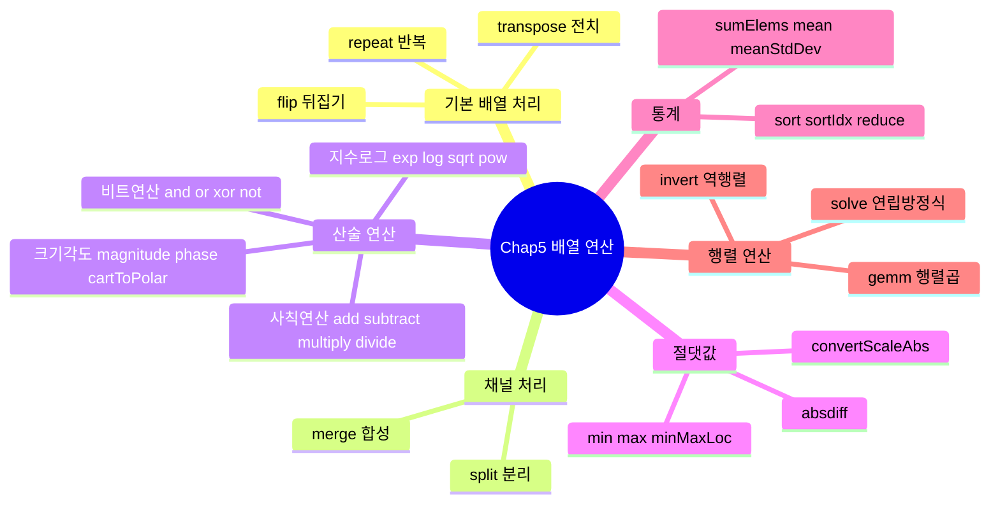

---

## 5.1 기본 배열 처리 함수

> 행렬(배열)의 형태를 변환하는 함수들이다.
> 카메라 영상처럼 좌우가 뒤집힌 영상을 보정하거나, 영상을 반복·전치하는 데 활용한다.

### 주요 함수

| 함수                             | 설명                                 |
| -------------------------------- | ------------------------------------ |
| `cv2.flip(src, flipCode[, dst])` | 배열을 수직/수평/양축으로 뒤집는다   |
| `cv2.repeat(src, ny, nx[, dst])` | 배열을 세로 ny회, 가로 nx회 반복한다 |
| `cv2.transpose(src[, dst])`      | 배열의 전치 행렬을 반환한다          |

### `cv2.flip()` flipCode 기준

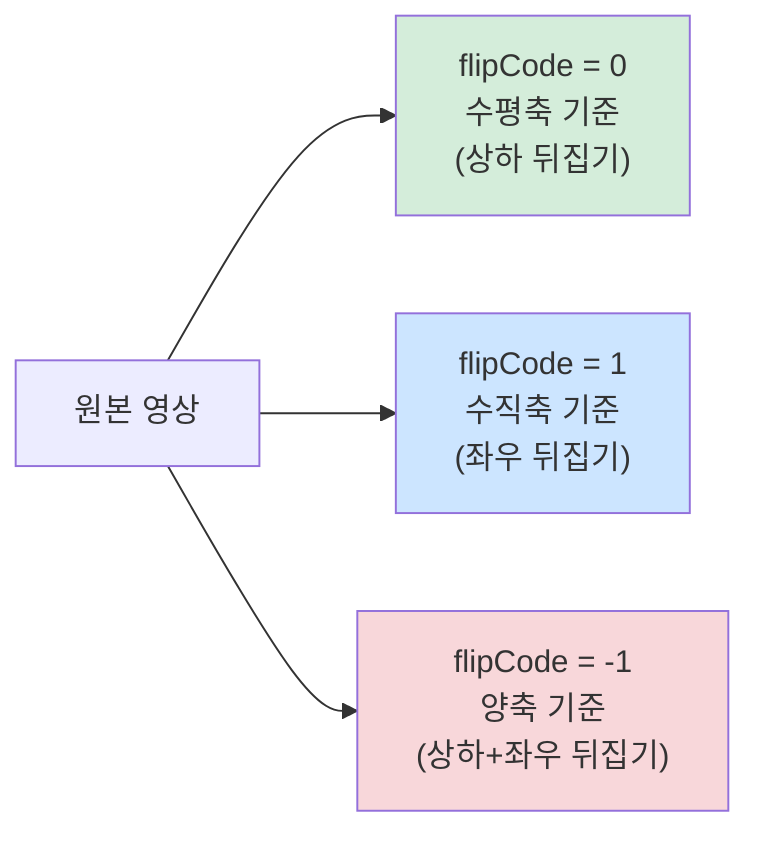

| flipCode | 기준 축         | 효과                                 |
| -------- | --------------- | ------------------------------------ |
| `0`      | 수평축 (x-axis) | 상하 반전                            |
| `1`      | 수직축 (y-axis) | 좌우 반전 (거울 효과)                |
| `-1`     | 양축 동시       | 상하 + 좌우 반전 (180도 회전과 동일) |

### `[, dst]` 인수의 의미

```python
# dst 생략 → 새 배열 반환
flipped = cv2.flip(img, 1)

# dst 지정 → 결과가 dst 배열에 저장 (메모리 재사용)
dst = np.empty_like(img)
cv2.flip(img, 1, dst)
```

> `[dst]`는 선택적 인수이다. 생략하면 OpenCV가 새 배열을 만들어 반환하고,
> 지정하면 해당 배열에 결과를 저장하므로 메모리를 재사용할 수 있다.

### 예시 코드 (`01.mat_array.py`)

```python
import numpy as np, cv2

image = cv2.imread('images/flip_test.jpg', cv2.IMREAD_COLOR)

x_axis   = cv2.flip(image, 0)   # 상하 반전
y_axis   = cv2.flip(image, 1)   # 좌우 반전
xy_axis  = cv2.flip(image, -1)  # 상하+좌우 반전
rep_image   = cv2.repeat(image, 1, 2)   # 가로 방향으로 2회 반복
trans_image = cv2.transpose(image)      # 전치 (행↔열 교환)
```

### transpose() 동작 원리

```
원본 (M×N):          전치 (N×M):
[ a  b  c ]          [ a  d ]
[ d  e  f ]    →     [ b  e ]
                     [ c  f ]

행과 열이 교환됨
영상에서는 90도 회전과 유사하지만 정확히 같지 않음
```

---

## 5.2 채널 처리 함수

> OpenCV에서 컬러 영상은 **BGR 3채널** 행렬로 저장된다.
> 채널을 분리하거나 합성하여 특정 채널만 처리할 수 있다.

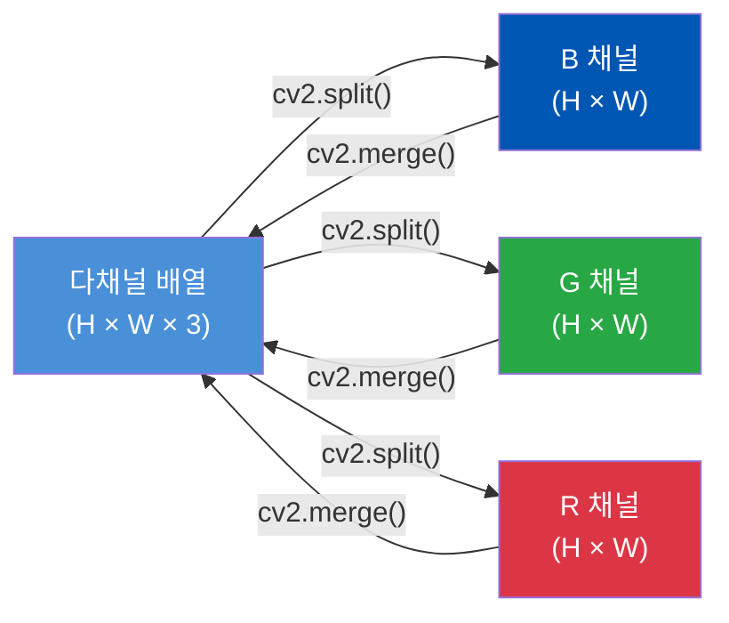

### 주요 함수

| 함수                   | 설명                                   |
| ---------------------- | -------------------------------------- |
| `cv2.merge(mv[, dst])` | 단일채널 배열들을 → 다채널 배열로 합성 |
| `cv2.split(m[, mv])`   | 다채널 배열을 → 단일채널 배열들로 분리 |

### 채널 분리/합성 예시 (`02.mat_channel.py`)

```python
import numpy as np, cv2

ch0 = np.zeros((2, 4), np.uint8) + 10   # 값 10으로 채워진 채널
ch1 = np.ones((2, 4), np.uint8) * 20    # 값 20
ch2 = np.full((2, 4), 30, np.uint8)     # 값 30

list_bgr  = [ch0, ch1, ch2]
merge_bgr = cv2.merge(list_bgr)   # (2, 4, 3) 다채널 행렬
split_bgr = cv2.split(merge_bgr)  # 다시 3개의 단일채널로 분리

print(merge_bgr.shape)             # (2, 4, 3)
print(np.array(split_bgr).shape)   # (3, 2, 4)
```

> `cv2.split()`의 반환값은 **튜플**이다. (numpy 배열의 리스트가 아님)

### 실제 컬러 영상 채널 분리 (`03.image_channels.py`)

```python
image = cv2.imread("images/color.jpg", cv2.IMREAD_COLOR)
bgr = cv2.split(image)  # B, G, R 채널을 각각 분리

cv2.imshow("Blue channel",  bgr[0])  # 파란색이 많은 영역이 밝게 나타남
cv2.imshow("Green channel", bgr[1])
cv2.imshow("Red channel",   bgr[2])
```

| 채널 분리 결과       | 해석                             |
| -------------------- | -------------------------------- |
| Blue 채널 밝은 영역  | 원본 영상에서 파란색이 강한 부분 |
| Green 채널 밝은 영역 | 원본 영상에서 초록색이 강한 부분 |
| Red 채널 밝은 영역   | 원본 영상에서 빨간색이 강한 부분 |

---

## 5.3 산술 연산 함수

### 5.3.1 사칙 연산

> OpenCV의 산술 연산은 **포화 연산(Saturate)**을 수행한다.
> 결과값이 자료형의 범위를 초과하면 최솟값/최댓값으로 클리핑된다.
> (예: uint8에서 255+10 = 255, 0-10 = 0)

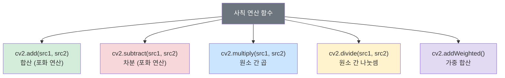

#### 주요 공통 인수

| 인수           | 설명                                              |
| -------------- | ------------------------------------------------- |
| `src1`, `src2` | 입력 배열 또는 스칼라                             |
| `dst`          | 결과 출력 배열                                    |
| `mask`         | 8비트 단일채널 마스크 — 0이 아닌 위치만 연산 수행 |
| `dtype`        | 출력 배열의 자료형                                |

#### `cv2.add()` / `cv2.subtract()`

```python
m1 = np.full((3, 6), 10, np.uint8)
m2 = np.full((3, 6), 50, np.uint8)

# 마스크: 오른쪽 절반(3열~)만 연산 수행
m_mask = np.zeros(m1.shape, np.uint8)
m_mask[:, 3:] = 1

m_add1 = cv2.add(m1, m2)               # 전체 덧셈
m_add2 = cv2.add(m1, m2, mask=m_mask)  # 마스크 영역만 덧셈
```

#### `cv2.multiply()` — scale 인수 주의

```
cv2.multiply(src1, src2[, dst[, scale[, dtype]]])
```

- `scale`: 두 배열의 원소 곱에 추가로 곱해주는 배율
- 수식: `dst(i) = saturate(src1(i) × src2(i) × scale)`

#### `cv2.addWeighted()` — 영상 블렌딩에 자주 사용

```
cv2.addWeighted(src1, alpha, src2, beta, gamma)
```

$$dst = \alpha \cdot src1 + \beta \cdot src2 + \gamma$$

| 인수    | 설명                               |
| ------- | ---------------------------------- |
| `alpha` | src1의 가중치                      |
| `beta`  | src2의 가중치                      |
| `gamma` | 합산 결과에 추가로 더해주는 스칼라 |

```python
# 예: 두 영상을 50:50으로 합성
blended = cv2.addWeighted(img1, 0.5, img2, 0.5, 0)
```

#### uint8 vs float32 나눗셈 비교 (`04.arithmetic_op.py`)

```python
m1 = np.full((3, 6), 10, np.uint8)
m2 = np.full((3, 6), 50, np.uint8)

m_div1 = cv2.divide(m1, m2)                          # uint8 → 소수점 버림 (0)
m1 = m1.astype(np.float32)
m2 = np.float32(m2)
m_div2 = cv2.divide(m1, m2)                          # float32 → 0.2 정확히 계산
```

> uint8 나눗셈 시 소수 부분이 버려진다.
> 정밀한 나눗셈 결과가 필요하면 반드시 **float32** 형변환 후 연산한다.

---

### 5.3.2 지수·로그·제곱근 관련 함수

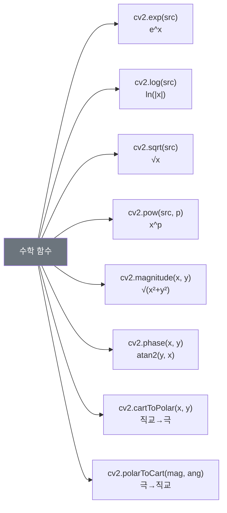

> 모든 수학 함수는 **ndarray 객체만** 입력 가능하다. 파이썬 리스트는 직접 전달 불가.

#### 기본 수학 함수

| 함수              | 수식           | 비고                  |
| ----------------- | -------------- | --------------------- |
| `cv2.exp(src)`    | $e^{src}$      | 자연지수              |
| `cv2.log(src)`    | $\ln(\|src\|)$ | 자연로그, 절댓값 먼저 |
| `cv2.sqrt(src)`   | $\sqrt{src}$   | 제곱근                |
| `cv2.pow(src, p)` | $src^p$        | p승                   |

```python
v1 = np.array([1, 2, 3], np.float32)   # float32 필수
v2 = np.array([[1], [2], [3]], np.float32)  # 열벡터 (3×1)
v3 = np.array([[1, 2, 3]], np.float32)      # 행벡터 (1×3)

v1_exp  = cv2.exp(v1)
v1_log  = cv2.log(v1)
v2_sqrt = cv2.sqrt(v2)
v3_pow  = cv2.pow(v3, 3)   # 세제곱

# 열벡터 출력 시 활용하는 변환 패턴
print(v1_log.transpose())  # 전치 → 행벡터
print(np.ravel(v2_sqrt))   # ravel() → 1차원 배열
print(v3_pow.flatten())    # flatten() → 1차원 배열
```

#### 크기(magnitude)와 각도(phase)

$$magnitude(i) = \sqrt{x(i)^2 + y(i)^2}$$

$$angle(i) = \text{atan2}(y(i), x(i))$$

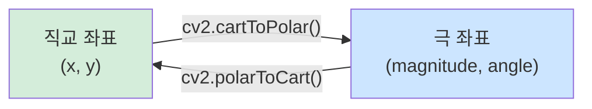

```python
x = np.array([1, 2, 3, 5, 10], np.float32)
y = np.array([2, 5, 6, 2,  9], np.float32)

mag = cv2.magnitude(x, y)           # 크기 계산
ang = cv2.phase(x, y)               # 각도 계산 (기본: 라디안)
p_mag, p_ang = cv2.cartToPolar(x, y)    # 직교 → 극 좌표 동시 변환
x2, y2 = cv2.polarToCart(p_mag, p_ang) # 극 → 직교 좌표 복원
```

| 인수                           | 설명                     |
| ------------------------------ | ------------------------ |
| `anglenDegrees=True`           | 각도를 도(degree)로 반환 |
| `anglenDegrees=False` (기본값) | 각도를 라디안으로 반환   |

---

### 5.3.3 논리(비트) 연산 함수

> 비트 단위 연산으로 영상의 특정 영역을 추출하거나 마스킹할 때 핵심적으로 사용된다.

#### 진리표

| 비트 A | 비트 B | AND | OR  | XOR | NOT A |
| ------ | ------ | --- | --- | --- | ----- |
| 0      | 0      | 0   | 0   | 0   | 1     |
| 0      | 1      | 0   | 1   | 1   | 1     |
| 1      | 0      | 0   | 1   | 1   | 0     |
| 1      | 1      | 1   | 1   | 0   | 0     |

#### 함수 목록

| 함수                          | 연산       | 특징                       |
| ----------------------------- | ---------- | -------------------------- |
| `cv2.bitwise_and(src1, src2)` | 비트별 AND | 두 영역의 교집합 추출      |
| `cv2.bitwise_or(src1, src2)`  | 비트별 OR  | 두 영역의 합집합           |
| `cv2.bitwise_xor(src1, src2)` | 비트별 XOR | 두 영역이 다른 부분만 추출 |
| `cv2.bitwise_not(src)`        | 비트별 NOT | 흑백 반전                  |

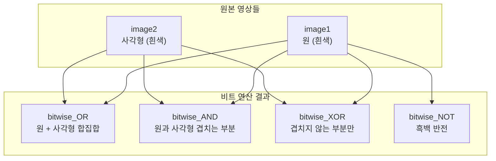

```python
# 07.bitwise_op.py
image1 = np.zeros((300, 300), np.uint8)
image2 = image1.copy()
cx, cy = 150, 150

cv2.circle(image1, (cx, cy), 100, 255, -1)       # 원
cv2.rectangle(image2, (0, 0, cx, 300), 255, -1)  # 좌측 절반 사각형

image3 = cv2.bitwise_or(image1, image2)   # 합집합
image4 = cv2.bitwise_and(image1, image2)  # 교집합
image5 = cv2.bitwise_xor(image1, image2)  # 차집합
image6 = cv2.bitwise_not(image1)          # 반전
```

#### 실전 응용 — 로고 합성 (`08.bitwise_overlap.py`)

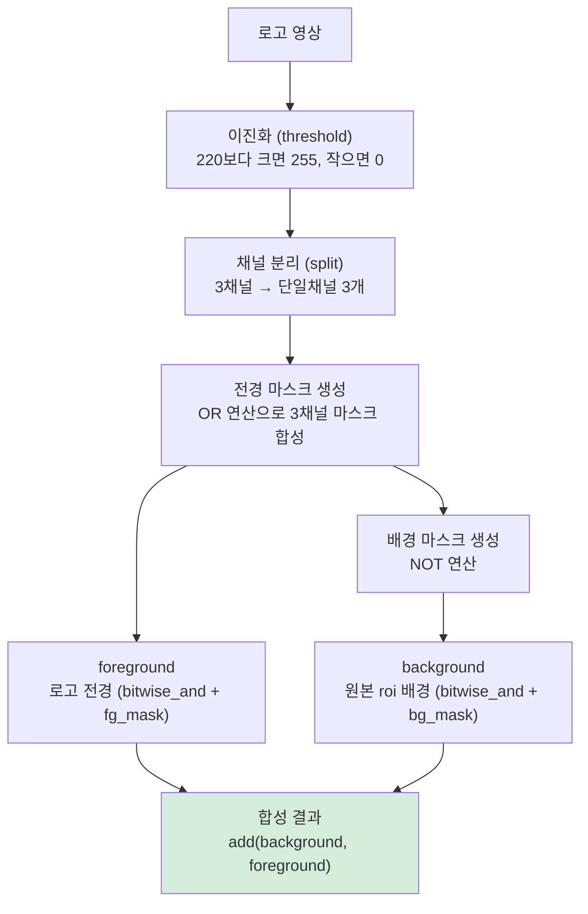

```python
# 이진화로 로고의 마스크 생성
masks = cv2.threshold(logo, 220, 255, cv2.THRESH_BINARY)[1]
masks = cv2.split(masks)

fg_pass_mask = cv2.bitwise_or(masks[0], masks[1])
fg_pass_mask = cv2.bitwise_or(masks[2], fg_pass_mask)  # 전경 마스크
bg_pass_mask = cv2.bitwise_not(fg_pass_mask)            # 배경 마스크

foreground = cv2.bitwise_and(logo, logo, mask=fg_pass_mask)  # 로고 전경
background = cv2.bitwise_and(roi,  roi,  mask=bg_pass_mask)  # 원본 배경
dst = cv2.add(background, foreground)  # 합성
```

---

## 5.4 절댓값 연산

> 영상 차분(Frame Difference) 등에서 음수값이 발생할 때 절댓값으로 변환하여 다음 처리 단계로 넘긴다.

### 주요 함수

| 함수                                    | 수식                                    | 설명                         |
| --------------------------------------- | --------------------------------------- | ---------------------------- |
| `cv2.absdiff(src1, src2)`               | $\|src1 - src2\|$                       | 두 배열 간 차분의 절댓값     |
| `cv2.convertScaleAbs(src, alpha, beta)` | $\|src \times \alpha + \beta\|$ → uint8 | 스케일 + 절댓값 + uint8 변환 |

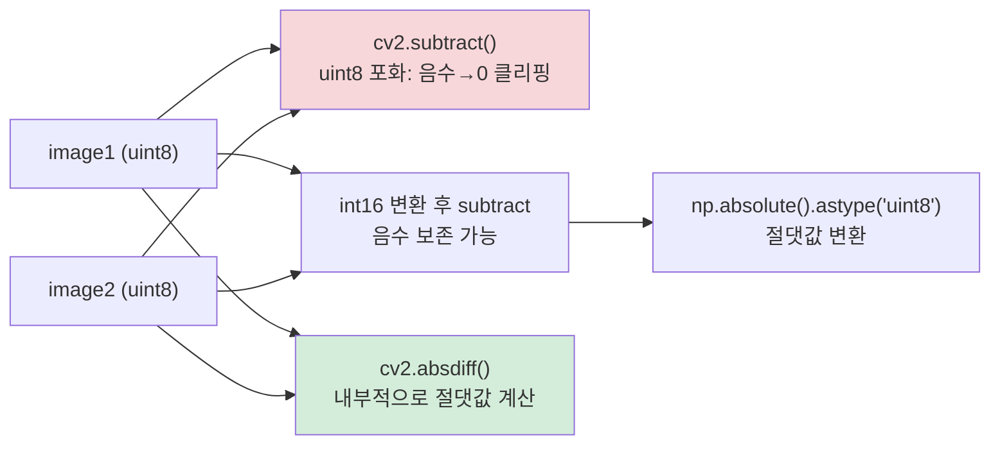

```python
# 10.mat_abs.py
dif_img1 = cv2.subtract(image1, image2)  # 음수 → 0 클리핑 (정보 손실)

# 음수 보존이 필요한 경우: int16으로 변환 후 연산
dif_img2 = cv2.subtract(np.int16(image1), np.int16(image2))
abs_dif1 = np.absolute(dif_img2).astype('uint8')

# 가장 간단한 방법: absdiff()
abs_dif2 = cv2.absdiff(image1, image2)  # 권장
```

> 단순히 `cv2.subtract(uint8, uint8)`를 사용하면 음수가 0으로 클리핑되어 **정보가 손실**된다.
> 차분 절댓값이 필요하다면 `cv2.absdiff()`를 사용하거나, int16으로 형변환 후 처리한다.

---

### 5.4.1 원소의 최솟값과 최댓값

| 함수                  | 반환값                             | 설명                                     |
| --------------------- | ---------------------------------- | ---------------------------------------- |
| `cv2.min(src1, src2)` | 배열                               | 원소 간 비교하여 작은 값으로 구성된 배열 |
| `cv2.max(src1, src2)` | 배열                               | 원소 간 비교하여 큰 값으로 구성된 배열   |
| `cv2.minMaxLoc(src)`  | `(minVal, maxVal, minLoc, maxLoc)` | 전체 최솟값/최댓값과 그 위치 반환        |

```python
# 10.mat_min_max.py
data = [10, 200, 5, 7, 9, 15, 35, 60, 80, 180, 100, 2, 55, 27, 70]
m1 = np.reshape(data, (3, 5))
m2 = np.full((3, 5), 50)

m_min = cv2.min(m1, 30)   # 각 원소와 스칼라 30 중 작은 값
m_max = cv2.max(m1, m2)   # 두 행렬의 원소 간 큰 값

min_val, max_val, min_loc, max_loc = cv2.minMaxLoc(m1)
```

> `minMaxLoc()`의 반환 좌표 `(loc)`는 `(x열, y행)` 순서이다.
> 행렬의 인덱스 순서 `[행][열]`과 반대이므로 주의한다.

#### 실전 응용 — 영상 정규화 (`11.image_min_max.py`)

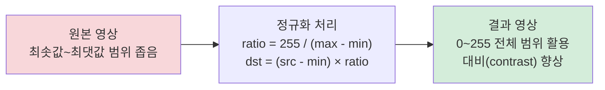

```python
min_val, max_val, _, _ = cv2.minMaxLoc(image)
ratio = 255 / (max_val - min_val)
dst = np.round((image - min_val) * ratio).astype('uint8')
# 결과: 원본의 최솟값 → 0, 최댓값 → 255로 선형 변환
```

---

## 5.5 통계 관련 함수

> 배열 원소들의 합·평균·표준편차·정렬 등 통계적 처리를 담당한다.

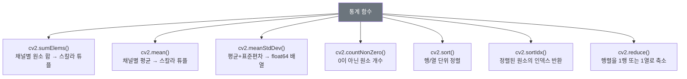

### 합과 평균 (`12.sum_avg.py`)

```python
image = cv2.imread("images/sum_test.jpg", cv2.IMREAD_COLOR)

# 마스크 영역(ROI) 지정
mask = np.zeros(image.shape[:2], np.uint8)
mask[60:160, 20:120] = 255

sum_value  = cv2.sumElems(image)       # 채널별 합 → 튜플 (B합, G합, R합, 0)
mean_val1  = cv2.mean(image)           # 채널별 평균 → 튜플
mean_val2  = cv2.mean(image, mask)     # 마스크 영역만 평균

mean, stddev   = cv2.meanStdDev(image)       # 전체 평균·표준편차
mean2, stddev2 = cv2.meanStdDev(image, mask=mask)  # 마스크 영역
```

| 함수               | 반환 자료형               | 반환 구조                  |
| ------------------ | ------------------------- | -------------------------- |
| `cv2.sumElems()`   | `tuple`                   | `(B합, G합, R합, 0)`       |
| `cv2.mean()`       | `tuple`                   | `(B평균, G평균, R평균, 0)` |
| `cv2.meanStdDev()` | `numpy.ndarray` (float64) | `(채널수×1)` 배열          |

### 정렬 (`13.sort.py`, `14.sortIdx.py`)

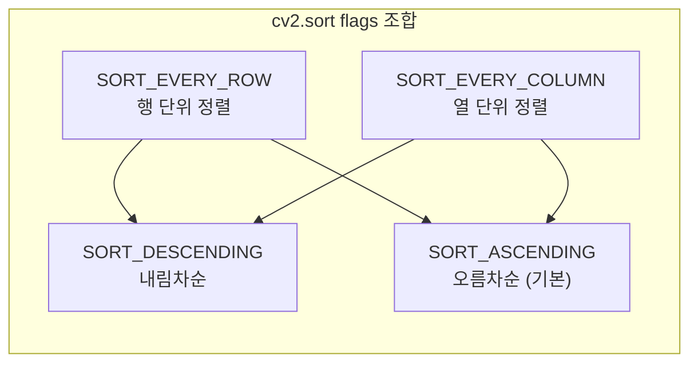

```python
m = np.random.randint(0, 100, 15).reshape(3, 5)

# cv2.sort() — 정렬된 값 반환
sort1 = cv2.sort(m, cv2.SORT_EVERY_ROW)                           # 행 단위 오름차순
sort2 = cv2.sort(m, cv2.SORT_EVERY_COLUMN)                        # 열 단위 오름차순
sort3 = cv2.sort(m, cv2.SORT_EVERY_ROW + cv2.SORT_DESCENDING)    # 행 단위 내림차순

# cv2.sortIdx() — 정렬된 원소의 인덱스 반환
sort1_idx = cv2.sortIdx(m, cv2.SORT_EVERY_ROW)     # 각 행에서 원소의 원래 열 인덱스
sort2_idx = cv2.sortIdx(m, cv2.SORT_EVERY_COLUMN)  # 각 열에서 원소의 원래 행 인덱스

# NumPy 대응 함수
sort4 = np.sort(m, axis=1)             # cv2.sort + SORT_EVERY_ROW 동일
sort5 = np.sort(m, axis=0)             # cv2.sort + SORT_EVERY_COLUMN 동일
sort6 = np.sort(m, axis=1)[:, ::-1]   # 행 단위 내림차순
sort7 = np.argsort(m, axis=0)          # cv2.sortIdx + SORT_EVERY_COLUMN 동일
```

> `cv2.sortIdx()`는 값 대신 **정렬 후 원소들의 원래 인덱스**를 반환한다.
> 정렬 순서를 추적하거나 원본 데이터 위치를 참조할 때 유용하다.

### 행렬 축소 (`16.mat_reduce.py`)

> `cv2.reduce()`는 행렬을 **열 방향(dim=0) → 1행** 또는 **행 방향(dim=1) → 1열**로 축소한다.

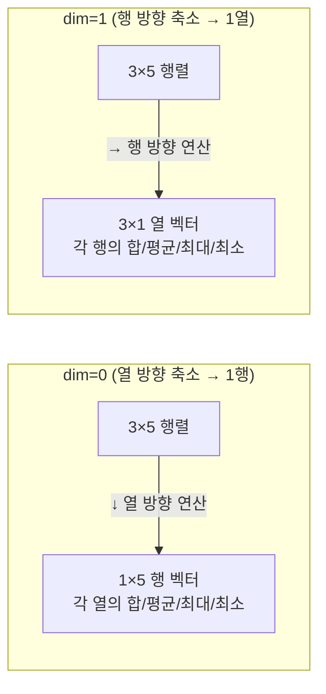

| rtype 상수       | 연산   |
| ---------------- | ------ |
| `cv2.REDUCE_SUM` | 합산   |
| `cv2.REDUCE_AVG` | 평균   |
| `cv2.REDUCE_MAX` | 최댓값 |
| `cv2.REDUCE_MIN` | 최솟값 |

```python
m = np.random.rand(3, 5) * 100

reduce_sum = cv2.reduce(m, dim=0, rtype=cv2.REDUCE_SUM)  # 각 열의 합 → (1, 5) 행벡터
reduce_avg = cv2.reduce(m, dim=1, rtype=cv2.REDUCE_AVG)  # 각 행의 평균 → (3, 1) 열벡터
reduce_max = cv2.reduce(m, dim=0, rtype=cv2.REDUCE_MAX)  # 각 열의 최댓값
reduce_min = cv2.reduce(m, dim=1, rtype=cv2.REDUCE_MIN)  # 각 행의 최솟값
```

> `cv2.reduce()`는 `np.float32` 또는 `np.float64` 타입 배열에서만 사용 가능하다.

---

## 5.6 행렬 연산 함수

> OpenCV는 선형대수 계산을 위한 행렬 연산 함수를 제공한다.

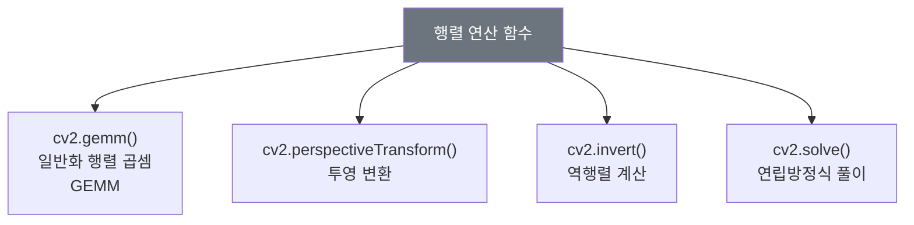

### `cv2.gemm()` — 일반화 행렬 곱셈

$$dst = \alpha \cdot src1^T \cdot src2 + \beta \cdot src3^T$$

```
cv2.gemm(src1, src2, alpha, src3, beta[, dst[, flags]])
```

| 인수           | 설명                                              |
| -------------- | ------------------------------------------------- |
| `src1`, `src2` | 곱할 두 입력 행렬 (float32/float64, 2채널 이하)   |
| `alpha`        | 행렬 곱에 대한 가중치                             |
| `src3`         | 행렬 곱 결과에 더해지는 델타 행렬 (없으면 `None`) |
| `beta`         | src3에 곱해지는 가중치                            |
| `flags`        | 전치 플래그 조합                                  |

| flags          | 동작                  |
| -------------- | --------------------- |
| `cv2.GEMM_1_T` | src1을 전치한 후 곱셈 |
| `cv2.GEMM_2_T` | src2을 전치한 후 곱셈 |
| `cv2.GEMM_3_T` | src3을 전치           |

```python
# 17.gemm.py
src1 = np.array([1, 2, 3, 1, 2, 3], np.float32).reshape(2, 3)
src2 = np.array([1, 2, 3, 4, 5, 6], np.float32).reshape(2, 3)

# src1^T × src2  (src1을 전치)
dst1 = cv2.gemm(src1, src2, 1.0, None, 1.0, flags=cv2.GEMM_1_T)

# src1 × src2^T  (src2를 전치)
dst2 = cv2.gemm(src1, src2, 1.0, None, 1.0, flags=cv2.GEMM_2_T)
```

### 실전 응용 — 좌표 회전 변환 (`18.point_transform.py`)

> 회전 변환 행렬과 `cv2.gemm()`을 조합하면 좌표를 임의 각도로 회전시킬 수 있다.

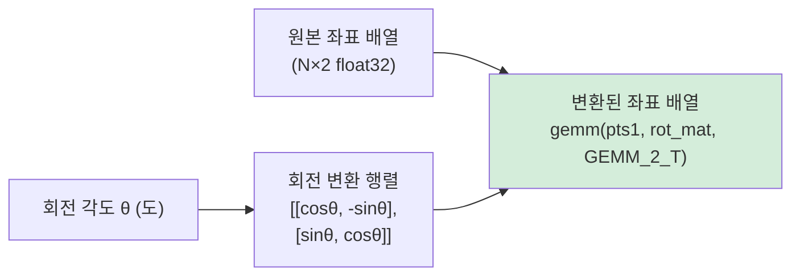

```python
theta = 20 * np.pi / 180  # 20도 → 라디안
rot_mat = np.array([[np.cos(theta), -np.sin(theta)],
                    [np.sin(theta),  np.cos(theta)]], np.float32)

pts1 = np.array([(250, 30), (400, 70), (350, 250), (150, 200)], np.float32)
pts2 = cv2.gemm(pts1, rot_mat, 1, None, 1, flags=cv2.GEMM_2_T)  # 회전 적용

# 결과 시각화
cv2.polylines(image, [np.int32(pts1)], True, (0, 255, 0), 2)  # 원본: 초록
cv2.polylines(image, [np.int32(pts2)], True, (255, 0, 0), 3)  # 회전: 파랑
```

### `cv2.invert()` — 역행렬 계산

```
cv2.invert(src[, dst[, flags]])  → (retval, dst)
```

| flags                 | 역행렬 계산 방법 | 입력 행렬 조건                     |
| --------------------- | ---------------- | ---------------------------------- |
| `cv2.DECOMP_LU`       | 가우시안 소거법  | 역행렬이 존재하는 정방행렬         |
| `cv2.DECOMP_SVD`      | 특이치 분해(SVD) | 정방행렬이 아닌 경우 → 의사 역행렬 |
| `cv2.DECOMP_CHOLESKY` | 촐레스키 분해    | 대칭 + 양의 정부호 정방행렬        |

### `cv2.solve()` — 연립방정식 풀이

$$Ax = b \quad \Rightarrow \quad x = A^{-1}b$$

```python
# 19.equation.py  —  연립방정식 Ax = b 풀기
data = [3, 0, 6, -3, 4, 2, -5, -1, 9]
m1 = np.array(data, np.float32).reshape(3, 3)   # 계수 행렬 A
m2 = np.array([36, 10, 28], np.float32)          # 상수 벡터 b

# 방법 1: 역행렬로 직접 계산
ret, inv = cv2.invert(m1, cv2.DECOMP_LU)
if ret:
    dst1 = inv.dot(m2)                        # NumPy 행렬곱
    dst2 = cv2.gemm(inv, m2, 1, None, 1)     # OpenCV 행렬곱

# 방법 2: cv2.solve() 직접 사용 (권장)
_, dst3 = cv2.solve(m1, m2, cv2.DECOMP_LU)
```

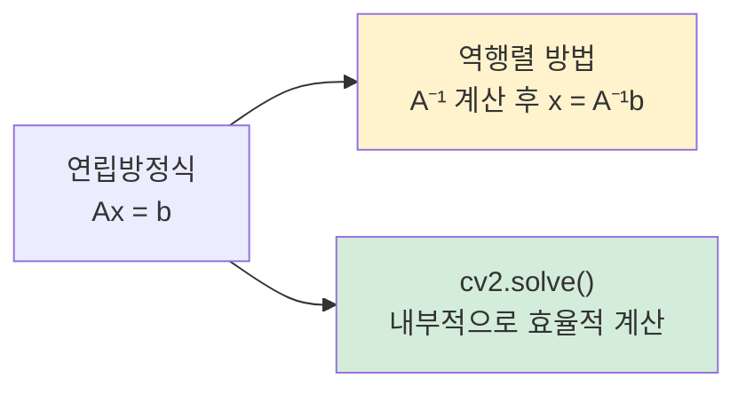

> `cv2.solve()`는 역행렬을 명시적으로 구하지 않고 방정식을 직접 풀기 때문에
> 수치 안정성이 더 좋고 일반적으로 더 빠르다.

---

## 핵심 함수 정리

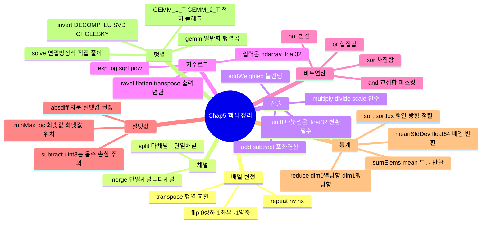

---

## 중요 포인트 요약

| 주제               | 핵심 주의사항                                                         |
| ------------------ | --------------------------------------------------------------------- |
| **포화 연산**      | `cv2.add(uint8)`: 결과 > 255 → 255 클리핑, 결과 < 0 → 0 클리핑        |
| **나눗셈 정밀도**  | `uint8`나눗셈은 소수 버림 → 정밀도 필요 시 `float32` 변환 필수        |
| **차분 절댓값**    | `cv2.subtract(uint8)`는 음수를 0으로 버림 → `cv2.absdiff()` 사용 권장 |
| **수학 함수 입력** | `cv2.exp()` 등은 Python 리스트 불가 → 반드시 `np.ndarray` 전달        |
| **minMaxLoc 좌표** | 반환값이 `(x열, y행)` 순서 → 행렬 인덱스 `[행][열]`과 반대            |
| **reduce 자료형**  | `cv2.reduce()`는 `float32` / `float64` 배열만 처리 가능               |
| **gemm 자료형**    | `cv2.gemm()`은 `float32` / `float64` 배열, 최대 2채널까지 가능        |
| **split 반환값**   | `cv2.split()` 반환 타입은 `tuple` (리스트 아님)                       |

## 연습문제 풀이

### prob6.py — numpy 정수 산술 + cv2.split() 채널 분리

**핵심 개념**: `int8` 오버플로우 vs `uint8` 포화 연산, 3채널 배열 채널 분리

| 연산 방식 | 코드 | 동작 |
|---------|------|------|
| numpy 기본 연산 (`int8`) | `m1 + m2` | 범위 초과 시 **롤오버** (오버플로우) |
| OpenCV 포화 연산 (`uint8`) | `cv2.add(m1, m2)` | 255 초과 → **255** 클리핑 |

```python
# int8에서 numpy 덧셈은 포화 없이 오버플로우 발생 → cv2.add() 사용 권장
m3 = m1 + m2             # numpy 기본 연산 (int8 범위 초과 시 롤오버)

# 3채널 (H×W×3) 배열 → 채널별 (H×W) 배열 3개로 분리
data = [1, 2, 3, 4, 5, 6, 7, 8, 9, 10, 11, 12]
m1 = np.array(data).reshape(2, 2, 3)  # (2, 2, 3) 배열
r, g, b = cv2.split(m1)               # 각각 (2, 2) 배열
```

---

### prob7.py — 채널 분리 + zeros 채널로 단색 이미지 생성

**핵심 개념**: `cv2.split()` + 빈 채널(`np.zeros`) + `cv2.merge()`

```python
blue, green, red = cv2.split(logo)                          # BGR 채널 분리
ch0 = np.zeros(logo.shape[:2], dtype=np.uint8)              # 빈 채널 생성

blue_img  = cv2.merge((blue,  ch0,  ch0))  # 파란색만 표시
green_img = cv2.merge((ch0, green,  ch0))  # 초록색만 표시
red_img   = cv2.merge((ch0,   ch0,  red))  # 빨간색만 표시
```

> 원하지 않는 채널 자리에 `np.zeros`를 채워 `cv2.merge()`하면 단색 채널 이미지를 만든다.

---

### prob8.py — 타원 마스크로 관심 영역(ROI) 추출

**핵심 개념**: `cv2.ellipse()`로 마스크 생성 → `bitwise_and(src, src, mask=...)`로 ROI 추출

```python
mask = np.zeros(image.shape[:2], dtype=np.uint8)
cv2.ellipse(mask, (190, 170), (80, 100), 0, 0, 360, 255, -1)  # 타원 마스크 생성
dst = cv2.bitwise_and(image, image, mask=mask)                  # 타원 영역만 추출
```

> **패턴**: `bitwise_and(src, src, mask=mask)` — mask가 255인 픽셀은 원본값을 유지하고, 0인 픽셀은 0(검정)으로 만든다.

---

### prob9.py — cv2.reduce()로 행/열 평균 계산

**핵심 개념**: `dim=0`(열 방향 축소→1행), `dim=1`(행 방향 축소→1열)

```python
image = np.random.randint(0, 255, (3, 6), dtype=np.uint8)
avg_row = cv2.reduce(image, 0, cv2.REDUCE_AVG)  # → (1, 6) 각 열의 평균
avg_col = cv2.reduce(image, 1, cv2.REDUCE_AVG)  # → (3, 1) 각 행의 평균
```

```
[3×6 배열]  dim=0(↓)  →  [1×6]  ← 각 열의 평균 (행들을 세로 방향으로 압축)
            dim=1(→)  →  [3×1]  ← 각 행의 평균 (열들을 가로 방향으로 압축)
```

---

### prob12.py — ROI 밝기 조절 + 명암비 조절

**핵심 개념**: 슬라이싱으로 ROI 지정 → `cv2.add()`로 밝기 증가, `cv2.multiply()`로 명암비 조절

```python
roi1 = image[50:150, 150:250]    # ROI 1 지정 (슬라이싱: [y:y+h, x:x+w])
roi2 = image[150:200, 250:300]   # ROI 2 지정

bright = cv2.add(roi1, 50)        # 밝기 +50 (포화 연산 적용)
scale  = cv2.multiply(roi2, 1.5)  # 명암비 ×1.5 (대비 증가)

image[50:150, 150:250]  = bright  # 원본 영상에 덮어쓰기
image[150:200, 250:300] = scale
```

| 효과 | 함수 | scale 값 |
|------|------|----------|
| 밝기 증가 | `cv2.add(roi, 스칼라)` | — |
| 대비 증가 | `cv2.multiply(roi, s)` | `s > 1` |
| 대비 감소 | `cv2.multiply(roi, s)` | `0 < s < 1` |

---

### prob13.py — sortIdx()로 Rect 크기 기준 정렬

**핵심 개념**: 면적 계산 → `cv2.sortIdx()`로 정렬 인덱스 획득 → 인덱스로 원본 배열 재배치

```python
rects = np.array([(10,20,50,40), (30,40,20,10), (5,5,100,80)], np.int32)

# 면적(w×h) 계산 → 열벡터(N×1)로 변환 (sortIdx 입력 형식)
areas = np.array([w*h for (_,_,w,h) in rects], np.int32).reshape(-1, 1)

# 면적 기준 오름차순 정렬 인덱스
sort_idx = cv2.sortIdx(areas, cv2.SORT_EVERY_COLUMN + cv2.SORT_ASCENDING)

# 인덱스로 원본 Rect 배열 재배치
sorted_rects = rects[sort_idx.flatten()]
```

> `reshape(-1, 1)`: `-1`은 자동 계산. 1차원 배열을 N×1 열벡터로 변환한다.
> `cv2.sortIdx()`는 정렬된 **인덱스**를 반환하므로, 이를 이용해 원본 배열을 재배치한다.

---

### prob14.py — cv2.invert() + cv2.solve()로 연립방정식 풀기

**핵심 개념**: 역행렬 방법 vs 직접 풀이, LU 분해(가우시안 소거법) 활용

```python
A = np.array([[3, 6, 3], [-5, 6, 1], [2, -3, 5]], np.float32)  # 계수 행렬
b = np.array([2, 10, 28], np.float32)                           # 상수 벡터

# 방법 1: 역행렬 계산 후 행렬곱 (@ = np.matmul)
ret, A_inv = cv2.invert(A, cv2.DECOMP_LU)
x = A_inv @ b   # Ax = b → x = A⁻¹b

# 방법 2: cv2.solve() 직접 풀이 (권장 — 더 빠르고 수치 안정적)
_, x = cv2.solve(A, b, cv2.DECOMP_LU)
```

| 방법 | 장점 | 단점 |
|------|------|------|
| `cv2.invert()` + `@` | 역행렬 재사용 가능 | 수치 오차 누적 가능 |
| `cv2.solve()` | 수치 안정성 우수, 빠름 | 역행렬 명시적 반환 없음 |

---

### prob15.py — 동차 좌표계로 중심점 기준 45도 회전

**핵심 개념**: 동차 좌표계 + `T2 @ M @ T1` 합성 변환 행렬로 임의 중심점 기준 회전

`prob15.py` 관련 상세 내용 정리

```python
import numpy as np, cv2
"""
사각형의 중심점을 기준으로 45도 회전시키는 프로그램을 완성하시오
사각형의 중심점을 원점으로 만들기 위해 좌표의 평행이동 활용
"""

pts1 = np.array([(100, 100, 1), (400, 100, 1),
                 (400, 250, 1), (100, 250, 1)], np.float32) # 4개 좌표

theta = 45 * np.pi / 180        # 회전 각도 - 라디안값
m = np.array([ [np.cos(theta), -np.sin(theta), 0],
               [np.sin(theta), np.cos(theta), 0],
             [0, 0, 1]], np.float32)  # 회전 변환 행렬

delta = (pts1[2] - pts1[0])//2  # 시작 좌표와 종료 좌표 차분//2
center = pts1[0] + delta        # 중심 좌표 계산 (cx, cy, 1)

## 평행이동 행렬
t1 = np.eye(3, dtype=np.float32)
t2 = np.eye(3, dtype=np.float32)

## 중심좌표 평행이동
t1[0,2] = -center[0] # x축 이동
t1[1,2] = -center[1] # y축 이동

t2[0,2] = center[0] # x축 역이동
t2[1,2] = center[1] # y축 역이동

## 행렬 곱 수행
m2 = t2 @ m @ t1

pts2 = cv2.gemm(pts1, m2, 1, None, 1, flags=cv2.GEMM_2_T)

for i, (pt1, pt2) in enumerate(zip(pts1, pts2)):
    print("pts1[%d] = %s, pts2[%d] = %s" % (i, pt1, i, pt2))

image = np.full((400, 500, 3), 255, np.uint8)
cv2.polylines(image, [np.int32(pts1[:, :2])], True, (0, 255, 0), 2)
cv2.polylines(image, [np.int32(pts2[:, :2])], True, (255, 0, 0), 3)

cv2.imshow('image', image)
cv2.waitKey(0)
cv2.destroyAllWindows()
```

💡 핵심 개념: 왜 그냥 회전시키지 않고 평행이동을 할까요?

기본적으로 수학(행렬)에서 제공하는 회전 변환은 **무조건 원점(0, 0)을 기준**으로 돕니다.
만약 사각형을 그냥 45도 회전시키면, 사각형 자체가 제자리에서 도는 게 아니라, 저 멀리 있는 (0,0)을 중심으로 크게 포물선을 그리며 엉뚱한 곳으로 날아가 버립니다.

그래서 사각형이 **제자리에서 돌게(중심점 기준 회전)** 하려면 다음 3단계의 마법을 부려야 합니다.

1. **가져오기:** 사각형의 중심을 원점(0,0)으로 끌고 옵니다. `(t1)`
2. **돌리기:** 원점(0,0)을 기준으로 45도 회전시킵니다. `(m)`
3. **돌려놓기:** 다시 원래 있던 자리로 사각형을 갖다 놓습니다. `(t2)`

이 흐름을 머릿속에 넣고 코드를 단계별로 뜯어보겠습니다.

---

### 단계별 코드 분석

### 1. 점의 정의 (동차 좌표계)

```python
pts1 = np.array([(100, 100, 1), (400, 100, 1),
                 (400, 250, 1), (100, 250, 1)], np.float32)
```

- 사각형의 네 꼭짓점 좌표입니다.
- `(x, y)`가 아니라 끝에 `1`이 붙어있는 `(x, y, 1)` 형태입니다. 이를 **동차 좌표계(Homogeneous coordinates)**라고 합니다.
- 이렇게 끝에 1을 붙여야 3x3 행렬 하나로 **회전과 평행이동을 동시에 계산**할 수 있기 때문에 사용하는 컴퓨터 비전의 기본 스킬입니다.

### 2. 순수 회전 행렬 만들기

```python
theta = 45 * np.pi / 180        # 각도를 라디안으로 변환
m = np.array([ [np.cos(theta), -np.sin(theta), 0],
               [np.sin(theta), np.cos(theta), 0],
             [0, 0, 1]], np.float32)
```

- 45도를 회전시키는 공식이 담긴 행렬 `m`입니다.
- 앞서 말했듯 이 행렬은 **무조건 (0, 0)을 기준**으로 회전시킵니다.

### 3. 사각형의 중심점 찾기

```python
delta = (pts1[2] - pts1[0])//2  # 시작 좌표와 종료 좌표 차분//2
center = pts1[0] + delta        # 중심 좌표 계산 (cx, cy, 1)
```

- `pts1[0]`은 좌상단(100, 100), `pts1[2]`는 우하단(400, 250)입니다.
- 두 점 사이의 거리를 반으로 나누어 더함으로써, 사각형의 정중앙 좌표 `center`를 구합니다. 중심 좌표는 `(250, 175, 1)`이 됩니다.

### 4. 평행이동 행렬 만들기 (가져오기 & 돌려놓기)

```python
t1 = np.eye(3, dtype=np.float32)
t2 = np.eye(3, dtype=np.float32)

## t1: 중심을 (0,0)으로 '가져오기' (마이너스 이동)
t1[0,2] = -center[0] # x를 -250만큼 이동
t1[1,2] = -center[1] # y를 -175만큼 이동

## t2: 다시 원래 자리로 '돌려놓기' (플러스 이동)
t2[0,2] = center[0] # x를 +250만큼 이동
t2[1,2] = center[1] # y를 +175만큼 이동
```

- `t1`은 사각형의 중심점을 `(0,0)`으로 이동시키는 행렬입니다.
- `t2`는 원점에 있는 사각형을 다시 원래 중심점인 `(250, 175)`로 돌려놓는 행렬입니다.

### 5. 행렬 곱하기 (3단계를 하나로 합치기)

```python
m2 = t2 @ m @ t1
```

- 행렬 곱셈(`@`)은 **오른쪽에서 왼쪽 순서**로 적용됩니다.
- 즉, 점의 좌표가 들어오면 **1. `t1`적용(원점으로) -> 2. `m`적용(회전) -> 3. `t2`적용(원래자리로)** 순서로 수학적 계산이 일어납니다.
- 이렇게 3개의 과정을 곱셈 한 번으로 합친 최종 변환 행렬이 `m2`입니다.

### 6. 사각형 좌표에 마법(최종 변환 행렬) 적용하기

```python
pts2 = cv2.gemm(pts1, m2, 1, None, 1, flags=cv2.GEMM_2_T)
```

- `cv2.gemm`은 행렬 곱셈을 아주 빠르게 해주는 OpenCV 함수입니다.
- 여기서 `flags=cv2.GEMM_2_T`가 매우 중요합니다. 이것은 두 번째 행렬(`m2`)을 **전치(Transpose, 행과 열을 뒤집음)**해서 곱하라는 뜻입니다.
- 왜 전치할까요? 우리가 정의한 `pts1`은 가로로 누운 행 벡터(`[x, y, 1]`) 형태이기 때문입니다. 선형대수학 규칙에 맞게 여러 개의 점(행 벡터)을 한 번에 계산하려면 변환 행렬을 전치해서 곱해야 수식이 성립합니다. `(결과 = pts1 @ m2.T)`

### 7. 결과 확인 및 그리기

```python
for i, (pt1, pt2) in enumerate(zip(pts1, pts2)):
    # ... 출력 부분 생략 ...

image = np.full((400, 500, 3), 255, np.uint8)
cv2.polylines(image, [np.int32(pts1[:, :2])], True, (0, 255, 0), 2)  # 원본(초록색)
cv2.polylines(image, [np.int32(pts2[:, :2])], True, (255, 0, 0), 3)  # 결과(파란색)
```

- `pts1[:, :2]`는 `(x, y, 1)`에서 그림을 그리기 위해 앞의 `x, y`만 가져오는 파이썬 슬라이싱 문법입니다.
- 원본 사각형은 초록색으로, 제자리에서 45도 회전된 사각형은 파란색으로 화면에 그려집니다.

---

### 📝 요약

이 코드가 복잡해 보였던 이유는 **"어떤 물체를 제자리에서 회전시키려면, 물체를 (0,0)으로 옮겼다가(t1), 회전시키고(m), 다시 원래 자리로 가져다 놓아야 한다(t2)"**는 행렬 회전의 태생적 한계이자 규칙 때문입니다.

이를 `m2 = t2 @ m @ t1` 이라는 한 줄의 행렬 곱으로 우아하게 해결한 아주 좋은 코드입니다! 이해에 도움이 되셨기를 바랍니다.

---

### 1. 평행이동 행렬을 만들 때 왜 `np.eye`를 쓰고, 어떻게 적용되는 걸까?

이 부분을 이해하려면 **'단위 행렬'**과 **'동차 좌표계(1을 추가한 좌표)'**의 마법을 알아야 합니다.

### 1) `np.eye`는 '아무것도 하지 마!'라는 뜻 (단위 행렬)

`np.eye(3)`은 대각선만 1이고 나머지는 0인 3x3 행렬(단위 행렬)을 만듭니다.
숫자로 치면 **'1'**과 같습니다. 어떤 수에 1을 곱하면 자기 자신이 되듯, 어떤 좌표에 단위 행렬을 곱하면 **원래 좌표 그대로 유지**됩니다.

$\begin{pmatrix} 1 & 0 & 0 \\ 0 & 1 & 0 \\ 0 & 0 & 1 \end{pmatrix} \begin{pmatrix} x \\ y \\ 1 \end{pmatrix} = \begin{pmatrix} x \\ y \\ 1 \end{pmatrix}$
_(기본 뼈대 준비 완료)_

### 2) 왜 굳이 3x3 행렬을 쓸까? (곱셈으로 덧셈하기)

좌표 $(x, y)$를 $tx, ty$만큼 이동시키려면 그냥 더하면 됩니다. $(x + tx, y + ty)$.
하지만 회전이나 크기 변환은 **'행렬 곱셈'**으로만 이루어집니다. 컴퓨터 구조상 '곱셈 따로, 덧셈 따로' 하면 계산이 너무 느려지므로, **모든 변환을 오직 '행렬 곱셈' 하나로 통일**하고 싶어 합니다.

그래서 수학자들이 꼼수를 부렸습니다. 좌표 끝에 **1을 추가**하고 $(x, y, 1)$, 3x3 단위 행렬의 **오른쪽 끝 열**에 이동하고 싶은 값$(tx, ty)$을 슬쩍 끼워 넣은 것입니다.

작성하신 코드의 `t1[0,2] = -center[0]`, `t1[1,2] = -center[1]`가 바로 이 위치에 값을 넣는 작업입니다.

### 3) 어떻게 적용되는지 계산해 보기

행렬이 곱해지는 과정을 직접 보면 소름 돋게 딱 맞아떨어집니다.
(이동할 값 $tx, ty$를 넣은 행렬과 좌표 곱셈)

$\begin{pmatrix} 1 & 0 & tx \\ 0 & 1 & ty \\ 0 & 0 & 1 \end{pmatrix} \begin{pmatrix} x \\ y \\ 1 \end{pmatrix} = \begin{pmatrix} (1 \cdot x) + (0 \cdot y) + (tx \cdot 1) \\ (0 \cdot x) + (1 \cdot y) + (ty \cdot 1) \\ (0 \cdot x) + (0 \cdot y) + (1 \cdot 1) \end{pmatrix} = \begin{pmatrix} x + tx \\ y + ty \\ 1 \end{pmatrix}$

보이시나요? 오직 **곱하기만 했을 뿐인데, 결과적으로 $x$와 $y$에 각각 $tx, ty$가 더해졌습니다.**
이것이 `np.eye`로 기본 틀을 잡고 끝부분 값을 바꿔 평행이동을 구현하는 이유입니다.

---

### 2. 행렬 곱하기는 왜 역순(오른쪽에서 왼쪽)으로 적용될까?

이건 행렬이라는 수학의 태생적 표기법, 즉 **'합성 함수'**의 원리 때문입니다.

행렬 곱셈은 점(좌표)을 변환시키는 **함수(기계)**와 같습니다.
중학교 때 배운 함수 $y = f(x)$를 떠올려 볼까요? $x$가 $f$라는 기계에 들어간다는 뜻입니다.

만약 $x$에 양말을 신기는 함수를 $f()$, 신발을 신기는 함수를 $g()$라고 해봅시다.
사람 발($x$)에 양말을 먼저 신고 신발을 신으려면 수식을 어떻게 쓸까요?

- 1단계: $f(x)$ (양말 신기)
- 2단계: $g( f(x) )$ (그 위에 신발 신기)

보시다시피 $x$를 기준으로 보면 **먼저 적용되는 함수가 $x$와 가장 가까운 쪽(오른쪽)**에 위치하게 됩니다. 읽는 순서는 왼쪽에서 오른쪽이지만, 계산은 안쪽(오른쪽)부터 밖(왼쪽)으로 진행되죠.

### 행렬에 적용해보기

좌표(벡터) $v$를 기준으로 코드의 3단계를 식으로 쓰면 다음과 같습니다.

1. 원점으로 옮기기 ($T_1$): $T_1 \cdot v$
2. 회전시키기 ($M$): $M \cdot (T_1 \cdot v)$
3. 다시 제자리로 ($T_2$): $T_2 \cdot (M \cdot T_1 \cdot v)$

수학의 결합 법칙에 의해 괄호를 다시 묶으면 아래와 같이 됩니다.
$\text{최종 좌표} = (T_2 \cdot M \cdot T_1) \cdot v$

우리가 컴퓨터에 시키고 싶은 것은 매번 점마다 변환을 3번씩 하는 게 아니라, `(T2 @ M @ T1)` 이라는 **거대한 변환 행렬 1개**를 미리 만들어 놓고, 점들에 한 번만 곱해서 속도를 높이는 것입니다.

그래서 코드에서 `m2 = t2 @ m @ t1` 이라고 만든 것입니다.
점($v$)이 오른쪽 끝에 있다고 상상해 보시면, 점과 가장 먼저 만나는(가장 오른쪽에 있는) `t1`부터 적용된다는 것이 이제 자연스럽게 느껴지실 겁니다!
