# 6. 화소 처리 (Processing Pixel)

> 화소(Pixel)란 화면(영상)을 구성하는 가장 기본이 되는 단위이다.
> 디지털 영상은 이 화소들의 집합이며, 이 화소들에 대해 다양한 연산을 수행하는 것이 영상처리이다.

## 목차

- [6.1 영상 화소의 접근](#61-영상-화소의-접근)
- [6.2 화소 밝기 변환](#62-화소-밝기-변환)
  - [6.2.1 그레이스케일 영상](#621-그레이스케일명암도-영상)
  - [6.2.3 영상 밝기의 가감 연산](#623-영상-밝기의-가감-연산)
  - [6.2.4 영상 합성](#624-행렬-덧셈-및-곱셈을-이용한-영상-합성)
  - [6.2.5 명암 대비](#625-명암-대비)
- [6.3 히스토그램](#63-히스토그램)
  - [6.3.1 히스토그램 개념](#631-히스토그램-개념)
  - [6.3.3 OpenCV 함수 활용](#633-opencv-함수-활용)
  - [6.3.4 히스토그램 스트레칭](#634-히스토그램-스트레칭)
  - [6.3.5 히스토그램 평활화](#635-히스토그램-평활화)
- [6.4 컬러 공간 변환](#64-컬러-공간-변환)
  - [6.4.1 컬러 및 컬러 공간](#641-컬러-및-컬러-공간)
  - [6.4.2 RGB 컬러 공간](#642-rgb-컬러-공간)
  - [6.4.3 CMY(K) 컬러 공간](#643-cmyk-컬러-공간)
  - [6.4.4 HSI 컬러 공간](#644-hsi-컬러-공간)
  - [6.4.5 기타 컬러 공간](#645-기타-컬러-공간)
- [핵심 함수 정리](#핵심-함수-정리)
- [중요 포인트 요약](#중요-포인트-요약)

---

## Chapter 6 전체 구조

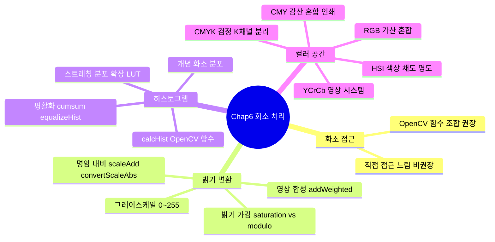

---

## 6.1 영상 화소의 접근

> 영상처리를 아주 간단하게 말하면, **2차원 데이터에 대한 행렬 연산**이다.
> OpenCV API도 `numpy.ndarray` 객체를 기반으로 영상 데이터를 처리한다.

### 화소(행렬 원소) 접근 방법

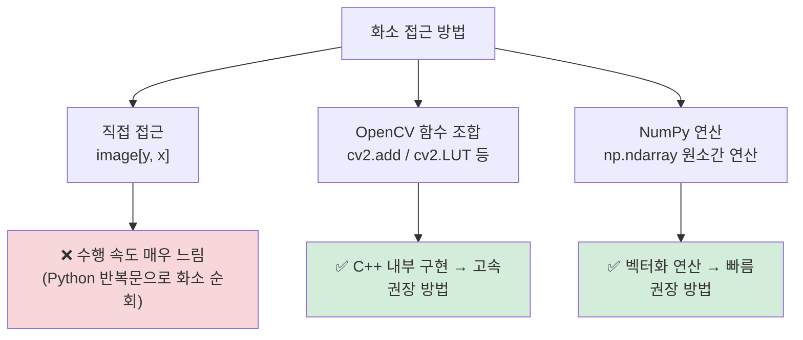

| 접근 방법 | 예시 | 속도 | 권장 여부 |
| --------- | ---- | ---- | --------- |
| 직접 인덱싱 | `image[y, x] = 255` | 매우 느림 | ❌ 비권장 |
| OpenCV 함수 | `cv2.add(image, 100)` | 빠름 | ✅ 권장 |
| NumPy 연산 | `image + 100` | 빠름 | ✅ 권장 |

> 행렬 화소에 직접 접근하는 경우 수행 속도가 매우 느리므로,
> **OpenCV 함수 조합** 또는 **ndarray 원소 간 연산**으로 구현하는 것을 권장한다.

---

## 6.2 화소 밝기 변환

### 6.2.1 그레이스케일(명암도) 영상

> 단일 채널 영상을 **그레이스케일(gray-scale) 영상** 또는 **명암도 영상**이라 한다.

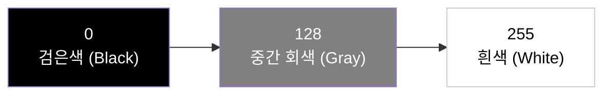

| 화소값 | 밝기 |
| ------ | ---- |
| `0` | 완전한 검정 |
| `1 ~ 127` | 어두운 회색 |
| `128` | 중간 회색 |
| `129 ~ 254` | 밝은 회색 |
| `255` | 완전한 흰색 |

---

### 6.2.3 영상 밝기의 가감 연산

> 화소에 상숫값을 **더하면 밝아지고**, **빼면 어두워진다**.
> 최댓값(255)에서 화소값을 빼면 **반전 영상**이 만들어진다.

#### OpenCV(Saturation) vs NumPy(Modulo) 차이

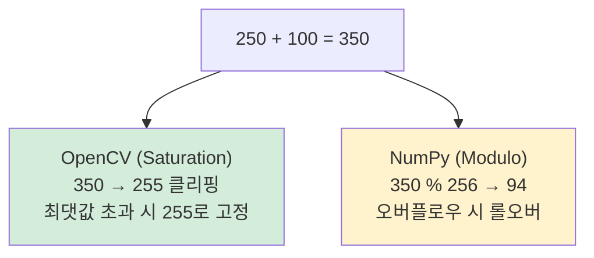

| 방식 | 동작 | 결과 (250 + 100) | 영상 처리에 적합 |
| ---- | ---- | --------------- | --------------- |
| OpenCV `cv2.add()` | Saturation (포화) | `255` | ✅ 권장 |
| NumPy `image + n` | Modulo (나머지) | `94` | ❌ 색 왜곡 주의 |

```python
# 04.bright_dark.py
image = cv2.imread("images/bright.jpg", cv2.IMREAD_GRAYSCALE)

# OpenCV 함수 이용 (saturation 방식) — 권장
dst1 = cv2.add(image, 100)       # 밝기 증가
dst2 = cv2.subtract(image, 100)  # 밝기 감소

# NumPy 이용 (modulo 방식) — 색 왜곡 주의
dst3 = image + 100   # 오버플로우 시 롤오버
dst4 = image - 100   # 언더플로우 시 롤오버
```

> 영상 밝기 조절에는 반드시 **OpenCV 함수**를 사용해야 직관적이고 안전하다.

---

### 6.2.4 행렬 덧셈 및 곱셈을 이용한 영상 합성

> 두 영상을 단순히 `cv2.add()`로 합산하면 255를 초과하는 화소가 흰색(255)으로 포화되어
> 영상 합성이 제대로 되지 않는다. **가중 합산**을 사용해야 한다.

#### 영상 합성 공식

$$dst(y,x) = image_1(y,x) \times \alpha + image_2(y,x) \times \beta$$

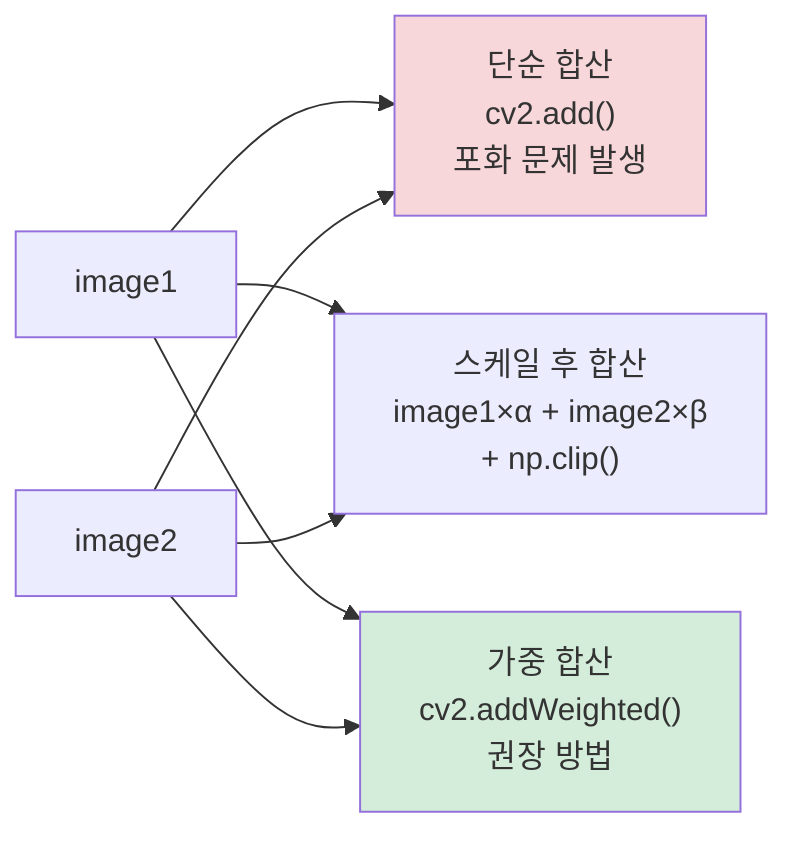

```python
# 05.image_synthesis.py
alpha, beta = 0.6, 0.7

add_img1 = cv2.add(image1, image2)               # ❌ 포화 문제 발생

add_img2 = cv2.add(image1 * alpha, image2 * beta)
add_img2 = np.clip(add_img2, 0, 255).astype(np.uint8)  # 수동 포화 처리

add_img3 = cv2.addWeighted(image1, alpha, image2, beta, 0)  # ✅ 권장
```

| 방법 | 함수 | 특징 |
| ---- | ---- | ---- |
| 단순 합산 | `cv2.add()` | 포화 문제 발생 — 비권장 |
| 스케일 후 합산 | `image*α + image*β` + `np.clip()` | 수동 포화 처리 필요 |
| 가중 합산 | `cv2.addWeighted()` | 내부적으로 포화 처리 — **권장** |

---

### 6.2.5 명암 대비

> **명암 대비(Contrast)**: 밝은 부분과 어두운 부분의 차이가 클수록 대비가 높아 또렷한 영상이 된다.

- 대비 **증가**: 1.0 이상의 값을 곱함
- 대비 **감소**: 1.0 이하의 값을 곱함

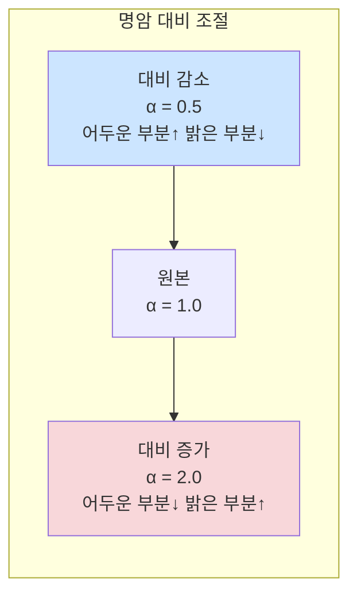

#### cv2.addWeighted를 활용한 명암 대비 조절

```python
# 06.contrast.py
noimage = np.zeros(image.shape[:2], image.dtype)  # 검은 빈 도화지 (더미 영상)
avg = cv2.mean(image)[0] / 2.0  # 영상 화소 평균의 절반

dst1 = cv2.scaleAdd(image, 0.5, noimage)              # 대비 감소
dst2 = cv2.scaleAdd(image, 2.0, noimage)              # 대비 증가
dst3 = cv2.addWeighted(image, 0.5, noimage, 0, avg)   # 대비 감소 + 밝기 보정
dst4 = cv2.addWeighted(image, 2.0, noimage, 0, -avg)  # 대비 증가 + 밝기 보정
```

> `cv2.scaleAdd`, `cv2.addWeighted`는 두 영상을 합성하는 함수지만,
> 위 코드에서는 단일 영상 대비 조절을 위해 **더미 영상(noimage)을 억지로 끼워 넣은 꼼수**이다.

#### 더 나은 방법 — cv2.convertScaleAbs

```python
# 더미 영상(noimage) 없이 구현하는 더 좋은 방법
dst1 = cv2.convertScaleAbs(image, alpha=0.5, beta=0)     # 대비 감소
dst2 = cv2.convertScaleAbs(image, alpha=2.0, beta=0)     # 대비 증가
dst3 = cv2.convertScaleAbs(image, alpha=0.5, beta=avg)   # 대비 감소 + 밝기 보정
dst4 = cv2.convertScaleAbs(image, alpha=2.0, beta=-avg)  # 대비 증가 + 밝기 보정
```

| 함수 | 수식 | 비고 |
| ---- | ---- | ---- |
| `cv2.scaleAdd(src, α, src2)` | `\|src × α + src2\|` | 두 번째 영상 필수 |
| `cv2.addWeighted(src1, α, src2, β, γ)` | `src1×α + src2×β + γ` | 두 번째 영상 필수 |
| `cv2.convertScaleAbs(src, alpha, beta)` | `\|src × α + β\|` → uint8 | **단일 영상으로 가능 — 권장** |

---

## 6.3 히스토그램

### 6.3.1 히스토그램 개념

> 영상처리에서 히스토그램은 **화소 밝기값의 분포**를 나타내는 지표이다.
> 이 분포를 이해하면 영상의 특성(어두움/밝음/대비)을 판단할 수 있다.

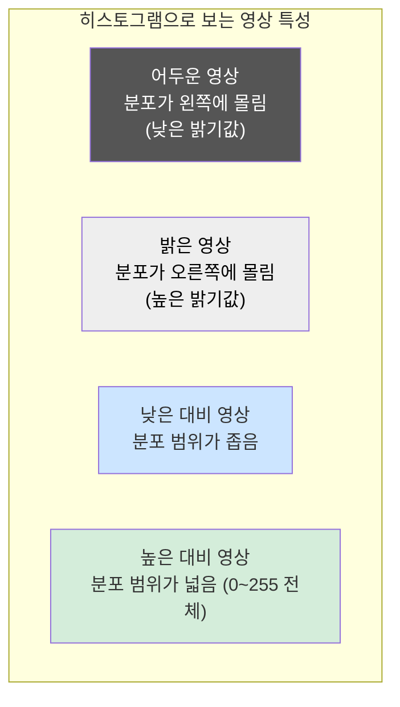

| 히스토그램 분포 특성 | 영상 특성 |
| ------------------- | --------- |
| 낮은 밝기값에 밀집 | 전체적으로 어두운 영상 |
| 높은 밝기값에 밀집 | 전체적으로 밝은 영상 |
| 좁은 범위에 밀집 | 낮은 대비 (흐릿한 영상) |
| 0~255 전체에 고루 분포 | 높은 대비 (선명한 영상) |

#### 히스토그램 직접 계산 (`08.calc_histogram.opencv.py`)

```python
def calc_histo(image, hsize, ranges=[0, 256]):
    hist = np.zeros((hsize, 1), np.float32)
    gap = ranges[1] / hsize  # 계급 간격 (예: 256/64 = 4)

    for i in (image / gap).flat:  # .flat → 2D 배열을 1D로 순회
        hist[int(i)] += 1         # 해당 bin(계급)에 빈도 누적
    return hist
```

---

### 6.3.3 OpenCV 함수 활용

#### cv2.calcHist()

```
cv2.calcHist(images, channels, mask, histSize, ranges [, hist [, accumulate]])
```

| 인수 | 설명 |
| ---- | ---- |
| `images` | 원본 배열들 — `CV_8U`, `CV_32F` 형, 크기가 같아야 함 |
| `channels` | 히스토그램 계산에 사용되는 채널 목록 (예: `[0]`) |
| `mask` | 특정 영역만 계산할 마스크 행렬 (없으면 `None`) |
| `histSize` | 각 차원의 bin(계급) 개수 (예: `[256]`) |
| `ranges` | 히스토그램 범위 (예: `[0, 256]`) |
| `accumulate` | 누적 플래그 — 여러 배열에서 단일 히스토그램을 구할 때 |

```python
# 09.calc_histogram_opencv.py
image = cv2.imread("images/bright.jpg", cv2.IMREAD_GRAYSCALE)

bins, ranges = [256], [0, 256]
hist = cv2.calcHist([image], [0], None, bins, ranges)
# hist.shape → (256, 1)  ← 각 밝기값(0~255)의 화소 빈도수
```

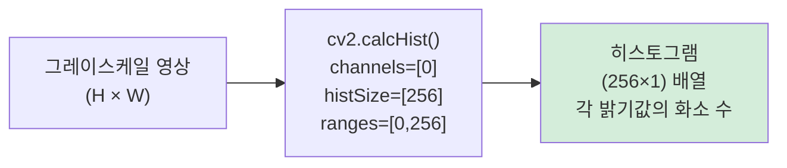

---

### 6.3.4 히스토그램 스트레칭

> 히스토그램 분포가 **좁아서 대비가 낮은 영상**의 화질을 개선하는 알고리즘이다.
> 분포를 0~255 전체 범위로 늘린다.

$$새\ 화소값 = \frac{화소값 - low}{high - low} \times 255$$

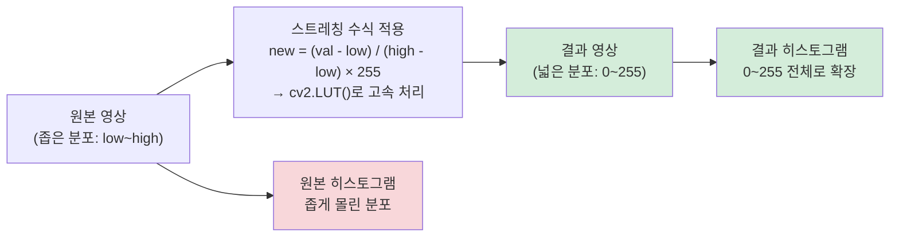

```python
# 11.histogram_stretching.py
bsize, ranges = [64], [0, 256]
hist = cv2.calcHist([image], [0], None, bsize, ranges)

bin_width = ranges[1] / bsize[0]           # 한 계급 너비 (예: 256/64 = 4)
low  = search_value_idx(hist, 0) * bin_width         # 최저 화소값
high = search_value_idx(hist, bsize[0]-1) * bin_width  # 최고 화소값

# 룩업 테이블(LUT) 생성
idx = np.arange(0, 256)
idx = (idx - low) / (high - low) * 255  # 스트레칭 수식 적용
idx[0:int(low)] = 0
idx[int(high+1):] = 255

dst = cv2.LUT(image, idx.astype("uint8"))  # LUT로 고속 변환
```

> `cv2.LUT(image, lut)`: 영상의 모든 화소값을 **룩업 테이블(LUT)의 첨자로 사용**하여
> 결과값을 한 번에 가져오는 고속 변환 함수이다. 직접 반복문보다 훨씬 빠르다.

---

### 6.3.5 히스토그램 평활화

> **평활화(Equalization)**: 히스토그램 분포가 전체 범위에 걸쳐 **균등해지도록** 변환하여 대비를 높인다.

#### 스트레칭 vs 평활화 비교

| 알고리즘 | 적용 대상 | 원리 |
| -------- | --------- | ---- |
| **히스토그램 스트레칭** | 분포 범위가 좁은 영상 | 최솟값→0, 최댓값→255 선형 확장 |
| **히스토그램 평활화** | 특정 밝기에 치우친 영상 | 누적 분포함수(CDF)를 이용해 균등 분포로 변환 |

#### 평활화 전체 과정

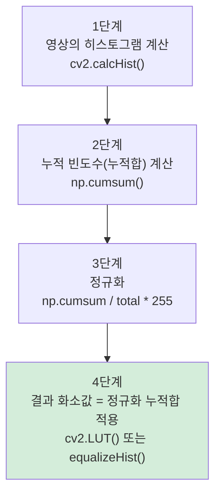

```python
# 12.histogram_equalize.py
bins, ranges = [256], [0, 256]
hist = cv2.calcHist([image], [0], None, bins, ranges)

# 방법 1: 직접 구현
accum_hist = np.zeros(hist.shape[:2], np.float32)
accum_hist[0] = hist[0]
for i in range(1, hist.shape[0]):
    accum_hist[i] = accum_hist[i-1] + hist[i]

accum_hist = (accum_hist / sum(hist)) * 255          # 정규화
dst1 = np.array([[accum_hist[val] for val in row] for row in image], dtype=np.uint8)

# 방법 2: NumPy + cv2.LUT 사용 (고속)
accum_hist = np.cumsum(hist)
cv2.normalize(accum_hist, accum_hist, 0, 255, cv2.NORM_MINMAX)
dst1 = cv2.LUT(image, accum_hist.astype(np.uint8))

# 방법 3: OpenCV 함수 (가장 간단)
dst2 = cv2.equalizeHist(image)
```

| 구현 방법 | 코드 | 속도 | 권장 |
| --------- | ---- | ---- | ---- |
| Python 반복문 | `for val in row` | 매우 느림 | ❌ |
| NumPy + cv2.LUT | `np.cumsum()` + `cv2.LUT()` | 빠름 | ✅ |
| OpenCV 내장 함수 | `cv2.equalizeHist()` | 가장 빠름 | ✅ 권장 |

---

## 6.4 컬러 공간 변환

### 6.4.1 컬러 및 컬러 공간

> **컬러 공간(Color Space)**: 색 표시계(RGB, CMY, HSI, YUV 등)의 모든 색을 3차원 좌표로 표현한 것.
> 서로 다른 컬러 공간 간에 수식을 통해 변환이 가능하다.

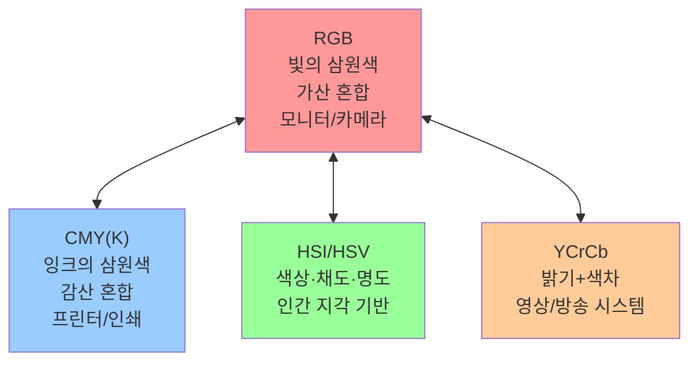

---

### 6.4.2 RGB 컬러 공간

> **빛의 삼원색**: 빨강(Red), 초록(Green), 파랑(Blue)
> 원색을 섞을수록 밝아지므로 **가산 혼합(Additive Mixture)**이라 한다.

| 색상 | R | G | B |
| ---- | - | - | - |
| 검정 (Black) | 0 | 0 | 0 |
| 흰색 (White) | 255 | 255 | 255 |
| 빨강 (Red) | 255 | 0 | 0 |
| 초록 (Green) | 0 | 255 | 0 |
| 파랑 (Blue) | 0 | 0 | 255 |
| 노랑 (Yellow) | 255 | 255 | 0 |
| 청록 (Cyan) | 0 | 255 | 255 |
| 자홍 (Magenta) | 255 | 0 | 255 |

> ⚠️ **OpenCV는 BGR 순서**로 저장한다. RGB와 채널 순서가 반대임에 주의!

---

### 6.4.3 CMY(K) 컬러 공간

> **잉크(물감)의 삼원색**: 청록(Cyan), 자홍(Magenta), 노랑(Yellow)
> 색을 섞을수록 어두워지므로 **감산 혼합(Subtractive Mixture)**이라 한다.
> 프린터/인쇄기에서 사용하는 컬러 공간.

$$CMY = 255 - RGB$$

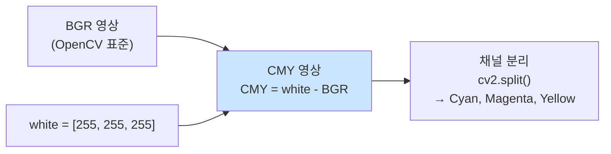

```python
# 13.convert_CMY.py
BGR_img = cv2.imread("images/color_model.jpg", cv2.IMREAD_COLOR)

white = np.array([255, 255, 255], np.uint8)
CMY_img = white - BGR_img                         # CMY 변환
Yellow, Magenta, Cyan = cv2.split(CMY_img)        # 채널 분리
```

#### CMYK 변환 — K(Black) 채널 추가

> CMYK는 CMY에서 경제적 이유로 **검정(K: Key) 채널을 별도로 분리**한 모델이다.
> 잉크 3색 혼합으로 검정을 만들면 비싸고 품질이 낮아지기 때문.

$$K = \min(C, M, Y)$$
$$C_{cmyk} = C - K, \quad M_{cmyk} = M - K, \quad Y_{cmyk} = Y - K$$

```python
# 14.convert_CMYK.py
white = np.array([255, 255, 255], np.uint8)
CMY_img = white - BGR_img
CMY = cv2.split(CMY_img)

black = cv2.min(CMY[0], cv2.min(CMY[1], CMY[2]))  # K채널: 3채널 중 최솟값
Yellow, Magenta, Cyan = CMY - black                # CMYK 분리
```

| 컬러 공간 | 채널 수 | 특징 |
| --------- | ------- | ---- |
| CMY | 3채널 | 이론적 인쇄 모델 |
| CMYK | 4채널 | 실용적 인쇄 모델 (검정 별도) |

---

### 6.4.4 HSI 컬러 공간

> 인간이 색을 인지하는 방식을 반영한 컬러 공간.
> **원뿔(Cone) 모양의 3차원 좌표계**로 모형화한다.

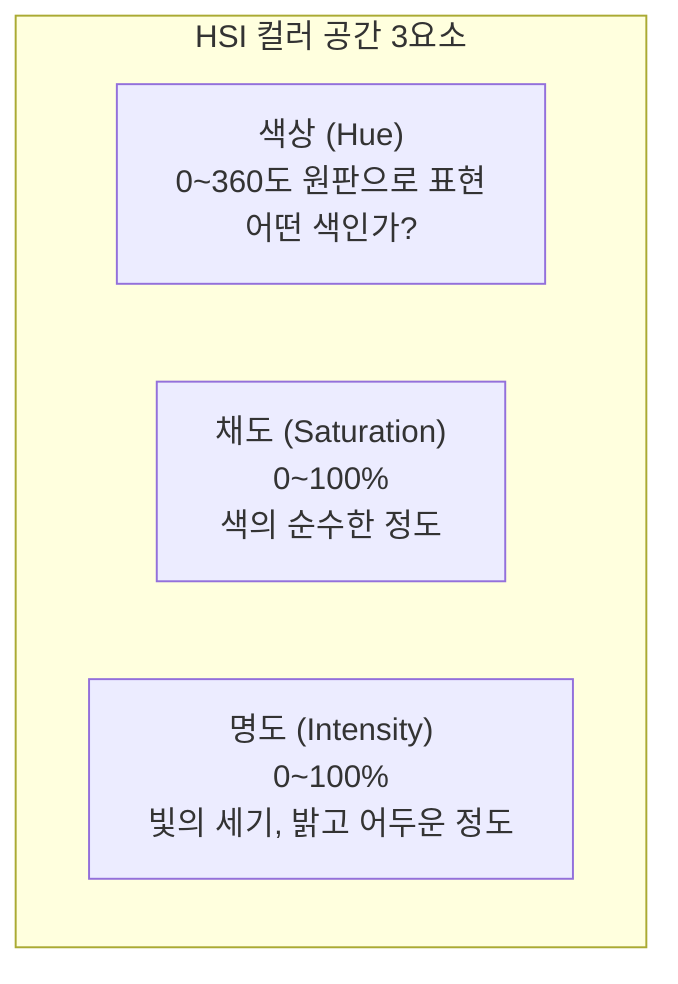

#### 색상(Hue) 원판

```
       빨강 (0°)
    다홍(300°)  노랑(60°)
파랑(240°)         녹색(120°)
    청록(180°)
```

| 색상 | Hue 각도 |
| ---- | -------- |
| 빨강 (Red) | 0° |
| 노랑 (Yellow) | 60° |
| 초록 (Green) | 120° |
| 청록 (Cyan) | 180° |
| 파랑 (Blue) | 240° |
| 다홍 (Magenta) | 300° |

#### 채도(Saturation)

| 채도 값 | 의미 |
| ------- | ---- |
| 0 (원판 중심) | 무채색 (흰색/회색/검정) |
| 100 (원판 가장자리) | 순색 (가장 선명한 색) |

#### 명도(Intensity/Value)

| 명도 값 | 의미 |
| ------- | ---- |
| 0 (원뿔 맨 아래) | 검은색 |
| 100 (원뿔 맨 위) | 흰색 |

#### RGB → HSI 변환 수식

$$H = \cos^{-1}\left(\frac{\frac{1}{2}[(R-G)+(R-B)]}{\sqrt{(R-G)^2+(R-B)(G-B)}}\right)$$

$$S = 1 - \frac{3}{R+G+B} \times \min(R, G, B)$$

$$I = \frac{R + G + B}{3}$$

```python
# 15.conver_HSV.py
# OpenCV에서는 HSV (HSI와 유사) 변환 함수 제공
hsv_img = cv2.cvtColor(bgr_img, cv2.COLOR_BGR2HSV)
h, s, v = cv2.split(hsv_img)
```

> OpenCV에서는 **HSV**(Value 대신 명도) 를 주로 사용하며 `cv2.COLOR_BGR2HSV`로 변환한다.
> HSI와 HSV는 명도 계산 방식이 약간 다르지만 개념은 동일하다.

---

### 6.4.5 기타 컬러 공간

#### YCrCb 컬러 공간

> 영상 시스템에서 사용되는 컬러 공간.
> **Y (휘도, 밝기)** 와 **Cr, Cb (색차)** 로 구성된다.

| 채널 | 의미 | 활용 |
| ---- | ---- | ---- |
| Y | 밝기 (Luma) | 흑백 TV와 호환 가능 |
| Cr | 빨간색 색차 | 색상 정보 |
| Cb | 파란색 색차 | 색상 정보 |

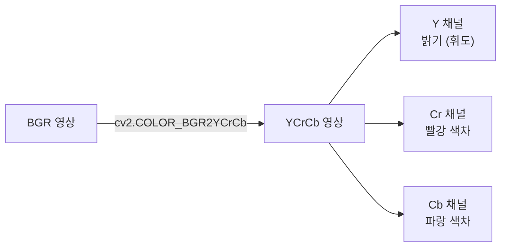

#### OpenCV 주요 컬러 공간 변환 코드

| 변환 방향 | 변환 코드 |
| --------- | --------- |
| BGR → 그레이스케일 | `cv2.COLOR_BGR2GRAY` |
| BGR → HSV | `cv2.COLOR_BGR2HSV` |
| BGR → YCrCb | `cv2.COLOR_BGR2YCrCb` |
| BGR → RGB | `cv2.COLOR_BGR2RGB` |
| BGR → LAB | `cv2.COLOR_BGR2LAB` |

```python
# 컬러 공간 변환 예시
gray   = cv2.cvtColor(image, cv2.COLOR_BGR2GRAY)
hsv    = cv2.cvtColor(image, cv2.COLOR_BGR2HSV)
ycrcb  = cv2.cvtColor(image, cv2.COLOR_BGR2YCrCb)
rgb    = cv2.cvtColor(image, cv2.COLOR_BGR2RGB)  # Matplotlib 출력 시 사용
```

---

## 핵심 함수 정리

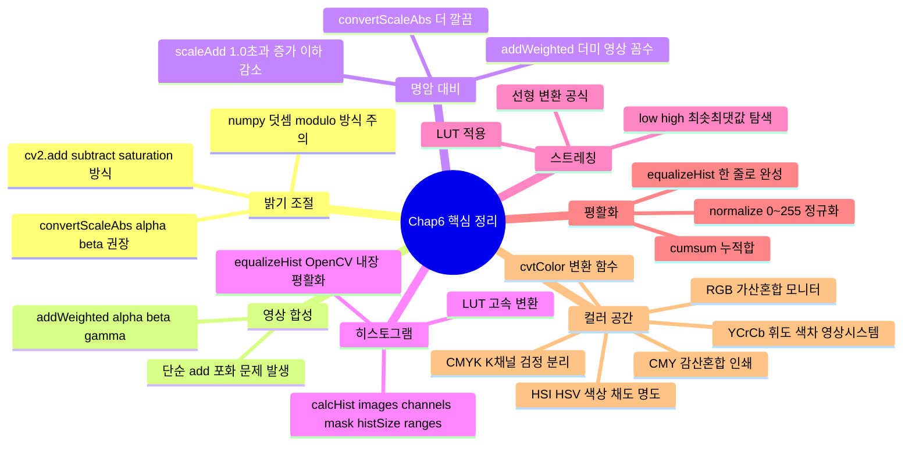

---

## 중요 포인트 요약

| 주제 | 핵심 주의사항 |
| ---- | ------------- |
| **Saturation vs Modulo** | `cv2.add(uint8)`: 255 초과 → 255 클리핑 / `numpy +`: 오버플로우 시 롤오버 |
| **영상 합성** | `cv2.add()` 단순 합산 시 포화 문제 → `cv2.addWeighted()` 사용 권장 |
| **명암 대비** | 더미 영상 꼼수 불필요 → `cv2.convertScaleAbs(alpha, beta)` 사용 권장 |
| **히스토그램 계산** | Python 반복문 직접 구현은 느림 → `cv2.calcHist()` 사용 필수 |
| **LUT 변환** | `cv2.LUT(image, lut)`: 화소값을 인덱스로 사용해 변환 — 반복문보다 훨씬 빠름 |
| **스트레칭 vs 평활화** | 스트레칭: 분포 범위가 좁을 때 / 평활화: 특정 값에 치우쳤을 때 |
| **equalizeHist** | `cv2.equalizeHist()`는 그레이스케일 단일 채널에만 적용 가능 |
| **BGR 순서 주의** | OpenCV는 **BGR**, RGB가 아님 — Matplotlib 출력 시 `COLOR_BGR2RGB` 변환 필수 |
| **CMY 변환** | `CMY = 255 - BGR` (white - BGR_img) |
| **CMYK K채널** | `K = cv2.min(C, M, Y)` — 세 채널 중 최솟값 |
| **HSV vs HSI** | OpenCV는 HSV 사용 (`cv2.COLOR_BGR2HSV`) — H: 0~180, S: 0~255, V: 0~255 |
