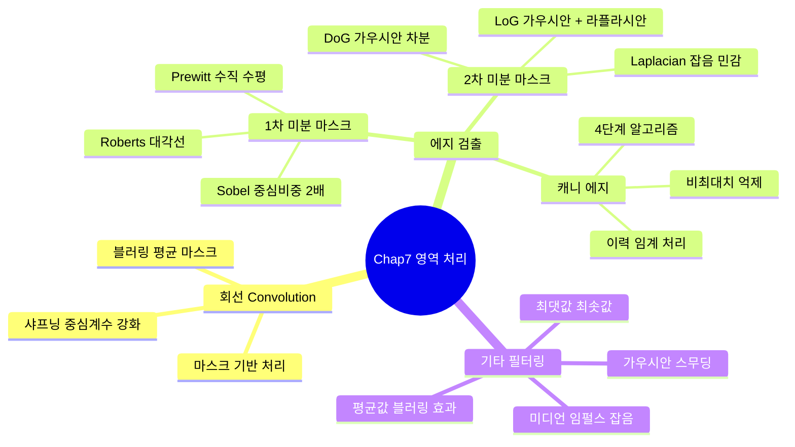

[← OpenCV-Python 학습 목차로 돌아가기](../README.md)

# 7. 영역 처리 (Processing Domain)

> 영상처리와 관련된 분야의 논문들을 읽다 보면, 공간 영역(spatial domain)이나 주파수 영역(frequency domain)이라는 표현이 자주 등장한다.

> 공간 영역에서의 처리는 대부분 '마스크' 혹은 '윈도우'라 불리는 커널(kernel)을 이용해서 회선(convolution)을 수행함으로써 이루어진다. 회선은 커널만 구성되면 쉽게 필터링을 수행하기 때문에 보통 실행 결과만 보고, 기본 수행 과정을 무시하는 경향이 있다.

> 이렇게 회선 과정에 대한 명확한 이해가 없으면 실제 현장에서 응용을 개발하면서 입력 영상의 상황에 적합한 필터링을 하고자 할 때, 가장 적합한 마스크를 쉽게 구성하지 못할 수 있다.

> 회선의 과정에 대한 명확한 이해와 마스크 계수들의 상관관계를 잘 파악한다면, 실제 응용에서 필요로 하는 상황에 맞는 필터링을 쉽게 떠올릴 수 있을 것이다. 또한, 그러한 필터링을 구현하는 마스크의 계수의 구성도 어렵지 않게 해결할 수 있다.

> 이 장에서는 공간 영역의 개념과 공간 영역을 기반으로 처리할 수 있는 필터링에 대해서 기술한다. 또한, 마스크 기반의 에지 검출 방법과 형태학을 기반으로 하는 모폴로지(morphology)에 대해서 자세히 설명한다.

## 목차

- [7.1 회선(Convolution)](#71-회선convolution)
  - [7.1.1 공간 영역의 개념과 회선](#711-공간-영역의-개념과-회선)
  - [7.1.2 블러링](#712-블러링)
  - [7.1.3 샤프닝](#713-샤프닝)
- [7.2 에지 검출](#72-에지-검출)
  - [7.2.1 1차 미분 마스크](#721-1차-미분-마스크)
  - [7.2.2 2차 미분 마스크](#722-2차-미분-마스크)
  - [7.2.3 캐니 에지 검출](#723-캐니-에지-검출)
- [7.3 기타 필터링](#73-기타-필터링)
  - [7.3.1 최댓값/최솟값 필터링](#731-최댓값최솟값-필터링)
  - [7.3.2 평균값 필터링](#732-평균값-필터링)
  - [7.3.3 미디언 필터링](#733-미디언-필터링)
  - [7.3.4 가우시안 스무딩 필터링](#734-가우시안-스무딩-필터링)
- [핵심 함수 정리](#핵심-함수-정리)
- [중요 포인트 요약](#중요-포인트-요약)

---

## Chapter 7 전체 구조



---

## 7.1 회선(Convolution)

### 7.1.1 공간 영역의 개념과 회선

> 의미가 조금은 복합적인 용어는 바로 '영역'이라는 단어이다.
> 영상 처리에서 '영역'에 대한 하나의 의미는 두 개의 다른 범위(domain)의 구분이다. 바로 이번 장에서 배울 공간 영역(spatial domain)이며, 다른 하나가 9장에서 배우게 될 주파수 영역(frequency domain)이다.
> 여기서 말하는 공간 영역은 영상들이 다루어지는 화소 공간을 의미한다. 예로서, x, y축의 2차원 공간을 말한다.

> 영역에 대한 다른 의미는 영역 기반 처리(area based processing)라는 표현에서 사용하는 영역이다. 이것은 앞 장에서 배운 화소 기반 처리와 상반되는 의미로서, 화소점 하나의 개념이라기 보다는 화소가 모인 특정 범위(영역)의 화소 배열을 의미한다.

> 즉, 화소 기반 처리가 화소값 각각에 대해 여러 가지 연산을 수행하는 것이라면, 영역 기반 처리는 마스크(mask)라 불리는 규정된 영역을 기반으로 연산이 수행된다. 이러한 이유에서 영역 기반 처리를 마스크 기반 처리라고도 한다.

**마스크 기반 처리**

> 마스크 기반 처리는 마스크 내의 원소값과 공간 영역에 있는 입력 영상의 화소값들을 대응되게 곱하여 출력 화소값을 계산하는 것을 말한다. 이러한 처리를 **모든 출력 화소값에 대해 이동하면서 수행하는 것을 회선(convolution)이라고 한다.** 이때, 입력 영상에 곱해지는 이 마스크는 커널(kernel), 윈도우(window), 필터(filter) 등의 이름으로도 불린다.

```
회선(Convolution) 수행 과정:

  입력 영상 (일부)        마스크 (3x3)         출력 화소 계산
  ┌──┬──┬──┬──┐         ┌────┬────┬────┐
  │f1│f2│f3│  │         │ m1 │ m2 │ m3 │         출력 O(i,j) =
  ├──┼──┼──┼──┤    ×    ├────┼────┼────┤    =    f1·m1 + f2·m2 + f3·m3
  │f4│f5│f6│  │         │ m4 │ m5 │ m6 │         f4·m4 + f5·m5 + f6·m6
  ├──┼──┼──┼──┤         ├────┼────┼────┤         f7·m7 + f8·m8 + f9·m9
  │f7│f8│f9│  │         │ m7 │ m8 │ m9 │
  └──┴──┴──┴──┘         └────┴────┴────┘

  ↳ 마스크를 한 화소씩 이동(slide)하면서 모든 출력 화소에 반복 수행
```

### 7.1.2 블러링

> 디지털 카메라로 사진을 찍다보면, 초점이 맞지 않을 때가 종종 있다. 이 경우에 찍힌 사진은 흐려져서 사용하지 못하게 된다. 어떤 경우에는 이러한 현상을 이용해서 영상의 디테일한 부분을 제거하는 아웃 포커싱(out focusing)이라는 기법으로 사진을 찍기도 한다.

> 블러링은 영상에서 화소값이 급격하게 변하는 부분들을 감소시켜 점진적으로 변하게 함으로써 영상이 전체적으로 부드러운 느낌이 나게 하는 기술이다.

> 어떻게 하면 화소값이 급격히 변화하는 것을 점진적으로 변하게 할 수 있을까? 정답은 커널 마스크를 이용해서 회선을 수행하는 것이다. 마스크를 모든 원소의 값이 같게 구성하여 회선을 수행하면 블러링이 적용된다. 이때 마스크의 전체 원소의 합이 1이 되어야 입력 영상의 밝기가 출력 영상에서 유지된다.

> O*{22}와 O*{23}의 계산에서 9개의 입력 영상 화소 중에서 6개 화소가 같다. 즉, 이웃하는 두 출력 화소는 마스크 크기 내에서 입력 화소의 2/3가 공통 부분이다. 그리고 블러링 마스크의 원소값이 모두 같기 때문에 입력 화소는 같은 비율로 출력 화소에 반영된다. 따라서 입력 화소의 공통부분이 같은 비율로 반영되기 때문에 출력 영상에서 **이웃하는 화소들이 비슷한 값을 같게 된다.**

```
블러링 마스크 (3x3 평균 마스크):

  ┌──────┬──────┬──────┐
  │ 1/9  │ 1/9  │ 1/9  │
  ├──────┼──────┼──────┤     전체 원소의 합 = 1  (밝기 유지)
  │ 1/9  │ 1/9  │ 1/9  │     모든 원소 값이 동일 (균등 평균)
  ├──────┼──────┼──────┤
  │ 1/9  │ 1/9  │ 1/9  │
  └──────┴──────┴──────┘

  → 마스크가 클수록 (5x5, 7x7 ...) 블러링 효과 강해짐
```

> `01.bluring.py` 참조

### 7.1.3 샤프닝

> 샤프닝은 입력 화소에서 이웃 화소끼리 차이를 크게 되도록 출력 화소를 만들어서 날카로운 느낌이 나게 만드는 것이다. 이렇게 함으로써 영상의 세세한 부분을 강조할 수 있으며, 경계 부분에서 명암 대비가 증가되는 효과를 낼 수 있다.

> 블러링에서 마스크의 원소값을 모두 같게 했다면, 샤프닝에서는 마스크 원소들의 값 차이가 커지도록 구성하면 된다.

> 입력 영상의 화소와 출력 영상의 화소가 마스크의 중심 위치에서 대응된다. 이 마스크의 중심 위치의 계수를 중심계수라 한다. 마스크 중심 계수의 비중이 크면 출력 영상은 입력 영상의 형태를 유지하게 된다. 추가적으로 주변 계수들은 중심계수와 값의 차이를 크게 만들면 샤프닝이 수행된다.

> 따라서 중심계수는 1보다 훨씬 크게 구성하며, 주변 화소는 비중을 감소시킬 수 있도록 음수 값을 갖게 한다. 그리고 전체 원소의 합은 1이 되도록 구성하면 샤프닝 필터가 완성된다.

```
샤프닝 마스크 예시 (3x3):

  mask1 (4방향 강조):        mask2 (8방향 강조):
  ┌────┬────┬────┐           ┌────┬────┬────┐
  │  0 │ -1 │  0 │           │ -1 │ -1 │ -1 │
  ├────┼────┼────┤           ├────┼────┼────┤
  │ -1 │  5 │ -1 │           │ -1 │  9 │ -1 │
  ├────┼────┼────┤           ├────┼────┼────┤
  │  0 │ -1 │  0 │           │ -1 │ -1 │ -1 │
  └────┴────┴──── ┘           └────┴────┴────┘
  합 = 0+(-1)+0               합 = (-1)×8 + 9
      +(-1)+5+(-1)                = -8 + 9 = 1
      +0+(-1)+0 = 1
  중심계수 5 (강조)          중심계수 9 (더 강한 강조)
  상하좌우 음수              8방향 모두 음수
```

> `02.sharpening.py` 참조

## 7.2 에지 검출

> 영상처리의 관점에서 에지, 가장자리, 모서리라는 뜻은 어떤 물체의 "윤곽선 혹은 경계선" 이라는 의미를 가질 수 있다. 이 윤곽선은 객체에서 크기, 위치, 모양을 인지할 수 있으며, 그 방향성을 탐지할 수 있다. 따라서 에지 검출은 영상처리에서 아주 중요하며 기본적인 처리 분야로 널리 다루어진다.

> 영상처리에서 에지는 "화소값이 급격하게 변화하는 부분"으로 정의할 수 있다. 즉, 화소값이 높은 값에서 낮은 값으로 변하거나, 혹은 낮은 값에서 높은 값으로 변하는 부분을 에지라 한다.

> 에지 검출(edge detection)이란 에지에 해당하는 화소값들을 찾는 과정이다. 그 방법으로는 가장 간단하게 이웃하는 화소의 차분을 이용하여 그 차분이 특정 임계값 이상인 곳을 에지로 지정하는 것이다. 다른 방법으로는 마스크를 이용하여 에지를 계산할 수도 있는데, 1차 미분 마스크나 2차 미분 마스크를 사용하여 회선을 수행하는 것이다.

### 7.2.1 1차 미분 마스크

> 이산된 데이터인 화소에 대한 기울기는 근사하여 계산한다.
> 먼저, 2차원 공간상의 한 화소에서 수평 방향과 수직 방향으로 각각 미분한다. 이것을 보통 편미분(partial derivative)이라 한다. 그리고 각 방향의 편미분을 한 화소 단위($dx=1, dy=1$)의 차분으로 근사한다. 다음으로 각 방향의 차분을 이용해서 기울기의 크기를 계산한다. 이 크기(magnitude)가 에지의 강도가 된다.

> 여기서 계산 복잡도를 줄이기 위해서 제곱과 제곱근(sqrt) 대신에 절대값을 사용하기도 한다. 또한, 역탄젠트(arctan) 함수에 가로 방향과 세로 방향 차분을 적용하면 에지의 방향을 계산할 수도 있다.

> 이러한 1차 미분 공식을 영상에 구현하는 쉬운 방법이 1차 미분 마스크로 회선을 적용하는 것이다. 3x3 마스크에서 입력 화소의 위치를 한번 생각해 보자. 마스크의 중심 위치의 입력 화소가 $f(x,y)$일 때,
> 마스크 원소를 "(a) y 방향 마스크"와 같이 $f(x,y), f(x,y+1)$ 위치에 -1과 1을 구성하여 회선을 수행하면, 회선의 내부 계산 수식이 $f(x,y+1)-f(x,y)$ 이 되어서 $y$ 방향 미분인 $G_y$ 와 같은 결과가 된다. 또한 "(b) x 방향 마스크"와 같이 $f(x,y), f(x+1,y)$ 위치에 -1과 1을 구성하여 회선을 수행하면, 회선 수식이 $f(x+1,y)-f(x,y)$이 되어서 $x$ 방향 미분인 $G_x$가 적용된다.

> 이 외에도 다양한 1차 미분 마스크가 있으며 대표적으로 로버츠(Roberts), 프리윗(Prewitt), 소벨(Sobel) 등이 있다.

**1. 로버츠(Roberts) 마스크**

> 로버츠 마스크는 대각선 방향으로 1과 -1을 배치하여 구성한다. 나머지 원소의 값이 모두 0이어서 다른 1차 미분 마스크에 비해서 계산이 단순하다. 그리고 한 번만 차분을 계산하기 때문에 차분의 크기가 작고, 이로 인해서 경계가 확실한 에지만을 추출하며, 잡음에 매우 민감하다.

```
Roberts 마스크:

  대각선 방향 마스크1 (↗):   대각선 방향 마스크2 (↖):
  ┌────┬────┬────┐            ┌────┬────┬────┐
  │ -1 │  0 │  0 │            │  0 │  0 │ -1 │
  ├────┼────┼────┤            ├────┼────┼────┤
  │  0 │  1 │  0 │            │  0 │  1 │  0 │
  ├────┼────┼────┤            ├────┼────┼────┤
  │  0 │  0 │  0 │            │  0 │  0 │  0 │
  └────┴────┴────┘            └────┴────┴────┘
  G1 = f(x,y) - f(x-1,y-1)   G2 = f(x,y) - f(x-1,y+1)

  에지 강도: |G| = |G1| + |G2|  (절대값 합산)
  특징: 단순, 계산 빠름, 잡음 민감, 에지 강도 약함
```

> `03.edge_roberts.py` 결과, 대각선 방향의 에지가 잘 검출되지만, 비교적 에지의 강도가 약하다.

---

**2. 프리윗(Prewitt) 마스크**

> 프리윗 마스크는 로버츠 마스크의 단점을 보완하기 위해 고안되었다. 먼저 수직 마스크를 보자. 원소의 배치가 수직 방향으로 구성되어서 수직 마스크라고 하며, 결과 영상에서 에지의 방향도 수직으로 나타난다. 중심계수의 앞과 뒤 화소로 x 방향 차분을 3번 계산한다. 다음 수평 마스크는 중심계수에서 위와 아래의 화소로 y방향의 차분을 3번 계산한다.

> 최종적으로 수직 마스크와 수평 마스크의 회선 결과에 대해서 크기로 영상(에지 강도)을 생성한다. 세 번의 차분을 합하기 때문에 로버츠 연산자에 비해 에지의 강도가 강하며, 수직과 수평 에지를 동등하게 찾는 데 효과적이다.

```
Prewitt 마스크:

  수직 마스크 (Gx):            수평 마스크 (Gy):
  ┌────┬────┬────┐             ┌────┬────┬────┐
  │ -1 │  0 │  1 │             │ -1 │ -1 │ -1 │
  ├────┼────┼────┤             ├────┼────┼────┤
  │ -1 │  0 │  1 │             │  0 │  0 │  0 │
  ├────┼────┼────┤             ├────┼────┼────┤
  │ -1 │  0 │  1 │             │  1 │  1 │  1 │
  └────┴────┴────┘             └────┴────┴────┘
  수직 방향 에지 검출          수평 방향 에지 검출
  (x 방향 차분 × 3)           (y 방향 차분 × 3)

  에지 강도: |G| = sqrt(Gx² + Gy²)  또는  |Gx| + |Gy|
  특징: Roberts보다 에지 강도 강함, 수직/수평 에지 균등 검출
```

> `04.edge_prewitt.py` 참조 — 대각선 방향보다는 수직과 수평 방향의 에지를 잘 검출한다.

---

**3. 소벨(Sobel) 마스크**

> 소벨 마스크는 에지 추출을 위한 가장 대표적인 1차 미분 연산자이다. 마스크의 구성은 프리윗 마스크와 유사하지만, **중심계수의 차분에 대한 비중을 2배로 키운 것**이 특징이다.

```
Sobel 마스크:

  수직 마스크 (Gx):            수평 마스크 (Gy):
  ┌────┬────┬────┐             ┌────┬────┬────┐
  │ -1 │  0 │  1 │             │ -1 │ -2 │ -1 │
  ├────┼────┼────┤             ├────┼────┼────┤
  │ -2 │  0 │  2 │             │  0 │  0 │  0 │
  ├────┼────┼────┤             ├────┼────┼────┤
  │ -1 │  0 │  1 │             │  1 │  2 │  1 │
  └────┴────┴────┘             └────┴────┴────┘
  중심행 계수 ×2               중심열 계수 ×2
  (중심 차분 비중 강화)        (중심 차분 비중 강화)

  특징: Prewitt 대비 중심 차분 비중 2배 → 대각선 방향 에지도 잘 검출
```

> 소벨 마스크도 수직 마스크의 회선 결과와 수평 마스크의 회선 결과의 크기로 구성된다.
> `cv2.Sobel(src, ddepth, dx, dy, ksize)` — OpenCV 제공 함수로 간편하게 사용 가능
> `05.edge_sobel.py` 참조

### 7.2.2 2차 미분 마스크

> 1차 미분 연산자는 밝기가 급격하게 변화하는 영역뿐 아니라 점진적으로 변화하는 부분까지 민감하게 에지를 검출하여 너무 많은 에지가 나타날 수 있다. 이를 보완하는 방법은 1차 미분에서 한 번 더 미분하는 방법인 2차 미분(second order derivative) 연산이 있다.

> 2차 미분 연산자는 변화하는 영역의 중심에 위치한 에지만을 검출하며, 밝기가 점진적으로 변화하는 영역에 대해서는 반응을 보이지 않는다. 대표적인 방법으로는 라플라시안, LoG(Laplacian of Gaussian), DoG(Difference of Gaussian)등 이 있다.

1. 라플라시안 에지 검출
   > 가장 대표적인 2차 미분 연산자로 라플라시안이 있다. 라플라시안은 피에르시몽 라플라스(Pierre-Simon Laplace)라는 프랑스의 수학자 이름을 따서 지은 것이다. 라플라시안은 함수 $f$에 대한 그래디언트의 발산으로 정의되며 수식으로 표현하면 다음과 같다.

$$
\Delta f = \nabla^2 f = \nabla \nabla f
$$

그리고 영상은 2차원 좌표계이기 때문에 2차원 직교좌표계에서 라플라시안 수식은 다음과 같다.

$$
\nabla^2 f = \frac{\partial^2 f}{\partial x^2} + \frac{\partial^2 f}{\partial y^2}
$$

각 항을 디지털 영상의 화소로 근사하여 1차 미분한 결과에 한 번 더 미분을 수행하면 다음과 같이 정리할 수 있다.

$$
\frac{\partial^2 f}{\partial x^2} = \frac{\partial f(x+1, y)}{\partial x} - \frac{\partial f(x, y)}{\partial x}=[f(x+1,y)-f(x,y)]-[f(x,y)-f(x-1,y)]
$$

$$
=f(x+1,y)-2 \cdot f(x,y) + f(x-1,y)
$$

$$
\frac{\partial^2 f}{\partial y^2} = \frac{\partial f(x, y+1)}{\partial y} - \frac{\partial f(x, y)}{\partial y}=[f(x,y+1)-f(x,y)]-[f(x,y)-f(x,y-1)]
$$

$$
=f(x,y+1)-2 \cdot f(x,y) + f(x,y-1)
$$

두 항을 더하면 다음과 같이 라플라시안 마스크의 공식이 완성된다.

$$
\nabla^2 f(x,y) = f(x-1,y) + f(x+1,y)+f(x,y-1)+f(x,y+1)-4 \cdot f(x,y)
$$

> 3X3 크기의 마스크를 예로 라플라시안 마스크 공식에 적용하면, 중심계수를 4배로 하고 상하좌우 화소를 중심계수와 반대 부호를 갖게 구성한다. 그리고 마스크 원소의 전체 합은 0이 되어야 한다.

```
Laplacian 마스크 (3x3):

  4방향 마스크:                8방향 마스크:
  ┌────┬────┬────┐             ┌────┬────┬────┐
  │  0 │  1 │  0 │             │ -1 │ -1 │ -1 │
  ├────┼────┼────┤             ├────┼────┼────┤
  │  1 │ -4 │  1 │             │ -1 │  8 │ -1 │
  ├────┼────┼────┤             ├────┼────┼────┤
  │  0 │  1 │  0 │             │ -1 │ -1 │ -1 │
  └────┴────┴────┘             └────┴────┴────┘
  합 = 0  (전체 합 반드시 0)   합 = 0
  상하좌우 4방향만 반응        대각선 포함 8방향 반응

  `cv2.Laplacian(src, ddepth, ksize)` — OpenCV 제공 함수
  `06.edge_laplacian.py` 참조
```

> 라플라시안은 중심계수와 4방향 혹은 8방향의 주변화소와 차분을 합하여 에지를 검출하기 때문에 주변 화소에 잡음 성분이 있으면 잡음 성분에 매우 민감하여 실제보다 더 많은 에지를 검출하는 경향이 있다.

2. LoG와 DoG
   > 라플라시안은 잡음에 민감한 단점이 있다. 그래서 잡음을 먼저 제거하고 라플라시안을 수행한다면 잡음에 강한 에지 검출이 가능할 것이다.

> 잡음 제거 방법으로는 미디언 필터링 혹은 최댓값/최솟값 필터링 등을 수행할 수 있다. 그러나 이런 방법들은 비선형 공간 필터링이기 때문에 마스크가 큰 경우 속도문제가 있다.

> 수행 속도를 생각한다면, 잡음을 제거해 주는 선형 공간 필터를 선택하여 회선을 하고, 그 후에 라플라시안 마스크로 회선하는 방법을 생각할 수 있다. 두 가지 모두 선형 필터링이기 때문에 다음 수식과 같이 하나로 합쳐서 단일 마스크로 계산할 수 있다. 여기서 $G_{\sigma}$는 가우시안 스무딩 마스크이며, \*는 회선을 의미한다.

$$
\Delta[G_{\sigma}(x,y)*f(x,y)] = [\delta G_{\sigma}(x,y)]*f(x,y) = LoG*f(x,y)
$$

이렇게 구성한 마스크를 LoG(Laplacia of Gaussian)라고 한다. LoG 마스크를 수식에 따라서 풀면 다음 수식과 같다.

$$
LoG(x,y) = \frac{1}{\pi \sigma^4}[1 - \frac{x^2+y^2}{2\sigma^2}]\cdot e^{-\frac{x^2+y^2}{2\sigma^2}}
$$

이 수식으로 마스크의 계수를 구성하고, 회선을 수행하면 잡음에 강한 에지를 검출할 수 있다. 다만, 수식에 따라 마스크 계수를 생성할 때 값의 범위가 너무 작은 관계로 전체 계수의 합이 0에 가까워지도록 스케일 조정이 필요하다.

> LoG는 복잡한 공식에 의해 마스크를 생성해야 하며, 그에 따라서 수행시간도 많이 걸리게 된다. 이런 단점을 보안하여 LoG와 유사한 기능을 하면서 단순한 방법으로 구현하는 알고리즘이 있다. 바로 DoG(Difference of Gaussian)이다.

> DoG는 이름에서도 알 수 있듯이 가우시안 스무딩 필터링의 차를 이용해서 에지를 검출하는 방법이다.

$$
DoG(x,y) = (\frac{1}{2\pi \sigma_1^2}\cdot e^{\frac{-(x^2+y^2)}{2\sigma_1^2}}) - (\frac{1}{2\pi \sigma_2^2}\cdot e^{\frac{-(x^2+y^2)}{2\sigma_2^2}})
$$

$$
(단, \sigma_1 < \sigma_2)
$$

> 두 개의 표준편차를 이용해서 가우시안 마스크를 만들고 그 차이가 DoG 마스크가 된다. 이 마스크로 회선을 수행하면 에지 검출이 가능하다. 여기서 각 표준편차의 값을 조절함으로써 검출할 에지의 넓이를 조절할 수 있다. 좀 더 쉽게 DoG를 구현하는 방법은 두 개의 표준편차로 가우시안 마스크를 생성하여 회선을 수행하고, 그 결과 행렬들의 차분을 계산하는 것이다.

`07.edge_DOG.py` 참조

### 7.2.3 캐니 에지 검출

> 영상 내에서 잡음은 다른 부분과 경계를 이루는 경우가 많다. 그다 보니 대부분의 에지 검출 방법이 이 잡음들을 에지로 검출하게 된다. 이 문제를 해결하는 방법으로 캐니 에지(Canny edge) 검출 기법이 있다. 캐니 에지 검출 방법은 1986년에 Johm F. Canny에 의해 개발된 것으로서 여러 단계의 알고리즘으로 구성된 에지 검출 방법이다.

> 캐니 에지 알고리즘은 일반적으로 다음의 네 단계의 알고리즘으로 구성되어 있다.

1. 블러링을 통한 노이즈 제거 (가우시안 블러링)
2. 화소 기울기(gradient)의 강도와 방향 검출 (소벨 마스크)
3. 비최대치 억제(non-maximum suppression)
4. 이력 임계값(hysteresis threshold)으로 에지 결정

> 세부적으로 첫 단계에서 블러링은 5x5 크기의 가우시안 필터를 적용해서 수행한다. 여기서 블러링은 불필요한 잡음을 제거하기 위해서 수행하는 것이기 때문에 마스크의 크기를 다르게 하든지 혹은 다른 블러링 필터를 적용해도 무관하다.

> 다음으로 화소 기울기(gradient) 검출에는 가로 방향과 세로 방향의 소벨 마스크로 회선을 적용하고, 회선이 완료된 행렬($G_x, G_y$)을 이용해서 화소 기울기의 크기(magnitude)와 방향(direction)을 계산한다. 그리고 기울기의 방향은 4개 방향(0, 45, 90, 135)으로 근사하여 단순화한다. **여기서 아래 그림에서 보는 바와 같이 기울기의 방향과 에지의 방향은 수직을 이루는 것에 유의하자.**

```
기울기(Gradient) 방향과 에지(Edge) 방향의 관계:

  수직 에지 예시:                   수평 에지 예시:

  어두움  │  밝음                   밝음
  ────────┼──────────             ──────────────────
          │                           에지 경계
       에지 경계                   ──────────────────
                                     어두움

  에지 방향:   ↕ (수직)            에지 방향:   ↔ (수평)
  기울기 방향: → (수평, 밝기 증가)  기울기 방향: ↓ (수직, 밝기 증가)

  ∴ 기울기 방향 ⊥ 에지 방향  (항상 서로 수직 관계)
```

> 비최대치 억제(non-maximum suppression)라는 것은 현재 화소가 이웃하는 화소들보다 크면 에지로 보존하고, 그렇지 않으면 에지가 아닌 것으로 간주해서 제거하는 것이다.

> 먼저, 에지의 방향에 있는 이웃 화소는 비교할 필요가 없기 때문에 아래 그림과 같이 기울기의 방향에 있는 두 개의 화소를 비교 대상으로 선택한다. 그리고 현재 화소와 선택된 두 화소의 에지 강도를 비교하여 최대치가 아니면 억제되고, 최대치인 것만 에지로 결정한다.

```
비최대치 억제(Non-Maximum Suppression): 기울기 방향에 따른 비교 화소 선택

  기울기 방향 0° (수평 →):       기울기 방향 90° (수직 ↑):
  ┌────┬────┬────┐               ┌────┬────┬────┐
  │    │    │    │               │    │ q1 │    │
  ├────┼────┼────┤               ├────┼────┼────┤
  │ q1 │  P │ q2 │               │    │  P │    │
  ├────┼────┼────┤               ├────┼────┼────┤
  │    │    │    │               │    │ q2 │    │
  └────┴────┴────┘               └────┴────┴────┘

  기울기 방향 45° (대각선 ↗):     기울기 방향 135° (대각선 ↖):
  ┌────┬────┬────┐               ┌────┬────┬────┐
  │    │    │ q1 │               │ q1 │    │    │
  ├────┼────┼────┤               ├────┼────┼────┤
  │    │  P │    │               │    │  P │    │
  ├────┼────┼────┤               ├────┼────┼────┤
  │ q2 │    │    │               │    │    │ q2 │
  └────┴────┴────┘               └────┴────┴────┘

  P  : 현재 화소
  q1, q2 : 기울기 방향의 비교 대상 이웃 화소

  P > q1 AND P > q2  →  에지 유지 (최대치이므로 보존)
  그 외               →  에지 아님 (최대치 아니므로 억제)
```

> 비최대치를 억제하여도 에진가 아닌 것이 에지로 결정된 경우가 많이 존재한다. 잘못된 에지를 제거하는 쉬운 방법 중에 하나가 임계값을 설정하고, 에지의 강도가 이 임계값보다 작으면 에지에서 제외하는 것이다. 그러나 임계값이 높으면 실제 에지도 제거될 수 있으며, 임계값이 낮으면 잘못된 에지를 제거하지 못하는 문제가 생길 수 있다.

> 캐니 알고리즘은 잘못된 에지를 제거하고, 정확한 에지만을 검출하여 에지가 끊어지는 것을 방지하는 방법으로 이력 임계 처리(hysteresis thresholding) 방법을 사용한다. 이것은 두 개의 임계값($T_{high}, T_{low}$)을 사용해서 에지의 이력을 추적하여 에지를 결정하는 방법이다.
> 이 방법은 각 화소에서 높은 임계값($T_{high}$)보다 크면 에지 추적을 시작한다. 그리고 추적을 시작하면 추적하지 않은 이웃 화소들을 대상으로 낮은 임계값($T_{low}$)보다 큰 화소를 에지로 결정하는 방식이다.

`08.edge_canny.py` 참조

## 7.3 기타 필터링

> 필터링에서는 선형 공간 필터링과 비선형 공간 필터링이 있다. 이전까지 배운 회선을 이용한 영상처리 방법들은 선형 공간 필터링이다. 이번 절에서는 비선형 공간 필터링의 방법을 소개한다.

### 7.3.1 최댓값/최솟값 필터링

```
최댓값/최솟값 필터링 동작 원리 (3x3 마스크 예시):

  입력 마스크 영역:
  ┌────┬────┬────┐
  │ 30 │ 80 │ 20 │
  ├────┼────┼────┤
  │ 50 │[P] │ 90 │   ← 중심 화소 P의 출력값 결정
  ├────┼────┼────┤
  │ 70 │ 40 │ 60 │
  └────┴────┴────┘

  마스크 내 9개 값: { 20, 30, 40, 50, 60, 70, 80, 90, P }

  최댓값 필터링  →  출력 = max = 90   (밝은 화소로 대체 → 어두운 점 잡음 제거)
  최솟값 필터링  →  출력 = min = 20   (어두운 화소로 대체 → 밝은 점 잡음 제거)
```

> 아래 그림은 최댓값/최솟값 필터링에 대한 도식이다. 이 방법은 입력 영상의 중심 화소에서 마스크로 씌워진 영역의 입력 화소들을 가져와서 계수를 구성하고 그 중에서 최댓값 혹은 최솟값을 출력 화소로 결정하는 방법이다. 즉, 최댓값 필터링은 마스크 계수 중에서 최댓값을 통과시켜 출력 화소가 되고, 최솟값 필터링은 최솟값을 통과시켜 출력 화소가 된다.

> 따라서 최댓값 필터링은 가장 큰 값인 밝은 색들로 출력 화소가 구성되기 때문에 돌출되는 어두운 값이 제거되며, 전체적으로 밝은 영상이 된다. 최솟값 필터링은 가장 작은 값들인 어두운 색들로 출력 화소가 구성되기 때문에 돌출되는 밝은 값들이 제거되며, 전체적으로 어두운 영상이 된다.

> 최댓값 필터링은 밝은 임펄스 잡음이 강조되며, 최솟값 필터링은 어두운 임펄스 잡음이 강조될 수 있다. 경우에 따라서 높은 대조를 가진 영상에서 특징을 확대시키기 위한 기법으로 이용될 수 있다.

> `09.filter_minMax.py`는 mode 값에 따라서 최댓값 필터링과 최솟값 필터링을 수행하는 예제이다. 특히, 모든 입력 화소를 순회하는 이중 for문 내에서 마스크 영역의 입력 화소를 가져오기 위해서 다시 이중 for문을 사용하지 않고, 마스크 영역을 관심 영역으로 지정하여 행렬로 처리하는 방법을 예시한다.

### 7.3.2 평균값 필터링

> 마스크 영역의 화소값들을 평균하기 때문에 블러링의 효과가 나타난다. 회선에서 블러링 마스크를 적용한 것과 결과가 같다.

> 이전 예제까지는 영상의 상하좌우 끝 부분에 마스크 크기의 절반만큼 검은색이 출력되었는데, 이번엔 정상적으로 처리된 경과를 보인다. 이것은 마스크의 범위가 입력 영상을 벗어나는 화소에 대해서 입력 영상의 중심 화소를 출력 화소로 지정했기 때문이다.

> OpenCV에서도 `cv2.filter2D()`, `cv2.blur()`, `cv2.boxFilter()`, `cv2.sepFilter2D()`와 같은 필터링을 수행하는 함수들에서 상하좌우 경계 부분의 화소값을 결정하는 방법으로 `borderType` 이라는 옵션 상수를 다음과 같이 정의해 두었다.

| borderType 상수 | 값 | 설명 |
|---|---|---|
| `cv2.BORDER_CONSTANT` | 0 | 경계 밖을 지정된 상수값(보통 0, 검정)으로 채움 |
| `cv2.BORDER_REPLICATE` | 1 | 가장자리 화소값을 그대로 복사하여 채움 |
| `cv2.BORDER_REFLECT` | 2 | 경계를 기준으로 반사(거울) 패딩 `fedcba│abcdefgh│hgfedcb` |
| `cv2.BORDER_REFLECT_101` | 4 | 경계 화소 제외하고 반사 `gfedcb│abcdefgh│gfedcba` (기본값) |
| `cv2.BORDER_WRAP` | 3 | 반대편 화소로 채움 (원형 패딩) |

> `10.filter_average.py` 참조

### 7.3.3 미디언 필터링

> 일정 영역에서 다른 화소들과 밝기가 심하게 차이가 나는 화소들은 임펄스 잡음(impluse noise)이나 소금-후추 잡음(salt & pepper noise)일 가능성이 높다. 미디언 필터링 과정에서 마스크 영역 내의 심하게 차이가 나는 화소들은 정렬로 인해서 최하위 값이나 최상위 값이 된다. 미디언 필터링에서 중간값 이외의 다른 나머지 값들은 출력 화소로 지정되지 않고 제거된다. 이러한 이유로 미디언 필터링은 임펄스 잡음이나 소금-후추 잡음을 제거해 준다. 그리고 평균값 필터링에 비하면 블러링 현상이 적다.

> 다만, 마스크의 크기가 커지면 잡음 제거 성능은 향상되지만, 모든 화소를 순회하며 마스크 범위에 대해 정렬 알고리즘을 수행해야 하는 부담 때문에 수행 시간이 기하급수적으로 증가한다.

> 미디언 필터링은 보통 명암도 영상에서 효과적으로 수행된다. RGB 컬러 공간에서는 3개(빨강, 녹색, 파랑) 채널 간의 상호 의존도가 매우 크다. 예를 들어서, 한 채널에서는 특정 화소가 주위와 심한 차이를 보여서 제거되어도, 다른 채널에서는 같은 화소가 주위와 차이가 적어서 제거되지 않는 경우들이 생긴다. 이런 경우 RGB 조합이 맞지 않아서 오히려 잡음이 더 많아질 수도 있다.

```
미디언 필터링 동작 원리 (3x3 마스크 예시):

  입력 마스크 영역:
  ┌─────┬─────┬─────┐
  │  30 │  80 │  20 │
  ├─────┼─────┼─────┤
  │  50 │ 255 │  90 │   ← 255 = 임펄스 잡음 (소금 잡음)
  ├─────┼─────┼─────┤
  │  70 │  40 │  60 │
  └─────┴─────┴─────┘

  ① 9개 값을 오름차순 정렬:
     { 20, 30, 40, 50, 60, 70, 80, 90, 255 }
          ↑                         ↑
        최솟값                   소금 잡음 (정렬 후 끝에 위치)

  ② 중간값(median) 선택 → 인덱스 4 = 60

  출력 화소 = 60  (잡음 255가 제거됨)

  `cv2.medianBlur(src, ksize)` — OpenCV 제공 함수
```

> `11.filter_median.py` 참조

### 7.3.4 가우시안 스무딩 필터링

> 가우시안 필터링은 가우시안 분포를 마스크의 계수로 사용하여 회선을 수행하는 것을 말한다.
> 가우시안 분포라는 말은 통계학이나 실험을 필요로 하는 대부분의 학문 분야에서 쉽게 정하는 용어이다.

> 정규 분포는 특정 값의 출현 비율을 그래프로 그렸을 때, 평균에서 가장 큰 수치를 가지며, 평균을 기준으로 좌우 대칭 형태가 나타나고, 좌우 양끝으로 갈수록 급격하게 수치가 낮아지는 종 모양의 형태를 보인다.

> 정규 분포를 평균($\mu$)과 표준편차($\sigma$)를 이용해서 함수식으로 표현하면 다음의 수식과 같다.

$$
N(\mu, \sigma) = \frac{1}{\sigma \sqrt{2\pi}}exp(-\frac{(x-\mu)^2}{2\sigma^2})
$$

> 가우시안 분포를 회선 마스크로 적용하려면 위 수식으로 2차원 행렬을 구성해야 한다. $x, y$ 좌표를 축으로 2차원 가우시안 분포 함수를 구성하면 다음의 수식과 같다.

$$
N(\mu, \sigma_x, \sigma_y) = \frac{1}{\sigma_x \sigma_y 2\pi}exp[-(\frac{(x-\mu)^2}{2\sigma_x^2}+\frac{(y-\mu)^2}{2\sigma_y^2})]
$$

> 이 가우시안 분포 값으로 마스크를 구성하여 회선을 수행하면 가우시안 스무딩을 수행할 수 있다. 단, 마스크 계수의 전체 합이 1이 되어야 입력 영상의 밝기를 유지할 수 있다.

> 가우시안 분포를 회선 마스크로 적용할 때 표준편차($\sigma$)가 클수록 마스크의 영향 범위가 넓어져 더 강한 블러링 효과가 나타난다.

```
가우시안 마스크 예시 (5x5, σ=1.0, 정규화된 근사값):

  ┌──────┬──────┬──────┬──────┬──────┐
  │ 0.04 │ 0.08 │ 0.10 │ 0.08 │ 0.04 │
  ├──────┼──────┼──────┼──────┼──────┤
  │ 0.08 │ 0.16 │ 0.20 │ 0.16 │ 0.08 │
  ├──────┼──────┼──────┼──────┼──────┤
  │ 0.10 │ 0.20 │ 0.26 │ 0.20 │ 0.10 │  ← 중심값 최대
  ├──────┼──────┼──────┼──────┼──────┤
  │ 0.08 │ 0.16 │ 0.20 │ 0.16 │ 0.08 │
  ├──────┼──────┼──────┼──────┼──────┤
  │ 0.04 │ 0.08 │ 0.10 │ 0.08 │ 0.04 │
  └──────┴──────┴──────┴──────┴──────┘
  전체 합 ≈ 1.0  (밝기 유지)
  중심에서 멀어질수록 계수 감소 (가우시안 분포 형태)
```

> `σ_x`와 `σ_y`를 다르게 설정하면 가로/세로 방향의 블러링 강도를 독립적으로 제어할 수 있다.

**OpenCV 제공 함수:**

| 함수 | 설명 |
|---|---|
| `cv2.GaussianBlur(src, ksize, sigmaX)` | 가장 간편한 가우시안 블러링 |
| `cv2.filter2D(src, -1, mask)` | 직접 생성한 가우시안 마스크로 회선 |
| `cv2.getGaussianKernel(ksize, sigma)` | 1차원 가우시안 커널 생성 |
| `cv2.sepFilter2D(src, -1, kernelX, kernelY)` | x, y 방향 1차원 커널을 분리 적용 (고속) |

> `12.filter_gaussian.py` 실행 결과 원본 영상을 제외하고 세 개의 흐려진 영상들을 볼 수 있다. 특히, 마스크의 크기에서 가로 값을 17로 상대적으로 크게 했기 때문에 가로 방향 표준편차가 커진다. 따라서 가로 방향으로 심하게 흐려지는 영상을 생성한다.

---

## 핵심 함수 정리

| 함수 | 설명 | 주요 인자 |
|---|---|---|
| `cv2.filter2D(src, ddepth, kernel)` | 사용자 정의 마스크로 회선 | `borderType` 으로 경계 처리 방식 지정 |
| `cv2.Sobel(src, ddepth, dx, dy, ksize)` | 소벨 에지 검출 | `dx=1,dy=0` 수직 / `dx=0,dy=1` 수평 |
| `cv2.Laplacian(src, ddepth, ksize)` | 라플라시안 에지 검출 | `ksize=1` 이면 3x3 기본 마스크 |
| `cv2.Canny(image, th1, th2)` | 캐니 에지 검출 | `th1`: 낮은 임계값, `th2`: 높은 임계값 |
| `cv2.GaussianBlur(src, ksize, sigmaX)` | 가우시안 블러링 | `sigmaX=0` 이면 ksize로 자동 계산 |
| `cv2.blur(src, ksize)` | 평균값 블러링 | `borderType` 으로 경계 처리 지정 가능 |
| `cv2.boxFilter(src, ddepth, ksize)` | 박스 필터 (합산 또는 평균) | `normalize=True` 면 평균값 필터링 |
| `cv2.medianBlur(src, ksize)` | 미디언 블러링 | ksize는 홀수만 사용 가능 |
| `cv2.magnitude(x, y)` | 두 행렬의 벡터 크기 계산 | Gx, Gy로 에지 강도 계산 시 사용 |
| `cv2.phase(x, y)` | 두 행렬 간의 각도 계산 | 에지 방향 계산, 라디안 단위 반환 |
| `cv2.getGaussianKernel(ksize, sigma)` | 1차원 가우시안 커널 생성 | `cv2.sepFilter2D`와 함께 사용 |
| `cv2.sepFilter2D(src, -1, kX, kY)` | x, y 분리 필터 적용 | 2D 가우시안을 1D로 분리해 고속 처리 |

---

## 중요 포인트 요약

1. **회선(Convolution)**: 마스크 내 원소값과 입력 화소를 대응 곱한 후 합산 → 출력 화소 결정. 마스크를 모든 화소에 대해 슬라이드하며 수행.

2. **블러링 마스크 설계 원칙**: 전체 원소 합 = 1, 모든 원소 값이 동일. 마스크 크기가 클수록 효과 강해짐.

3. **샤프닝 마스크 설계 원칙**: 중심계수가 크고 주변계수가 음수, 전체 원소 합 = 1.

4. **1차 미분 마스크 비교**:

   | 마스크 | 특징 | 강점 |
   |---|---|---|
   | Roberts | 대각선 배치, 계산 단순 | 빠름, 경계 명확한 에지 |
   | Prewitt | 수직/수평 마스크 쌍 | 수직/수평 에지 균등 검출 |
   | Sobel | Prewitt + 중심 차분 ×2 | 대각선 에지도 검출, 가장 널리 사용 |

5. **2차 미분(Laplacian)**: 에지 강도 변화의 중심점만 검출. 점진적 변화에는 무반응. 잡음에 민감하므로 LoG/DoG 조합 권장.

6. **LoG vs DoG**: LoG는 이론적으로 정확하지만 계산 복잡. DoG는 두 가우시안 마스크의 차분으로 LoG를 근사 → 구현 간단, 속도 빠름.

7. **캐니 에지 4단계**: 가우시안 블러링 → 소벨 기울기 → 비최대치 억제 → 이력 임계 처리. 현재까지 가장 우수한 에지 검출 방법 중 하나.

8. **비선형 필터링**: 정렬 기반. 최대/최솟값 필터는 임펄스 잡음 강조/제거. 미디언 필터는 소금-후추 잡음 제거에 탁월. 마스크 크기 증가 시 수행 시간 크게 증가.

9. **가우시안 스무딩**: σ 클수록 블러링 강도 증가. x, y 방향 σ를 독립 설정 가능. `sepFilter2D` 로 1D 커널 분리 적용 시 연산량 감소.
