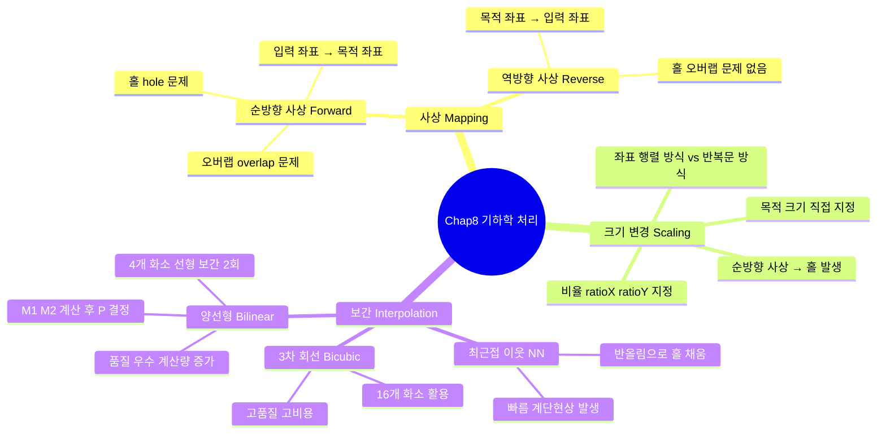

[← OpenCV-Python 학습 목차로 돌아가기](../README.md)

# 8. 기하학 처리 (Processing Geometry)

> 기하학의 영어 단어 "geometry"는 토지를 뜻하는 "geo-"와 측량을 뜻하는 "metry"라는 단어가 합해져서 만들어진 용어이다.
> 영상처리에서 기하학 처리는 영상 내에 있는 기하학적인 대상의 공간적 배치를 변경하는 과정을 말한다. 이것을 화소의 입장에서 보면, 영상을 구성하는 화소들의 공간적 위치를 재배치하는 과정이라 할 수 있다.

> 이러한 변환에는 크게 회전, 크기변경, 평행이동 등이 있다. 보통 영상처리 관련 논문에서는 이 세 가지 변환을 일컬어 RST 변환이라 말한다. Rotation, Scaling, Translation의 첫 글자이다.

## 목차

- [8.1 사상](#81-사상)
- [8.2 크기 변경(확대/축소)](#82-크기-변경확대축소)
- [8.3 보간](#83-보간)
  - [8.3.1 최근접 이웃 보간법](#831-최근접-이웃-보간법)
  - [8.3.2 양선형 보간법](#832-양선형-보간법)
- [핵심 함수 정리](#핵심-함수-정리)
- [중요 포인트 요약](#중요-포인트-요약)

---

## Chapter 8 전체 구조



---

## 8.1 사상

> 기하학적 처리의 기본은 화소들의 배치를 변경하는 것이다. 화소의 배치를 변경하려면 사상(mapping)이라는 의미를 이해해야 한다. 사상은 화소들의 배치를 변경할 때, 입력 영상의 좌표가 새롭게 배치될 해당 목적 영상의 좌표를 찾아서 화소값을 옮기는 과정을 말한다.

> 여기에는 순방향 사상(forward mapping)과 역방향 사상(reverse mapping)의 두 가지 방식이 있다. 순방향 사상은 입력 영상의 좌표를 중심으로 목적 영상의 좌표를 계산하여 화소의 위치를 변환하는 방식이다. 이 방식은 일반적으로 입력 영상과 목적 영상이 크기가 같을 때 유용하게 사용된다. 반면, 두 영상의 크기가 달라지면, 홀(hole)이나 오버랩(overlap)의 문제가 발생할 수 있다.

- 홀

  > 홀은 입력 영상의 좌표들로 목적 영상의 좌표를 만드는 과정에서 사상되지 않은 화소를 가리킨다. 보통 영상을 확대하거나 회전할 때에 발생한다.

- 오버랩

  > 반면, 오버랩은 영상을 축소할 때 주로 발생한다. 이것은 입력 영상의 여러 화소들이 목적 영상의 한 화소로 사상되는 것을 말한다.

- 역방향 사상
  > 이런 문제를 해결할 수 있는 방법이 역방향 사상이다. 역방향 사상은 목적 영상의 좌표를 중심으로 역변환을 계산하여 해당하는 원본 영상의 좌표를 찾아서 화소값을 가져오는 방식이다.

```
역방향 사상(Reverse Mapping) 방식:

  입력 영상 (2×2)              목적 영상 (3×3) — 확대
  ┌────────┬────────┐          ┌──────┬──────┬──────┐
  │ P(0,0) │ P(1,0) │          │(0,0) │(1,0) │(2,0) │
  ├────────┼────────┤   역변환  ├──────┼──────┼──────┤
  │ P(0,1) │ P(1,1) │  ←─────  │(0,1) │(1,1) │(2,1) │
  └────────┴────────┘          ├──────┼──────┼──────┤
                               │(0,2) │(1,2) │(2,2) │
                               └──────┴──────┴──────┘

  목적 영상의 각 좌표 (i, j)에서 역변환으로 입력 영상 좌표 (x, y)를 계산:
    y = i / ratioY,  x = j / ratioX

  → 목적 영상의 모든 화소가 빠짐없이 채워짐 (홀 없음)
  → 입력 영상의 한 화소를 여러 목적 화소가 참조해도 오버랩 없음

  ※ 순방향 사상(Forward)과 비교:
  ┌─────────────────────┬──────────────────────────┐
  │  순방향 사상         │  역방향 사상              │
  │  입력 → 목적 좌표    │  목적 → 입력 좌표 (역변환)│
  │  확대 시 홀 발생     │  홀/오버랩 없음           │
  │  축소 시 오버랩 발생 │  항상 안정적인 결과        │
  └─────────────────────┴──────────────────────────┘
```

> 위 예시에서 입력 영상에서 하단 왼쪽 한 개의 화소가 목적 영상의 두 개 화소로 각각 사상된다. 이 경우에도 역방향 사상의 방식은 홀이나 오버랩은 발생하지 않는다. 다만, 입력 영상의 한 화소를 목적 영상의 여러 화소에서 사용하게 되면 결과 영상의 품질이 떨어질 수 있다.
> 이런 문제를 해결하는 방법이 8.3절에서 배우게 되는 보간법이다.

## 8.2 크기 변경(확대/축소)

> 목적 영상이 입력 영상보다 커지면 확대가 되고, 작아지면 축소가 된다.

> 영상의 크기 변경 방법은 먼저 비율을 이용해서 수행할 수 있다. 변경하려는 가로와 세로의 비율(ratioX, ratioY)를 지정하여 입력 영상의 좌표(x,y)에 곱하면 목적 영상의 좌표(x', y')를 계산할 수 있다.

$$
y' = y \cdot ratioY \\
x' = x \cdot ratioX
$$

> 다른 방법으로 목적 영상의 크기를 지정해서 변경할 수도 있다. 이것은 입력 영상과 목적 영상의 크기로 비율을 계산하고, 계산된 비율을 이용해서 목적 영상의 좌표를 계산한다.

$$
ratioY = \frac{dst_{height}}{org_{height}},
ratioX = \frac{dst_{width}}{org_{width}}
$$

```
크기 변경 구현 방식 비교:

  [방법1] 좌표 행렬(벡터화) 방식            [방법2] 반복문 방식
  ──────────────────────────────            ────────────────────────────
  y = np.arange(0, H)                       for y in range(H):
  x = np.arange(0, W)                         for x in range(W):
  y, x = np.meshgrid(y, x)                      i = int(y * ratioY)
  i = np.int32(y * ratioY)                       j = int(x * ratioX)
  j = np.int32(x * ratioX)                       dst[i, j] = img[y, x]
  dst[i, j] = img[y, x]

  → NumPy 벡터 연산 (고속)                  → Python 반복문 (현저히 느림)
  → 수백 배 빠른 수행 속도
```

> `01.scaling.py` 실행 결과에서 영상을 확대(dst3)했을 때, 순방향 사상으로 인해서 채워지지 않은 홀이 다수 발생해 영상의 화질이 상당히 좋지 못하다. 또한 수행 시간을 비교해 보면 좌표 행렬을 인덱스로 사용한 방법이 반복문 방식보다 현저하게 빠른 것을 확인할 수 있다.

## 8.3 보간

> 순방향 사상으로 목적 영상의 화소를 찾으려면 입력 영상의 4개 화소는 쉽게 배치되지만, 목적 영상에서 확대되는 나머지 화소들은 홀(hole)이 발생한다. 이런 문제를 해결하는 방법으로 역방향 사상을 통해서 홀의 화소들을 입력 영상에서 찾아 목적 영상의 화소에 대입함으로써 목적 영상의 화질을 유지할 수 있다. 반면, 영상을 축소할 때에는 오버랩의 문제가 발생하여 축소가 제대로 되지 않을 수 있다.

> 이런 문제를 해결하기 위해, 목적 영상에서 홀의 화소들을 채우며, 오버랩되지 않게 화소들을 배치하여 목적 영상을 만드는 기법을 보간법(interpolation)이라 한다. 보간법의 종류에는 최근접 이웃 보간법(nearest neighbor interpolation), 양선형 보간법(bilinear interpolation), 3차 회전 보간법(cubic convolution interpolation) 등 다양한 방법이 있다.

### 8.3.1 최근접 이웃 보간법

> 목적 영상을 만드는 과정에서 홀이 발생하여 화소값을 할당받지 못한 위치에 값을 찾을 때, 그 위치에 가장 가깝게 이웃한 입력 영상의 화소값을 가져오는 방법이다.

> 이 방법은 목적 화소의 좌표를 반올림하는 간단한 알고리즘으로 비어있는 홀들을 채울 수 있어 쉽고 빠르게 목적 영상의 품질을 높일 수 있다. 다만, 확대의 비율이 커지면 영상 내에서 경계선이나 모서리 부분에서 계단 현상이 나타날 수 있다.

```
최근접 이웃 보간법(Nearest Neighbor Interpolation) 동작 원리:

  역방향 사상으로 목적 좌표 (i, j)에서 입력 좌표 계산:
    y = i / ratioY  →  반올림  →  round(y) = y'
    x = j / ratioX  →  반올림  →  round(x) = x'

  예시 (ratioY = ratioX = 2.0, 2배 확대):
  ┌───────────────────────────────────────────┐
  │  목적 좌표(i=1, j=1)  →  y=0.5, x=0.5    │
  │  반올림 적용 → y'=1, x'=1                 │
  │  → 입력 영상의 (1, 1) 화소값 사용        │
  │                                           │
  │  목적 좌표(i=0, j=1)  →  y=0.0, x=0.5    │
  │  반올림 적용 → y'=0, x'=1                 │
  │  → 입력 영상의 (0, 1) 화소값 사용        │
  └───────────────────────────────────────────┘

  구현 (역방향 사상):
    y = np.int32(i / ratioY)   # 반올림(int 변환)
    x = np.int32(j / ratioX)
    dst[i, j] = img[y, x]

  장점: 계산 단순, 빠른 속도
  단점: 확대 비율이 클수록 경계선/모서리에서 계단(블록) 현상 발생
```

> `02.scaling_nearest.py` 참조 — `Common/interpolation.py`의 `scaling()` (순방향)과 비교하여 역방향 사상으로 구현한 최근접 이웃 보간의 결과를 확인할 수 있다.

### 8.3.2 양선형 보간법

> 영상을 확대할 때 확대비율이 커지면, 최근접 이웃 보간법은 모자이크 현상 혹은 경계 부분에서 계단 현상이 나타나게 된다. 이러한 문제를 보완하는 방법이 양선형 보간법(bilinear interpolation)이다.

> 여기서 선형의 의미는 쉽게 표현하자면 직선의 특징을 가진 것이라 할 수 있는데, 직선의 방정식을 예로 들 수 있다. 두 개의 화소의 값을 알고 있을 때 그 값을 직선으로 그려보자. 이때 직선 위에 위치한 화소들의 값은 직선의 수식을 이용해서 쉽게 계산할 수 있다.

> 양선형 보간법은 이와 같은 선형 보간을 두 번에 걸쳐서 수행하기에 붙여진 이름이다. 그 세부적인 방법은 아래 다이어그램을 이용해서 설명한다.

```
양선형 보간법(Bilinear Interpolation) 단계별 과정:

  [단계 1] 역변환으로 입력 영상의 인접 4개 화소(P1, P2, P3, P4) 찾기

    입력 영상
    ┌──────────┬──────────┐
    │  P1(y,x) │ P2(y,x+1)│   ← 상단 두 화소
    ├──────────┼──────────┤
    │P3(y+1,x) │P4(y+1,x+1)  ← 하단 두 화소
    └──────────┴──────────┘
         ↑          ↑
         α : 가로 거리 비율 (소수점 부분)
         β : 세로 거리 비율 (소수점 부분)

  [단계 2] 1차 선형 보간 — 가로 방향으로 두 번 수행

    상단:  M1 = (1-α)·P1 + α·P2   ─── P1과 P2 사이 중간값
    하단:  M2 = (1-α)·P3 + α·P4   ─── P3과 P4 사이 중간값

           P1 ────────────── P2
            ↑       M1        ↑
            │   α  ←→  1-α    │
            └──────────────────┘

  [단계 3] 2차 선형 보간 — 세로 방향으로 한 번 수행

           M1
            │  β  ↑
            │     │
            P ← 최종 화소값
            │     │
            │ 1-β ↓
           M2

    최종:  P = (1-β)·M1 + β·M2
```

> 먼저, 목적 영상의 화소(P)를 역변환으로 계산하여 가장 가까운 위치에 있는 입력 영상의 4개 화소(P1, P2, P3, P4)를 가져온다. 가져온 4개 화소를 두 개씩(P1P2, P3P4) 묶어서 두 화소를 잇는 직선을 구성한다.

> 다음으로 직선의 선상에서 목적 영상 화소의 좌표로 중간 위치를 찾고, 그 위치의 화소값 $(M_1, M_2)$을 계산한다. 이때 중간 위치의 화소값은 기준 화소값($P_1, P_2, P_3, P_4$)과 거리 비율($\alpha, 1-\alpha$)을 바탕으로 직선의 수식을 이용해서 계산한다.

> 마지막으로, 구해진 중간 화소값($M_1, M_2$)을 잇는 직선을 다시 구성하고, 두 개의 중간 화소값과 거리 비율($\beta, 1-\beta$)을 바탕으로 직선의 수식을 이용해서 최종 화소값($P$)를 계산한다. 이 최종 화소값이 목적 영상의 해당 좌표의 화소값이 된다.

> 정확히는 세 번의 선형 보간을 수행하지만, 4개 화소값($P_1, P_2, P_3, P_4$)에 대해서 두 번 수행하는 선형 보간은 1차 보간으로 간주한다. 그리고 중간 화소값($M_1, M_2$)에 대해서 수행하는 선형 보간을 2차 보간으로 간주하기 때문에 양선형 보간이라 한다. 이것을 수식으로 표현하면 다음과 같다.

$$
M_1 = (1-\alpha) \cdot P_1 + \alpha \cdot P_2
$$

$$
M_2 = (1-\alpha) \cdot P_3 + \alpha \cdot P_4
$$

$$
P = (1-\beta) \cdot M_1 + \beta \cdot M_2
$$

> 여기서 $\alpha$는 목적 화소의 역변환 좌표에서 가로 방향 소수점 부분(0~1)이며, $\beta$는 세로 방향 소수점 부분(0~1)이다. OpenCV의 `cv2.resize()` 함수에서 보간 방법을 지정할 때 다음의 옵션 상수를 사용한다.

| 보간 방법 상수          | 값  | 설명                                              | 권장 용도              |
| ----------------------- | --- | ------------------------------------------------- | ---------------------- |
| `cv2.INTER_NEAREST`     | 0   | 최근접 이웃 보간법. 가장 빠름, 계단 현상 발생     | 이진 마스크, 레이블 맵 |
| `cv2.INTER_LINEAR`      | 1   | 양선형 보간법. 기본값, 속도와 품질의 균형         | 일반적인 확대/축소     |
| `cv2.INTER_CUBIC`       | 2   | 3차 회선 보간법. 16개 화소 사용, 고품질           | 확대 시 권장           |
| `cv2.INTER_AREA`        | 3   | 영역 기반 리샘플링. 모아레 현상 억제              | 축소 시 권장           |
| `cv2.INTER_LANCZOS4`    | 8   | Lanczos 보간법. 고품질, 계산 비용 높음            | 고해상도 확대          |

---

## 핵심 함수 정리

| 함수 / 방법                                              | 설명                              | 주요 인자                                              |
| -------------------------------------------------------- | --------------------------------- | ------------------------------------------------------ |
| `cv2.resize(src, dsize, fx, fy, interpolation)`         | 영상 크기 변경 (OpenCV 내장)      | `dsize`: 목적 크기, `fx/fy`: 비율, `interpolation`: 보간 방법 |
| `np.meshgrid(y, x)`                                     | 좌표 행렬 생성                    | 반복문 없이 전체 좌표를 행렬로 표현 → 고속 처리        |
| `np.divide(size[::-1], img.shape[:2])`                  | 크기 비율 계산                    | `size`와 `shape`는 (width, height) vs (height, width) 역순 주의 |
| `np.int32(coord / ratio)`                               | 역방향 사상 좌표 계산 (최근접 이웃) | 소수점을 버림(int 변환)으로 가장 가까운 정수 좌표 선택 |
| `dst[i, j] = img[y, x]`                                 | NumPy 팬시 인덱싱으로 화소 사상   | 행렬 인덱스를 이용한 벡터화 일괄 처리                  |

---

## 중요 포인트 요약

1. **순방향 사상 vs 역방향 사상**:

   | 방식        | 좌표 기준      | 확대 시   | 축소 시       | 결론              |
   | ----------- | -------------- | --------- | ------------- | ----------------- |
   | 순방향 사상 | 입력 → 목적    | 홀 발생   | 오버랩 발생   | 크기 변경 시 비권장 |
   | 역방향 사상 | 목적 → 입력    | 문제 없음 | 문제 없음     | **권장 방식**      |

2. **크기 변경 비율 계산**: `ratioY, ratioX = np.divide(size[::-1], img.shape[:2])` — `size`는 `(width, height)` 순서지만 `img.shape`는 `(height, width)` 순서이므로 `[::-1]`로 역순 처리가 필요하다.

3. **좌표 행렬 방식의 성능 우위**: NumPy `meshgrid`를 이용한 벡터화 연산은 Python 반복문 방식에 비해 수십~수백 배 빠르다. 영상처리에서 화소 단위 반복문은 가능한 한 피해야 한다.

4. **보간법 품질 비교**:

   | 보간법         | 참조 화소 수 | 속도   | 화질          | 주요 특징                  |
   | -------------- | ----------- | ------ | ------------- | -------------------------- |
   | 최근접 이웃    | 1개         | 가장 빠름 | 낮음 (계단)  | 구현 단순, 이진 영상에 적합 |
   | 양선형(Bilinear) | 4개       | 보통   | 보통~좋음     | 속도/품질 균형, 기본값      |
   | 3차 회선(Cubic) | 16개       | 느림   | 좋음          | 확대 시 선명도 우수         |
   | 영역(Area)     | 가변        | 보통   | 좋음 (축소 시) | 모아레 억제, 축소에 최적   |

5. **양선형 보간 핵심 공식**: $\alpha$는 가로 소수점 비율, $\beta$는 세로 소수점 비율일 때,
   - $M_1 = (1-\alpha) \cdot P_1 + \alpha \cdot P_2$ (상단 선형 보간)
   - $M_2 = (1-\alpha) \cdot P_3 + \alpha \cdot P_4$ (하단 선형 보간)
   - $P = (1-\beta) \cdot M_1 + \beta \cdot M_2$ (최종 세로 선형 보간)

6. **`cv2.resize()` 보간 방법 선택 기준**: 확대할 때는 `INTER_CUBIC`, 축소할 때는 `INTER_AREA`를 권장한다. 일반적인 용도에는 기본값인 `INTER_LINEAR`(양선형)을 사용한다.
