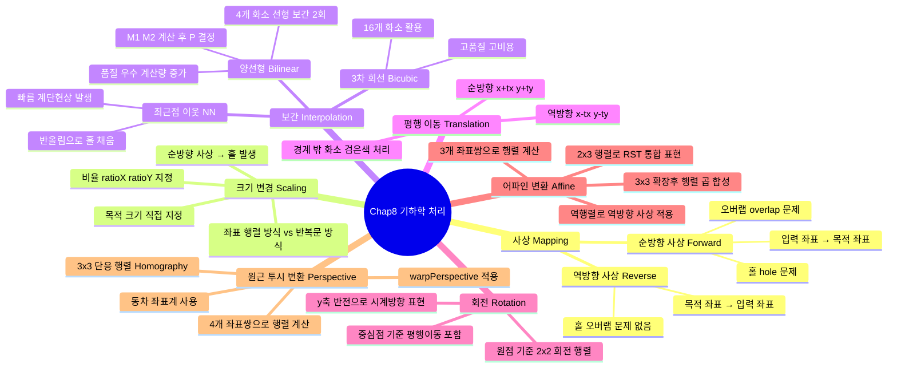

[← OpenCV-Python 학습 목차로 돌아가기](../README.md)

# 8. 기하학 처리 (Processing Geometry)

> 기하학의 영어 단어 "geometry"는 토지를 뜻하는 "geo-"와 측량을 뜻하는 "metry"라는 단어가 합해져서 만들어진 용어이다.
> 영상처리에서 기하학 처리는 영상 내에 있는 기하학적인 대상의 공간적 배치를 변경하는 과정을 말한다. 이것을 화소의 입장에서 보면, 영상을 구성하는 화소들의 공간적 위치를 재배치하는 과정이라 할 수 있다.

> 이러한 변환에는 크게 회전, 크기변경, 평행이동 등이 있다. 보통 영상처리 관련 논문에서는 이 세 가지 변환을 일컬어 RST 변환이라 말한다. Rotation, Scaling, Translation의 첫 글자이다.

## 목차

- [8.1 사상](#81-사상)
- [8.2 크기 변경(확대/축소)](#82-크기-변경확대축소)
- [8.3 보간](#83-보간)
  - [8.3.1 최근접 이웃 보간법](#831-최근접-이웃-보간법)
  - [8.3.2 양선형 보간법](#832-양선형-보간법)
- [8.4 평행 이동](#84-평행-이동)
- [8.5 회전](#85-회전)
- [8.6 어파인 변환](#86-행렬-연산을-통한-기하학-변환---어파인-변환)
- [8.7 원근 투시 변환](#87-원근-투시투영-변환)
- [핵심 함수 정리](#핵심-함수-정리)
- [중요 포인트 요약](#중요-포인트-요약)

---

## Chapter 8 전체 구조



---

## 8.1 사상

> 기하학적 처리의 기본은 화소들의 배치를 변경하는 것이다. 화소의 배치를 변경하려면 사상(mapping)이라는 의미를 이해해야 한다. 사상은 화소들의 배치를 변경할 때, 입력 영상의 좌표가 새롭게 배치될 해당 목적 영상의 좌표를 찾아서 화소값을 옮기는 과정을 말한다.

> 여기에는 순방향 사상(forward mapping)과 역방향 사상(reverse mapping)의 두 가지 방식이 있다. 순방향 사상은 입력 영상의 좌표를 중심으로 목적 영상의 좌표를 계산하여 화소의 위치를 변환하는 방식이다. 이 방식은 일반적으로 입력 영상과 목적 영상이 크기가 같을 때 유용하게 사용된다. 반면, 두 영상의 크기가 달라지면, 홀(hole)이나 오버랩(overlap)의 문제가 발생할 수 있다.

- 홀

  > 홀은 입력 영상의 좌표들로 목적 영상의 좌표를 만드는 과정에서 사상되지 않은 화소를 가리킨다. 보통 영상을 확대하거나 회전할 때에 발생한다.

- 오버랩

  > 반면, 오버랩은 영상을 축소할 때 주로 발생한다. 이것은 입력 영상의 여러 화소들이 목적 영상의 한 화소로 사상되는 것을 말한다.

- 역방향 사상
  > 이런 문제를 해결할 수 있는 방법이 역방향 사상이다. 역방향 사상은 목적 영상의 좌표를 중심으로 역변환을 계산하여 해당하는 원본 영상의 좌표를 찾아서 화소값을 가져오는 방식이다.

```
역방향 사상(Reverse Mapping) 방식:

  입력 영상 (2×2)              목적 영상 (3×3) — 확대
  ┌────────┬────────┐          ┌──────┬──────┬──────┐
  │ P(0,0) │ P(1,0) │          │(0,0) │(1,0) │(2,0) │
  ├────────┼────────┤   역변환  ├──────┼──────┼──────┤
  │ P(0,1) │ P(1,1) │  ←─────  │(0,1) │(1,1) │(2,1) │
  └────────┴────────┘          ├──────┼──────┼──────┤
                               │(0,2) │(1,2) │(2,2) │
                               └──────┴──────┴──────┘

  목적 영상의 각 좌표 (i, j)에서 역변환으로 입력 영상 좌표 (x, y)를 계산:
    y = i / ratioY,  x = j / ratioX

  → 목적 영상의 모든 화소가 빠짐없이 채워짐 (홀 없음)
  → 입력 영상의 한 화소를 여러 목적 화소가 참조해도 오버랩 없음

  ※ 순방향 사상(Forward)과 비교:
  ┌─────────────────────┬──────────────────────────┐
  │  순방향 사상         │  역방향 사상              │
  │  입력 → 목적 좌표    │  목적 → 입력 좌표 (역변환)│
  │  확대 시 홀 발생     │  홀/오버랩 없음           │
  │  축소 시 오버랩 발생 │  항상 안정적인 결과        │
  └─────────────────────┴──────────────────────────┘
```

> 위 예시에서 입력 영상에서 하단 왼쪽 한 개의 화소가 목적 영상의 두 개 화소로 각각 사상된다. 이 경우에도 역방향 사상의 방식은 홀이나 오버랩은 발생하지 않는다. 다만, 입력 영상의 한 화소를 목적 영상의 여러 화소에서 사용하게 되면 결과 영상의 품질이 떨어질 수 있다.
> 이런 문제를 해결하는 방법이 8.3절에서 배우게 되는 보간법이다.

## 8.2 크기 변경(확대/축소)

> 목적 영상이 입력 영상보다 커지면 확대가 되고, 작아지면 축소가 된다.

> 영상의 크기 변경 방법은 먼저 비율을 이용해서 수행할 수 있다. 변경하려는 가로와 세로의 비율(ratioX, ratioY)를 지정하여 입력 영상의 좌표(x,y)에 곱하면 목적 영상의 좌표(x', y')를 계산할 수 있다.

$$
y' = y \cdot ratioY \\
x' = x \cdot ratioX
$$

> 다른 방법으로 목적 영상의 크기를 지정해서 변경할 수도 있다. 이것은 입력 영상과 목적 영상의 크기로 비율을 계산하고, 계산된 비율을 이용해서 목적 영상의 좌표를 계산한다.

$$
ratioY = \frac{dst_{height}}{org_{height}},
ratioX = \frac{dst_{width}}{org_{width}}
$$

```
크기 변경 구현 방식 비교:

  [방법1] 좌표 행렬(벡터화) 방식            [방법2] 반복문 방식
  ──────────────────────────────            ────────────────────────────
  y = np.arange(0, H)                       for y in range(H):
  x = np.arange(0, W)                         for x in range(W):
  y, x = np.meshgrid(y, x)                      i = int(y * ratioY)
  i = np.int32(y * ratioY)                       j = int(x * ratioX)
  j = np.int32(x * ratioX)                       dst[i, j] = img[y, x]
  dst[i, j] = img[y, x]

  → NumPy 벡터 연산 (고속)                  → Python 반복문 (현저히 느림)
  → 수백 배 빠른 수행 속도
```

> `01.scaling.py` 실행 결과에서 영상을 확대(dst3)했을 때, 순방향 사상으로 인해서 채워지지 않은 홀이 다수 발생해 영상의 화질이 상당히 좋지 못하다. 또한 수행 시간을 비교해 보면 좌표 행렬을 인덱스로 사용한 방법이 반복문 방식보다 현저하게 빠른 것을 확인할 수 있다.

## 8.3 보간

> 순방향 사상으로 목적 영상의 화소를 찾으려면 입력 영상의 4개 화소는 쉽게 배치되지만, 목적 영상에서 확대되는 나머지 화소들은 홀(hole)이 발생한다. 이런 문제를 해결하는 방법으로 역방향 사상을 통해서 홀의 화소들을 입력 영상에서 찾아 목적 영상의 화소에 대입함으로써 목적 영상의 화질을 유지할 수 있다. 반면, 영상을 축소할 때에는 오버랩의 문제가 발생하여 축소가 제대로 되지 않을 수 있다.

> 이런 문제를 해결하기 위해, 목적 영상에서 홀의 화소들을 채우며, 오버랩되지 않게 화소들을 배치하여 목적 영상을 만드는 기법을 보간법(interpolation)이라 한다. 보간법의 종류에는 최근접 이웃 보간법(nearest neighbor interpolation), 양선형 보간법(bilinear interpolation), 3차 회전 보간법(cubic convolution interpolation) 등 다양한 방법이 있다.

### 8.3.1 최근접 이웃 보간법

> 목적 영상을 만드는 과정에서 홀이 발생하여 화소값을 할당받지 못한 위치에 값을 찾을 때, 그 위치에 가장 가깝게 이웃한 입력 영상의 화소값을 가져오는 방법이다.

> 이 방법은 목적 화소의 좌표를 반올림하는 간단한 알고리즘으로 비어있는 홀들을 채울 수 있어 쉽고 빠르게 목적 영상의 품질을 높일 수 있다. 다만, 확대의 비율이 커지면 영상 내에서 경계선이나 모서리 부분에서 계단 현상이 나타날 수 있다.

```
최근접 이웃 보간법(Nearest Neighbor Interpolation) 동작 원리:

  역방향 사상으로 목적 좌표 (i, j)에서 입력 좌표 계산:
    y = i / ratioY  →  반올림  →  round(y) = y'
    x = j / ratioX  →  반올림  →  round(x) = x'

  예시 (ratioY = ratioX = 2.0, 2배 확대):
  ┌───────────────────────────────────────────┐
  │  목적 좌표(i=1, j=1)  →  y=0.5, x=0.5    │
  │  반올림 적용 → y'=1, x'=1                 │
  │  → 입력 영상의 (1, 1) 화소값 사용        │
  │                                           │
  │  목적 좌표(i=0, j=1)  →  y=0.0, x=0.5    │
  │  반올림 적용 → y'=0, x'=1                 │
  │  → 입력 영상의 (0, 1) 화소값 사용        │
  └───────────────────────────────────────────┘

  구현 (역방향 사상):
    y = np.int32(i / ratioY)   # 반올림(int 변환)
    x = np.int32(j / ratioX)
    dst[i, j] = img[y, x]

  장점: 계산 단순, 빠른 속도
  단점: 확대 비율이 클수록 경계선/모서리에서 계단(블록) 현상 발생
```

> `02.scaling_nearest.py` 참조 — `Common/interpolation.py`의 `scaling()` (순방향)과 비교하여 역방향 사상으로 구현한 최근접 이웃 보간의 결과를 확인할 수 있다.

### 8.3.2 양선형 보간법

> 영상을 확대할 때 확대비율이 커지면, 최근접 이웃 보간법은 모자이크 현상 혹은 경계 부분에서 계단 현상이 나타나게 된다. 이러한 문제를 보완하는 방법이 양선형 보간법(bilinear interpolation)이다.

> 여기서 선형의 의미는 쉽게 표현하자면 직선의 특징을 가진 것이라 할 수 있는데, 직선의 방정식을 예로 들 수 있다. 두 개의 화소의 값을 알고 있을 때 그 값을 직선으로 그려보자. 이때 직선 위에 위치한 화소들의 값은 직선의 수식을 이용해서 쉽게 계산할 수 있다.

> 양선형 보간법은 이와 같은 선형 보간을 두 번에 걸쳐서 수행하기에 붙여진 이름이다. 그 세부적인 방법은 아래 다이어그램을 이용해서 설명한다.

```
양선형 보간법(Bilinear Interpolation) 단계별 과정:

  [단계 1] 역변환으로 입력 영상의 인접 4개 화소(P1, P2, P3, P4) 찾기

    입력 영상
    ┌──────────┬──────────┐
    │  P1(y,x) │ P2(y,x+1)│   ← 상단 두 화소
    ├──────────┼──────────┤
    │P3(y+1,x) │P4(y+1,x+1)  ← 하단 두 화소
    └──────────┴──────────┘
         ↑          ↑
         α : 가로 거리 비율 (소수점 부분)
         β : 세로 거리 비율 (소수점 부분)

  [단계 2] 1차 선형 보간 — 가로 방향으로 두 번 수행

    상단:  M1 = (1-α)·P1 + α·P2   ─── P1과 P2 사이 중간값
    하단:  M2 = (1-α)·P3 + α·P4   ─── P3과 P4 사이 중간값

           P1 ────────────── P2
            ↑       M1        ↑
            │   α  ←→  1-α    │
            └──────────────────┘

  [단계 3] 2차 선형 보간 — 세로 방향으로 한 번 수행

           M1
            │  β  ↑
            │     │
            P ← 최종 화소값
            │     │
            │ 1-β ↓
           M2

    최종:  P = (1-β)·M1 + β·M2
```

> 먼저, 목적 영상의 화소(P)를 역변환으로 계산하여 가장 가까운 위치에 있는 입력 영상의 4개 화소(P1, P2, P3, P4)를 가져온다. 가져온 4개 화소를 두 개씩(P1P2, P3P4) 묶어서 두 화소를 잇는 직선을 구성한다.

> 다음으로 직선의 선상에서 목적 영상 화소의 좌표로 중간 위치를 찾고, 그 위치의 화소값 $(M_1, M_2)$을 계산한다. 이때 중간 위치의 화소값은 기준 화소값($P_1, P_2, P_3, P_4$)과 거리 비율($\alpha, 1-\alpha$)을 바탕으로 직선의 수식을 이용해서 계산한다.

> 마지막으로, 구해진 중간 화소값($M_1, M_2$)을 잇는 직선을 다시 구성하고, 두 개의 중간 화소값과 거리 비율($\beta, 1-\beta$)을 바탕으로 직선의 수식을 이용해서 최종 화소값($P$)를 계산한다. 이 최종 화소값이 목적 영상의 해당 좌표의 화소값이 된다.

> 정확히는 세 번의 선형 보간을 수행하지만, 4개 화소값($P_1, P_2, P_3, P_4$)에 대해서 두 번 수행하는 선형 보간은 1차 보간으로 간주한다. 그리고 중간 화소값($M_1, M_2$)에 대해서 수행하는 선형 보간을 2차 보간으로 간주하기 때문에 양선형 보간이라 한다. 이것을 수식으로 표현하면 다음과 같다.

$$
M_1 = (1-\alpha) \cdot P_1 + \alpha \cdot P_2
$$

$$
M_2 = (1-\alpha) \cdot P_3 + \alpha \cdot P_4
$$

$$
P = (1-\beta) \cdot M_1 + \beta \cdot M_2
$$

> 여기서 $\alpha$는 목적 화소의 역변환 좌표에서 가로 방향 소수점 부분(0~1)이며, $\beta$는 세로 방향 소수점 부분(0~1)이다. OpenCV의 `cv2.resize()` 함수에서 보간 방법을 지정할 때 다음의 옵션 상수를 사용한다.

| 보간 방법 상수       | 값  | 설명                                          | 권장 용도              |
| -------------------- | --- | --------------------------------------------- | ---------------------- |
| `cv2.INTER_NEAREST`  | 0   | 최근접 이웃 보간법. 가장 빠름, 계단 현상 발생 | 이진 마스크, 레이블 맵 |
| `cv2.INTER_LINEAR`   | 1   | 양선형 보간법. 기본값, 속도와 품질의 균형     | 일반적인 확대/축소     |
| `cv2.INTER_CUBIC`    | 2   | 3차 회선 보간법. 16개 화소 사용, 고품질       | 확대 시 권장           |
| `cv2.INTER_AREA`     | 3   | 영역 기반 리샘플링. 모아레 현상 억제          | 축소 시 권장           |
| `cv2.INTER_LANCZOS4` | 8   | Lanczos 보간법. 고품질, 계산 비용 높음        | 고해상도 확대          |

## 8.4 평행 이동

> 일반적으로 그래프에 좌표를 표시할 때와는 다르게 영상에서 원점 좌표는 기본적으로 최상단 왼쪽이다. 평행이동(translation)은 영상의 원점을 기준으로 모든 화소를 동일하게 가로 방향과 세로 방향으로 옮기는 것을 말한다.

> 순방향 사상을 적용하면 입력 영상의 화소 $(x,y)$에서 이동할 화소 수만큼 가로 방향과 세로 방향으로 더해 주어 목적 영상의 화소 위치$(x', y')$를 정한다.

> 반면, 역방향 사상을 적용하면 평행이동하려는 화소 개수를 목적 영상의 좌표에서 빼면 양의 방향(오른쪽 하단)으로 이동한다. 예를 들어 입력 영상에서 10 화소만큼 오른쪽으로 이동한 영상을 구한다면, 목적 영상 입장에서는 10 화소만큼 왼쪽에 있는 입력 영상의 화소의 값을 가져와야 한다.

**순방향 사상**: 입력 좌표 $(x, y)$에서 이동량 $(t_x, t_y)$를 더해 목적 좌표 계산

$$
x' = x + t_x, \quad y' = y + t_y
$$

**역방향 사상**: 목적 좌표 $(x', y')$에서 이동량을 빼서 입력 좌표 계산 (홀/오버랩 방지)

$$
x = x' - t_x, \quad y = y' - t_y
$$

```
평행 이동(Translation) 동작 예시:

  원본 영상                  dst1: (30, 80) 이동        dst2: (-70, -50) 이동
  ┌─────────────┐           ┌─────────────┐           ┌─────────────┐
  │             │           │▓▓▓▓▓▓▓▓▓▓▓▓▓│           │       ╔═════╪═╗
  │  ▣ 객체     │  tx=+30   │▓▓▓▓         │  tx=-70   │       ║  ▣  │ ║
  │             │  ty=+80   │▓▓  ▣ 객체   │  ty=-50   │       ║     │ ║
  │             │  ──────▶  │▓▓           │  ──────▶  │       ╚═════╪═╝
  └─────────────┘           └─────────────┘           └─────────────┘
                              ▓=검은색 여백                범위 밖 화소 제거됨

  역방향 사상 수식:  (j, i) = 목적 좌표
    x = j - tx,  y = i - ty   → 입력 영상에서 해당 좌표 픽셀 가져옴
    범위 밖이면 → 출력 화소 = 0 (검은색)
```

> `04.translation.py` 참조 — `contain(p, shape)` 함수로 역변환 좌표가 입력 영상 범위 내인지 확인하여 경계 밖 화소를 검은색으로 처리한다.

## 8.5 회전

> 회전은 입력 영상의 모든 화소를 영상의 원점을 기준으로 원하는 각도만큼 모든 화소에 대해서 회전 변환을 시키는 것을 말한다. 이것은 2차원 평면에서 회전 변환을 나타내는 행렬을 통해서 수식으로 표현할 수 있다.

> 다음은 회전 변환을 수행하는 행렬을 수식으로 나타낸 것이다. 회전 변환의 역행렬이 sin() 함수의 부호만 다르기 때문에 순방향 사상과 역방향 사상도 단지 sin() 함수의 부호만 차이가 난다.

**순방향 사상**: 입력 좌표 $(x, y)$ → 목적 좌표 $(x', y')$

$$
\begin{bmatrix} x' \\ y' \end{bmatrix}
=
\begin{bmatrix} \cos\theta & -\sin\theta \\ \sin\theta & \cos\theta \end{bmatrix}
\begin{bmatrix} x \\ y \end{bmatrix}
$$

$$
x' = x\cos\theta - y\sin\theta, \quad y' = x\sin\theta + y\cos\theta
$$

**역방향 사상**: 목적 좌표 $(x', y')$ → 입력 좌표 $(x, y)$ (역행렬 적용 — $\sin$ 부호만 반전)

$$
\begin{bmatrix} x \\ y \end{bmatrix}
=
\begin{bmatrix} \cos\theta & \sin\theta \\ -\sin\theta & \cos\theta \end{bmatrix}
\begin{bmatrix} x' \\ y' \end{bmatrix}
$$

$$
x = x'\cos\theta + y'\sin\theta, \quad y = -x'\sin\theta + y'\cos\theta
$$

> 목적 영상의 모든 화소$(x', y')$에 대해서 역방향 사상의 수식을 적용하여 입력 화소를 계산하면, 아래 그림과 같이 원점으로부터 시계 방향으로 정해진 각도만큼 회전된 영상이 생성된다. 직교 좌표계에서 회전 변환은 반시계 방향으로 적용된다. 그러나 영상 좌표계에서는 y 좌표가 하단으로 내려갈수록 증가하기 때문에 시계 방향 회전으로 표현됨에 유의한다.

```
영상 좌표계에서의 회전 (원점 기준, θ = 45°)

  (0,0)──────────────→ x
    │  ┌───────────┐        ┌──────────────────┐
    │  │           │  회전   │╲                 │
    │  │  원본      │  ───▶  │  ╲  (범위 밖      │
    │  │  영상      │        │   ╲   화소는      │
    │  │           │        │    ╲  검은색)     │
    │  └───────────┘        │     ╲            │
    ↓                       └──────────────────┘
    y
  ※ 영상 좌표계는 y가 아래로 증가 → 수학적 반시계가 시계 방향으로 보임

  원점(0,0) 기준 회전의 문제점:
  ┌──────────┐          ┌──────────┐
  │▣         │  θ 회전   │          │
  │   영상    │  ──────▶ │   ╲영상   │  ← 좌상단 원점 기준이라
  │          │          │    ╲     │     영상이 잘려나감
  └──────────┘          └──────────┘
  원점=(0,0)              원점=(0,0)

  중심점(cx,cy) 기준 회전:
  ┌──────────┐          ┌──────────┐
  │          │  θ 회전   │  ╲    ╱  │
  │  ⊕ 중심   │  ──────▶ │   ╲  ╱   │  ← 영상 중심이 고정된 채
  │          │          │   ╱  ╲   │     회전됨 (자연스러운 결과)
  └──────────┘          └──────────┘
  cx=W/2, cy=H/2          cx=W/2, cy=H/2
```

> 평행 이동과 마찬가지로 목적 영상의 범위를 벗어나는 입력 화소는 제거되며, 입력 영상에서 찾지 못하는 목적 화소는 검은색이나 흰색으로 지정한다.

> 일반적으로 영상을 회전시킬 때에는 회전의 기준을 영상의 기준 원점인 좌상단이 아닌, 물체의 중심(center X, center Y)으로 하는 경우가 많다. 이 경우에는 다음과 같이 평행이동의 수식을 포함하여 회전 변환을 수행한다. 이것은 영상을 원점으로 이동시킨 후, 회전을 수행하고, 다시 기준점 좌표로 이동하는 것이다.

$$
\begin{bmatrix} x' \\ y' \end{bmatrix}
=
\begin{bmatrix} \cos\theta & -\sin\theta \\ \sin\theta & \cos\theta \end{bmatrix}
\begin{bmatrix} x - c_x \\ y - c_y \end{bmatrix}
+
\begin{bmatrix} c_x \\ c_y \end{bmatrix}
$$

$$
x' = (x - c_x)\cos\theta - (y - c_y)\sin\theta + c_x
$$

$$
y' = (x - c_x)\sin\theta + (y - c_y)\cos\theta + c_y
$$

여기서 $(c_x, c_y)$는 회전 기준이 되는 중심 좌표이며, 영상 전체를 기준으로 할 때는 $c_x = W/2,\ c_y = H/2$ 로 지정한다. 세 단계로 분해하면 다음과 같다.


## 8.6 행렬 연산을 통한 기하학 변환 - 어파인 변환

> 앞에서 기술한 기하학 변환들의 수식은 행렬식으로 표현이 가능하다. 즉, 기하학 변환 수식이 행렬의 곱으로 표현되는 것이다.

> 회전과 크기변경은 2x2 행렬로 표현이 가능하지만, 덧셈이 포함된 평행이동까지 나타내려면 2x3 행렬이 필요하다. 다음 수식과 같이 2x3 행렬로 변환 행렬을 구성하는 것을 어파인 변환(affine transform)이라 한다.

$$
\begin{bmatrix} x' \\ y' \end{bmatrix}
=
\underbrace{\begin{bmatrix} a_{00} & a_{01} & a_{02} \\ a_{10} & a_{11} & a_{12} \end{bmatrix}}_{2 \times 3\ \text{어파인 행렬}\ M}
\begin{bmatrix} x \\ y \\ 1 \end{bmatrix}
$$

> 어파인 변환은 변환 전과 변환 후의 두 어파인 공간 사이의 공선점을 보존하는 변환이다.

- 어파인 공간 : 유클리드 공간의 어파인 기하학적 성징들을 일반화해서 만들어지는 구조이다.
- 공선점(colinear point): 한 직성 상에 있는 점들을 뜻함.

> 따라서 변환 전에 직선은 변환 후에도 그대로 직선이며, 그 거리의 비율도 유지된다. 또한, 변환 전에 평행선도 변환 후에 평행선이 된다.

> 어파인 변환을 수행하는 방법은 크게 두 가지가 있다.

> 하나는 회전 각도, 크기변경 비율, 평행이동의 정도를 각각 지정해서 각각 변환 행렬을 구성한다. 그리고 각 변환 행렬을 행렬 곱으로 구성하면 하나의 변환 행렬을 만들 수 있다. 각 행렬을 곱하는 순서는 변환하고자 하는 방식에 따라서 달라질 수 있다. 이때 2x3 크기의 어파인 행렬로 구성하면 행렬의 곱을 계산할 수 없기 때문에 다음 수식과 같이 3x3 크기의 행렬로 구성하여 행렬 곱을 수행한다.

$$
M_{rot} = \begin{bmatrix} \cos\theta & \sin\theta & 0 \\ -\sin\theta & \cos\theta & 0 \\ 0 & 0 & 1 \end{bmatrix}, \quad
M_{scale} = \begin{bmatrix} f_x & 0 & 0 \\ 0 & f_y & 0 \\ 0 & 0 & 1 \end{bmatrix}, \quad
M_{trans} = \begin{bmatrix} 1 & 0 & t_x \\ 0 & 1 & t_y \\ 0 & 0 & 1 \end{bmatrix}
$$

$$
M = M_{cen} \cdot M_{rot} \cdot M_{trans} \cdot M_{scale} \cdot M_{org}
\quad \Rightarrow \quad
\text{최종 어파인 행렬} = M[0\text{:}2,\ :]\ \text{(3x3 → 2x3 변환)}
$$

> 다른 한 가지 방법으로는 아래 그림과 같이 변환 전인 입력 영상의 좌표 3개$(x_1, x_2, x_3)$와 변환이 완료된 목적 영상에서 상응하는 좌표 3개$(x_1', x_2', x_3')$를 알면 두 좌표 $(x \rarr x')$ 사이를 변환해주는 어파인 변환 행렬을 구할 수 있다.

```
3개 좌표쌍으로 어파인 행렬 계산 (cv2.getAffineTransform):

  입력 영상 좌표 (pt1)         목적 영상 좌표 (pt2)
  ┌──────────────────┐        ┌──────────────────┐
  │ ①(30, 70)       │        │ ①'(120, 20)      │
  │                  │  ───▶  │                  │
  │ ②(20, 240)      │        │ ②'(10, 180)      │
  │                  │        │                  │
  │ ③(300, 110)     │        │ ③'(280, 260)     │
  └──────────────────┘        └──────────────────┘

  pt1 → pt2 의 사상 관계로부터 어파인 행렬 M 도출:
    aff_mat = cv2.getAffineTransform(pt1, pt2)

  → 직선 보존, 평행선 보존, 거리 비율 보존 (어파인 성질)
  → 3개 좌표쌍이 6개 미지수 (2x3 행렬 원소)를 완전히 결정
```

> 이렇게 행렬의 곱으로 기하학 변환을 적용하면 단순하면서도 쉽게 입력 영상에 대한 변환이 가능하다.
> OpenCV에서도 어파인 변환을 수행할 수 있는 `cv2.warpAffine()` 함수를 제공한다. 이 함수는 지정된 어파인 변환 행렬을 적용하면 입력 영상에 어파인 변환을 수행한 목적 영상을 반환한다. 또한 어파인 변환 행렬을 만드는 함수로는 `cv2.getAffineTransform()`과 `cv2.getRotationMatrix2D()`가 있다.

> `cv2.getAffineTransform()`은 변환 전의 좌표 3개와 변환 후의 좌표 3개를 지정하면 해당 변환을 수행해줄 수 있는 어파인 행렬을 반환한다. `cv2.getRotationMatrix2D()`는 회전 변환과 크기 변경을 수행하는 어파인 행렬을 반환한다. 여기서 회전의 방향은 양수일 때 반시계 방향으로 회전하는 행렬을 반환한다. 이것은 영상 좌표에서 직교 좌표계에서의 회전과 같은 방향으로 표현하기 위함이다.

> 다음 예제 `07.affine_transform.py`는 어파인 행렬을 지정하면 해당 변환을 수행하는 사용자 정의 함수 `affine_transform()`를 구현한다. 본 예제는 목적 화소를 기준으로 입력 화소를 찾는 역방향 사상을 적용한다. 따라서 어파인 행렬은 다음과 같이 역행렬로 주어져야 한다.

$$
\begin{bmatrix} x \\ y \end{bmatrix}
= M^{-1} \begin{bmatrix} x' \\ y' \\ 1 \end{bmatrix},
\quad M^{-1} = \text{cv2.invertAffineTransform}(M)
$$

> `07.affine_combination.py` 실행 결과에서 dst4가 dst3에서 x 방향으로 평행이동을 수행하도록 했는데, 결과에서는 대각선 방향으로 평행이동이 된다. 이것은 dst4에 회전 변환 후에 평행이동이 적용되기 때문에 45도 기울어진 방향으로 평행이동 되기 때문이다. 즉, 각 변환 행렬을 적용하여 하나의 어파인 행렬로 만들고, 이것을 영상에 적용할 경우에 변환 행렬을 곱하는 순서가 중요함을 보여주는 한 예가 된다.

## 8.7 원근 투시(투영) 변환

> 원근법은 눈에 보이는 3차원의 세계를 2차원의 그림(평면)으로 옮길 때에 관찰자가 보는 것 그대로 사물과의 거리를 반영하여 그리는 방법을 말한다. 정확히는 투시 혹은 투영 원근법(projection transformation)이 이에 해당한다.

> 원근 투시 변환(perspective projection transformation)은 이 원근법을 영상 좌표계에서 표현하는 것으로서 아래 그림과 같이 3차원 실세계의 좌표 P를 투영 스크린 상의 2차원 좌표로 표현할 수 있도록 변환하는 것을 말한다.

```
원근 투시 변환 개념도:

  3D 실세계                     2D 투영 스크린 (영상)
                                ┌──────────────┐
       ● P(X, Y, Z)             │   ● p(x, y)  │
      /                         │  /           │
     /  투영선                  │ /             │
    /                           │               │
  👁  관찰자 (카메라 원점)      └──────────────┘
  (0, 0, 0)

  투영 변환: p(x, y) = P(X, Y, Z) / Z  (원근 나눗셈)
    x = f · X/Z,   y = f · Y/Z   (f = 초점 거리)

  2D 영상에서의 원근 변환 활용:
  ┌──────────────────┐            ┌──────────────────┐
  │  ●────────────●  │            │  ●──────────────●│
  │  │  원근 왜곡  │  │  원근변환  │  │     보정 후     │ │
  │  │  (사다리꼴) │  │  ────────▶ │  │   (직사각형)   │ │
  │  ●────────────●  │            │  ●──────────────●│
  └──────────────────┘            └──────────────────┘
  카메라 각도로 찍힌 평면          수직 정면 뷰로 변환 (Bird's eye view)

  → 4개 좌표쌍(사다리꼴 → 직사각형)으로 변환 행렬 H 계산
```

> 영상처리에서 원근 변환은 주로 2차원 영상을 다른 2차원 영상으로 변환할 때에 사용한다. 예를 들어, 카메라에서 입력받은 영상에서 카메라 렌즈에 의한 왜곡을 보정할 수 있다. 그리고 원근감이 잘 표현된 2차원 영상을 변환하여 3차원 공간 상의 거리를 측정하고자 할 때 사용될 수도 있다.

> 원근 투영 변환을 사용할 때는 동차 좌표계를 사용하는 것이 편리하다.

> 원근 변환을 수행할 수 있는 행렬은 다음의 수식과 같다. 이 수식으로 입력 영상의 좌표를 목적 영상의 좌표로 변환하면 원근 변환이 수행된다.

> 어파인 변환과 달리 원근 변환은 **3×3 단응 행렬(Homography)**을 사용한다. 동차 좌표계(homogeneous coordinates)로 표현하면 다음과 같다.

$$
\begin{bmatrix} wx' \\ wy' \\ w \end{bmatrix}
=
\underbrace{\begin{bmatrix} h_{00} & h_{01} & h_{02} \\ h_{10} & h_{11} & h_{12} \\ h_{20} & h_{21} & h_{22} \end{bmatrix}}_{3 \times 3\ \text{단응 행렬 } H}
\begin{bmatrix} x \\ y \\ 1 \end{bmatrix}
$$

$$
x' = \frac{h_{00}x + h_{01}y + h_{02}}{h_{20}x + h_{21}y + h_{22}}, \quad
y' = \frac{h_{10}x + h_{11}y + h_{12}}{h_{20}x + h_{21}y + h_{22}}
$$

> 어파인 변환이 **3개 좌표쌍**으로 행렬을 결정하는 것과 달리, 원근 변환은 **4개 좌표쌍**이 필요하다. 이는 단응 행렬의 8개 자유도(DOF)를 결정하기 위함이다.

```
어파인 vs 원근 변환 비교:

  ┌─────────────┬──────────────────────┬──────────────────────┐
  │             │ 어파인 변환 (Affine)  │ 원근 변환 (Perspective)│
  ├─────────────┼──────────────────────┼──────────────────────┤
  │ 행렬 크기   │ 2×3                  │ 3×3                  │
  │ 자유도      │ 6 DOF                │ 8 DOF                │
  │ 필요 좌표쌍 │ 3개                  │ 4개                  │
  │ 보존 성질   │ 직선, 평행선, 비율   │ 직선 (평행선 불보존) │
  │ 변형 범위   │ 이동, 회전, 크기, 전단│ + 원근(사다리꼴 변형)│
  │ OpenCV 함수 │ cv2.warpAffine()     │ cv2.warpPerspective()│
  └─────────────┴──────────────────────┴──────────────────────┘
```

다음은 원근 변환과 관련된 OpenCV 함수들에 대한 설명이다.

- `cv2.getPerspectiveTransform(src, dst [, solveMethod])` $\rarr$ retval
  - 설명: 4개의 좌표쌍을 입력하면 원근 변환 행렬을 반환한다.
  - borderMode: 경계지정 방법

- `cv2.warpPerspective(src, M, dsize[, dst[, flags[, borderMode[, borderValue]]]])` $\rarr$ dst
  - 설명: 영상에 원근 변환을 적용한다.
  - M: 원근 변환 행렬
  - flags: 보간 방법
  - borderMode: 경계지정 방법
  - borderValue: 상수 경계일 때, 경계 화소값

- `cv2.tranform(src, M)` $\rarr$ dst
  - 설명: 입력 좌표 행렬에 원근 변환을 수행한 결과를 반환한다.

### 함수 및 인수 구조

- `cv2.warpAffine(src, M, dsize [, dst [, flags [, borderMode [, borderValue ]]]])` $\rarr$ `dst`
  - 설명 : 입력 영상에 어파인 변환을 수행해서 반환한다.
  - M : 어파인 변환 행렬
  - dsize: 반환 영상의 크기
  - flags : 보간 방법
  - borderMode : 경계지정 방법

- `cv2.getAffineTransform(src, dst)` $\rarr$ retval
  - 설명: 3개의 좌표쌍을 입력하면 어파인 변환 행렬을 반환한다.

- `cv2.getRotationMatrix2D(center, angle, scale)` $\rarr$ retval
  - 설명: 회전 변환과 크기 변경을 수행할 수 있는 어파인 행렬을 반환한다.
  - center: 회전의 중심점
  - angle: 회전각도, 양수 각도가 반시계 방향 회전 수행
  - scale: 변경할 크기

- `cv2.invertAffineTransform(M [, iM])` $\rarr$ `iM`
  - 설명: 어파인 변환 행렬의 역행렬을 반환한다.

---

## 핵심 함수 정리

| 함수 / 방법                                             | 설명                                | 주요 인자                                                           |
| ------------------------------------------------------- | ----------------------------------- | ------------------------------------------------------------------- |
| `cv2.resize(src, dsize, fx, fy, interpolation)`         | 영상 크기 변경 (OpenCV 내장)        | `dsize`: 목적 크기, `fx/fy`: 비율, `interpolation`: 보간 방법       |
| `np.meshgrid(y, x)`                                     | 좌표 행렬 생성                      | 반복문 없이 전체 좌표를 행렬로 표현 → 고속 처리                     |
| `np.divide(size[::-1], img.shape[:2])`                  | 크기 비율 계산                      | `size`와 `shape`는 `(width, height)` vs `(height, width)` 역순 주의 |
| `np.int32(coord / ratio)`                               | 역방향 사상 좌표 계산 (최근접 이웃) | 소수점 버림으로 가장 가까운 정수 좌표 선택                          |
| `dst[i, j] = img[y, x]`                                 | NumPy 팬시 인덱싱으로 화소 사상     | 행렬 인덱스를 이용한 벡터화 일괄 처리                               |
| `np.subtract((j, i), pt)`                               | 평행 이동 역변환 좌표 계산          | 목적 좌표에서 이동량을 빼서 입력 좌표 계산                          |
| `contain(p, shape)`                                     | 좌표 범위 확인 (경계 처리)          | `0 <= p[0] < shape[0] and 0 <= p[1] < shape[1]`                     |
| `cv2.warpAffine(src, M, dsize, flags, borderMode)`      | 어파인 변환 적용                    | `M`: 2×3 어파인 행렬, `dsize`: 출력 크기, `flags`: 보간 방법        |
| `cv2.getAffineTransform(src, dst)`                      | 3개 좌표쌍으로 어파인 행렬 계산     | `src`, `dst`: 각 3개의 float32 좌표 배열                            |
| `cv2.getRotationMatrix2D(center, angle, scale)`         | 회전+크기변경 어파인 행렬 생성      | `angle` 양수 = 반시계 방향, `scale` = 크기 배율                     |
| `cv2.invertAffineTransform(M)`                          | 어파인 행렬의 역행렬 계산           | 역방향 사상 구현 시 사용                                            |
| `cv2.fastAtan2(y, x)`                                   | 빠른 역탄젠트 각도 계산 (도 단위)   | 두 좌표간 차분으로 각도 계산 시 사용                                |
| `cv2.getPerspectiveTransform(src, dst)`                 | 4개 좌표쌍으로 원근 변환 행렬 계산  | `src`, `dst`: 각 4개의 float32 좌표 배열                            |
| `cv2.warpPerspective(src, M, dsize, flags, borderMode)` | 원근 변환 적용                      | `M`: 3×3 단응 행렬, 어파인 변환과 달리 평행선 불보존                |

---

## 중요 포인트 요약

1. **순방향 사상 vs 역방향 사상**:

   | 방식        | 좌표 기준   | 확대 시   | 축소 시     | 결론                |
   | ----------- | ----------- | --------- | ----------- | ------------------- |
   | 순방향 사상 | 입력 → 목적 | 홀 발생   | 오버랩 발생 | 크기 변경 시 비권장 |
   | 역방향 사상 | 목적 → 입력 | 문제 없음 | 문제 없음   | **권장 방식**       |

2. **크기 변경 비율 계산**: `ratioY, ratioX = np.divide(size[::-1], img.shape[:2])` — `size`는 `(width, height)` 순서지만 `img.shape`는 `(height, width)` 순서이므로 `[::-1]`로 역순 처리가 필요하다.

3. **좌표 행렬 방식의 성능 우위**: NumPy `meshgrid`를 이용한 벡터화 연산은 Python 반복문 방식에 비해 수십~수백 배 빠르다. 영상처리에서 화소 단위 반복문은 가능한 한 피해야 한다.

4. **보간법 품질 비교**:

   | 보간법           | 참조 화소 수 | 속도      | 화질           | 주요 특징                   |
   | ---------------- | ------------ | --------- | -------------- | --------------------------- |
   | 최근접 이웃      | 1개          | 가장 빠름 | 낮음 (계단)    | 구현 단순, 이진 영상에 적합 |
   | 양선형(Bilinear) | 4개          | 보통      | 보통~좋음      | 속도/품질 균형, 기본값      |
   | 3차 회선(Cubic)  | 16개         | 느림      | 좋음           | 확대 시 선명도 우수         |
   | 영역(Area)       | 가변         | 보통      | 좋음 (축소 시) | 모아레 억제, 축소에 최적    |

5. **양선형 보간 핵심 공식**: $\alpha$는 가로 소수점 비율, $\beta$는 세로 소수점 비율일 때,
   - $M_1 = (1-\alpha) \cdot P_1 + \alpha \cdot P_2$ (상단 선형 보간)
   - $M_2 = (1-\alpha) \cdot P_3 + \alpha \cdot P_4$ (하단 선형 보간)
   - $P = (1-\beta) \cdot M_1 + \beta \cdot M_2$ (최종 세로 선형 보간)

6. **`cv2.resize()` 보간 방법 선택 기준**: 확대할 때는 `INTER_CUBIC`, 축소할 때는 `INTER_AREA`를 권장한다. 일반적인 용도에는 기본값인 `INTER_LINEAR`(양선형)을 사용한다.

7. **평행 이동 부호 방향**: 역방향 사상에서 `(j - tx, i - ty)`로 이동량을 **빼면** 양의 방향(오른쪽/아래)으로 객체가 이동한다. 직관적으로 "목적지에서 출발지를 찾기 위해 역방향으로 이동"한다고 이해하면 된다.

8. **회전 좌표계 주의**: 영상 좌표계는 y가 아래로 증가하므로, 수학적 반시계 방향 회전이 화면에서는 **시계 방향**으로 보인다. `cv2.getRotationMatrix2D()`는 이를 보정하여 양수 각도가 반시계 방향으로 표시된다.

9. **어파인 변환 행렬 합성 순서**: 행렬 곱셈은 교환 법칙이 성립하지 않으므로 순서가 중요하다. `07.affine_combination.py`의 결과처럼 회전 후 평행이동을 적용하면, 평행이동이 회전된 축 방향으로 수행된다.

   | 적용 순서                                      | 결과                             |
   | ---------------------------------------------- | -------------------------------- |
   | 원점 이동 → 회전 → 크기 → 평행이동 → 중심 복귀 | 자연스러운 중심 기준 복합 변환   |
   | 회전 → 평행이동                                | 평행이동 방향이 회전된 축을 따름 |

10. **어파인 vs 원근 변환 선택**:
    - **어파인**: 평행선 보존이 필요할 때 (회전, 크기변경, 전단 등)
    - **원근**: 카메라 각도 보정, 사다리꼴→직사각형 변환, Bird's eye view 생성 등
