# 3. 인공지능과 이미지 처리

## 3.1 딥러닝이란?

### 3.1.1 인공 신경망 기초

### 3.1.2 합성곱 신경망(CNN)

선형 신경망(Fully Connected Layer)을 이미지 처리에 적용하면 두 가지 치명적인 문제가 발생한다.

- **공간 정보 소실**: 모든 픽셀을 1차원으로 펼치는 과정에서 픽셀 간 거리·위치 관계가 사라짐
- **과다한 연산량**: 모든 뉴런이 다음 층의 모든 뉴런과 연결되므로 파라미터 수가 폭발적으로 증가

합성곱 층(Convolutional Layer)은 이 두 문제를 동시에 해결한다.

#### CNN 동작 원리

합성곱 필터가 이미지의 좌측 상단에서 출발해 오른쪽으로 한 칸씩 이동하며 합성곱 연산을 수행한다. 이미지 우측 끝에 도달하면 아래로 한 칸 내려가 같은 방식으로 반복한다.

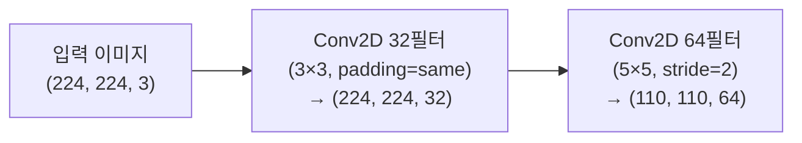

```python
model = Sequential()

model.add(Conv2D(32, kernel_size=(3,3), strides=(1,1), padding='same', activation='relu', input_shape=input_shape))
model.add(Conv2D(64, kernel_size=(5,5), strides=(2,2), padding='valid', activation='relu'))
```

- **첫 번째 층**: `padding='same'`을 적용하여 공간 크기를 유지 → `(224, 224, 32)`
- **두 번째 층**: `kernel_size=(5,5)`로 더 넓은 영역의 맥락을 포착, `stride=2`로 크기 축소 → `(110, 110, 64)`

#### 풀링(Pooling)

합성곱 층만으로 데이터 크기를 줄이면 가중치 파라미터가 늘어나 연산 비용이 증가한다. **풀링 층**은 학습 가능한 파라미터 없이 대표값만 추출하여 데이터를 압축한다.

| 항목      | 합성곱 층          | 풀링 층          |
| --------- | ------------------ | ---------------- |
| 파라미터  | 있음 (가중치 학습) | 없음             |
| 역할      | 특징 추출          | 크기 축소        |
| 연산 비용 | 높음               | 낮음             |
| 공간 정보 | 유지               | 요약 (손실 없이) |

풀링은 모델의 **위치 불변성(translation invariance)** 에도 기여한다. 객체가 약간 이동하더라도 풀링을 거친 출력값의 차이가 크게 달라지지 않는다.

```python
from tensorflow.keras.models import Sequential
from tensorflow.keras.layers import Conv2D, MaxPooling2D

input_shape = (224, 224, 3)
model = Sequential()
model.add(Conv2D(32, kernel_size=(3,3), activation='relu', input_shape=input_shape))
model.add(MaxPooling2D(pool_size=(2,2)))
```

---

### 3.1.3 생성적 적대 신경망(GAN)

#### 이미지 생성

그림을 그릴 때 우리는 대상을 관찰하여 얻은 정보를 활용한다. 지역에 따라 동일한 대상이 다른 형태로 묘사될 수 있다. 열대 지방 사람은 바다를 연하게 그리고, 추운 지방 사람은 어둡게 표현하며 빙하를 추가할 수 있다. 그러나 두 그림 모두 '넓은 수면'이라는 공통점을 지닌다.

신경망 모델로 이미지를 생성하려면, 사람처럼 대상에 대한 **일반적인 지식(분포)**을 학습해야 한다. 텍스트·음성·음악 생성 모델 모두 동일한 원리로 작동한다 — 데이터에서 자주 등장하는 패턴을 학습하고, 이를 일반화하여 '그럴듯한' 결과물을 재구성한다.

이미지 데이터의 특징은 **분포(distribution)** 라는 개념으로 설명된다. 아이들에게 비행기를 그리라고 하면, 대부분은 낮 하늘을 배경으로 비행기 측면을 그린다. 이는 아이들이 비행기를 주로 낮에, 매체(뉴스·영화)를 통해 측면으로 접하기 때문이다. 데이터 수집 과정의 편향이 생성 결과에도 반영된다.

#### 이미지 생성 모델에 필요한 요소

우수한 이미지 생성 모델이 갖춰야 할 세 가지 핵심 능력:

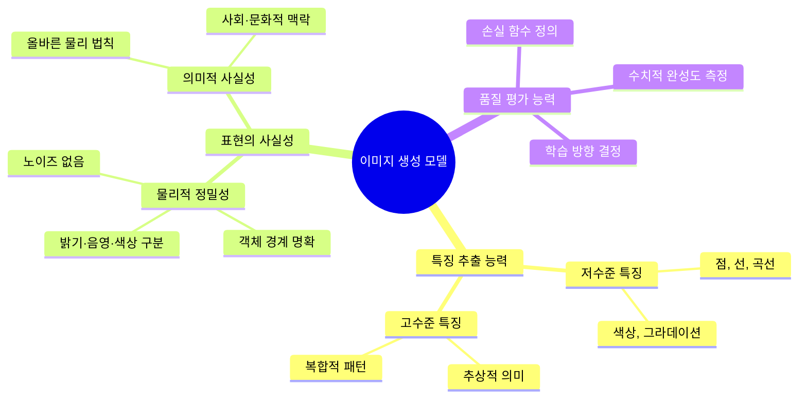

1. **특징 추출**: 저수준(점·선·색상)부터 고수준(추상적 의미) 특징까지 포착
2. **사실적 표현**: 물리적 정밀성과 사회·문화적 맥락을 반영한 묘사
3. **품질 평가**: 생성 이미지의 완성도를 수치로 표현하여 학습에 반영

#### 이미지 생성과 비지도 학습

비지도 학습은 레이블 없이 모델을 학습시키기에 지도 학습만큼의 학습 효율을 내기 어렵다. GAN은 이 한계를 우회하는 독창적인 방법을 사용한다 — 레이블 없이 이미지만 모아 학습시키되, **간이 레이블을 자동으로 생성**하여 지도 학습 방식으로 변환한다.

#### 오토 인코더

생성적 적대 신경망 이전에 등장한 이미지 생성 기법으로, 단순하면서도 강력한 학습 구조를 가진다.

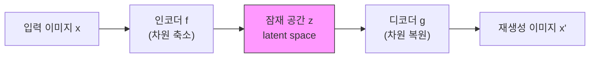

**인코더**: 고차원 이미지 $x$를 압축된 잠재 공간 $z$로 매핑

$$z = f(x)$$

**디코더**: 잠재 공간 $z$를 원본 크기의 이미지 $x'$로 복원

$$x' = g(z)$$

**학습 목표**: 재생성 이미지가 원본과 최대한 유사하도록 학습

$$x \approx x'$$

입력 이미지 $x$가 동시에 레이블로 사용되므로, 이는 **비지도 학습**에 해당한다.

#### 인코더

오토 인코더의 인코더는 비지도 학습의 **차원 축소(dimensionality reduction)** 와 비슷한 역할을 한다.

| 방법               | 선형 관계 | 비선형 관계 |
| ------------------ | --------- | ----------- |
| PCA (전통적)       | 효과적    | 처리 불가   |
| 오토 인코더 인코더 | 효과적    | **효과적**  |

인코더는 여러 층의 신경망으로 구성되며, 차원을 줄여가는 과정에서 이미지를 표현하는 **가장 중요하고 의미 있는 정보**를 탐색하도록 학습된다.

#### 디코더

디코더는 인코더에 의해 생성된 잠재 공간 표현을 원래의 데이터 공간으로 복원한다. 일반적으로 인코더 구조를 반대로 따른다.

- 인코더가 3층 구조 → 디코더도 3층 구조
- 인코더의 각 층이 크기를 줄임 → 디코더의 각 층이 크기를 늘림

#### 오토 인코더의 다양한 응용과 한계

**응용**:

- **특징 추출기**: 잘 학습된 인코더 부분만 분리하여 특징 추출기로 사용
- **이미지 복원(Denoising)**: 노이즈가 추가된 이미지를 입력으로, 원본을 목표로 학습하면 노이즈 제거 수행

**한계**:

| 한계          | 설명                                                            |
| ------------- | --------------------------------------------------------------- |
| 입력 의존성   | 이미지를 생성하려면 반드시 유사한 입력 이미지가 필요            |
| 표현의 제한   | 학습된 이미지의 특징만 재현 가능; 구성 요소를 따로 그릴 수 없음 |
| 구조의 단순함 | 텍스트로 원하는 이미지를 지시하기에 구조가 지나치게 단순        |

예시: 사람 얼굴만 학습한 오토 인코더는 눈·코·입을 독립적으로 그릴 수 없다.

#### 생성적 적대 신경망의 아이디어

GAN(Generative Adversarial Networks)은 레이블 없이도 진짜 같은 이미지를 만들어내는 모델이다.

핵심 아이디어: **생성자(Generator)** 와 **판별자(Discriminator)** 가 서로 경쟁하며 학습한다.

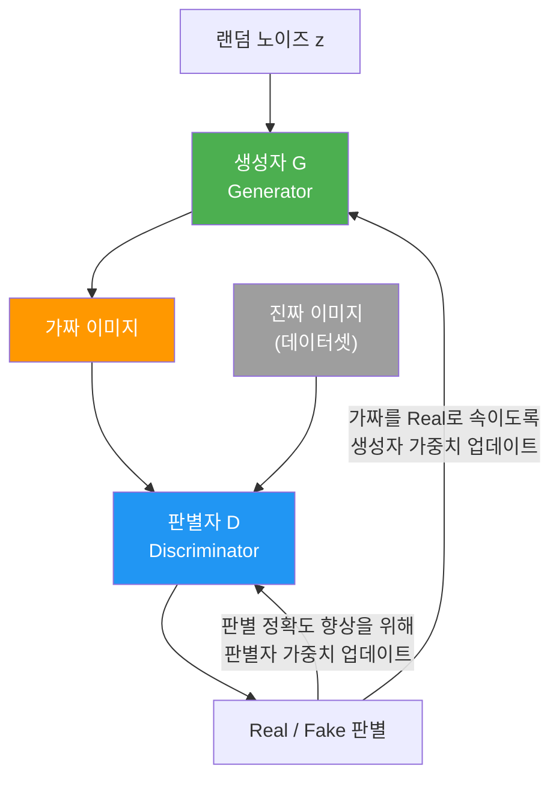

학습 이미지 데이터만 있으면, 자동으로 다음과 같은 간이 레이블이 생성된다:

- **진짜 이미지** → 레이블 `1`
- **생성자가 만든 가짜 이미지** → 레이블 `0`

#### 생성자

생성자의 역할과 학습 과정:

- **입력**: 랜덤 노이즈 또는 잠재 공간(latent space)에서 샘플링된 벡터
- **출력**: 실제 데이터와 동일한 차원·형태의 가짜 이미지
- **목표**: 판별자가 가짜를 진짜로 분류하도록 속이는 것 (판별 확률 최대화)

학습이 진행될수록 생성자는 점점 원본에 가까운 데이터를 생성하게 되며, 이는 판별자도 더 정교하게 구별해야 함을 의미한다.

#### 판별자

판별자는 **이진 분류** 모델이다.

- **입력**: 실제 이미지 또는 생성자가 만든 가짜 이미지
- **출력**: 시그모이드 활성화 함수를 통해 0~1 사이의 확률값
  - 진짜 샘플 → `1`에 가깝게
  - 가짜 샘플 → `0`에 가깝게
- **손실 함수**: 이진 교차 엔트로피(Binary Cross-Entropy)

**판별자 학습 과정**:

1. 생성자로 가짜 샘플을 생성한다.
2. 실제 샘플과 가짜 샘플을 각각 입력받아 판별자의 출력 확률값을 계산한다.
3. 진짜 샘플 손실과 가짜 샘플 손실을 합산하여 총 손실을 계산한다.
4. 총 손실에 대한 그레디언트를 계산하고, 이를 사용하여 판별자의 가중치를 업데이트한다.

이 과정을 반복하며 판별자는 점차적으로 생성자가 만든 가짜 샘플과 실제 샘플을 더 잘 구별하게 된다.

---

#### 텐서플로를 활용한 GAN 학습 실습

**데이터와 모델 구성**

```python
import numpy as np
import tensorflow as tf
from tensorflow.keras.layers import Dense, Flatten, Reshape
from tensorflow.keras.models import Sequential
from tensorflow.keras.datasets import mnist
from tqdm import tqdm
from google.colab.patches import cv2_imshow

(train_images, _), (_, _) = mnist.load_data()
train_images = (train_images - 127.5) / 127.5  # [-1, 1] 범위로 정규화
```

**모델 생성**

랜덤 노이즈를 받아 다층 퍼셉트론을 통과하여 이미지를 생성하는 **생성자** 모델:

```python
def build_generator(input_dim):
    model = Sequential()
    model.add(Dense(512, input_dim=input_dim, activation='relu'))
    model.add(Dense(28*28, activation='tanh'))  # 출력층 활성화 함수는 Dense 인수로 전달
    model.add(Reshape((28, 28)))
    return model
```

이미지가 원본인지 생성된 이미지인지 판별하는 **판별자** 모델:

```python
def build_discriminator():
    model = Sequential()
    model.add(Flatten(input_shape=(28, 28)))
    model.add(Dense(256, activation='relu'))
    model.add(Dense(1, activation='sigmoid'))
    return model
```

**하이퍼파라미터 정의**

```python
INPUT_DIM = 50
BATCH_SIZE = 64
EPOCHS = 10
BUFFER_SIZE = 600
```

**모델 및 옵티마이저 선언**

```python
generator = build_generator(INPUT_DIM)
discriminator = build_discriminator()

generator_optimizer = tf.keras.optimizers.Adam(1e-3)
discriminator_optimizer = tf.keras.optimizers.Adam(1e-2)
train_dataset = tf.data.Dataset.from_tensor_slices(train_images).shuffle(BUFFER_SIZE).batch(BATCH_SIZE)
```

#### 손실 함수 정의

생성자와 판별자의 손실 함수를 각각 정의한다.

- **판별자 손실**: 진짜는 `1`, 가짜는 `0`으로 잘 구분하는지 평가
- **생성자 손실**: 판별자를 얼마나 많이 속였는지 평가 (가짜를 `1`로 예측하게 만들수록 손실 감소)

```python
binary_cross_entropy = tf.keras.losses.BinaryCrossentropy()

def discriminator_loss(real_output, fake_output):
    real_loss = binary_cross_entropy(tf.ones_like(real_output), real_output)   # 진짜 → 1
    fake_loss = binary_cross_entropy(tf.zeros_like(fake_output), fake_output)  # 가짜 → 0
    total_loss = real_loss + fake_loss
    return total_loss

def generator_loss(fake_output):
    return binary_cross_entropy(tf.ones_like(fake_output), fake_output)  # 가짜를 1로 속이도록
```

- `real_output`: 원본 이미지를 본 판별자의 출력값 → 정답은 `1`
- `fake_output`: 생성 이미지를 본 판별자의 출력값 → 정답은 `0`

판별자 손실(`discriminator_loss`)은 이 정답을 얼마나 잘 맞히는지를 기준으로, 생성자 손실(`generator_loss`)은 `fake_output`이 `1`에 얼마나 가까운지를 기준으로 계산한다.

**학습 함수 정의**

```python
@tf.function  # 1. 그래프 모드로 컴파일하여 실행 속도 향상
def train_step(images):
    noise = tf.random.normal([BATCH_SIZE, INPUT_DIM])

    with tf.GradientTape() as gen_tape, tf.GradientTape() as disc_tape:
        generated_images = generator(noise, training=True)              # 2. 노이즈 → 가짜 이미지 생성
        real_output = discriminator(images, training=True)              #    진짜 이미지 판별
        fake_output = discriminator(generated_images, training=True)    #    가짜 이미지 판별
        gen_loss  = generator_loss(fake_output)                         # 3. 각 손실 계산
        disc_loss = discriminator_loss(real_output, fake_output)

    gradients_of_generator     = gen_tape.gradient(gen_loss,  generator.trainable_variables)      # 4. 그레디언트 계산
    gradients_of_discriminator = disc_tape.gradient(disc_loss, discriminator.trainable_variables)

    generator_optimizer.apply_gradients(zip(gradients_of_generator,     generator.trainable_variables))     # 5. 가중치 업데이트
    discriminator_optimizer.apply_gradients(zip(gradients_of_discriminator, discriminator.trainable_variables))
    return gen_loss, disc_loss, generated_images
```

#### 모델 학습

```python
for epoch in range(1, EPOCHS+1):
    t = tqdm(train_dataset)
    for image_batch in t:
        g_loss, d_loss, fake_image = train_step(image_batch)
        t.set_description_str(f"Epoch - {epoch}")
        t.set_postfix({"G_loss": "%0.3f" % g_loss.numpy(),
                       "D_loss": "%0.3f" % d_loss.numpy()})

    cv2_imshow(np.concatenate(                           # cv2_imshow: Colab 전용 이미지 출력 함수
        list(fake_image.numpy()[:10] * 127.5 + 127.5), axis=1))
```

### 생성적 적대 신경망의 한계

GAN은 강력한 생성 모델이지만, 아직 극복해야 할 세 가지 주요 한계가 존재한다.

| 한계             | 핵심 문제                            |
| ---------------- | ------------------------------------ |
| 노이즈 기반 생성 | 어떤 이미지가 출력될지 제어 불가     |
| 개체 인식 불가능 | 이미지 내 객체의 위치·속성 조절 불가 |
| 학습의 불안정성  | 모드 붕괴, 학습 발산 등              |

#### 노이즈로부터 만들어지는 이미지

노이즈 기반 생성의 장점은 결과가 제한되지 않고 다양하다는 점이다. 그러나 어떤 이미지가 출력될지 예측하거나 제어할 수 없다는 단점이 있다.

예를 들어 MNIST 숫자 생성 모델에 노이즈를 입력하면 `2`가 나올지 `3`이 나올지 알 수 없다. 학습 데이터와 닮은 이미지를 만드는 데는 적합하지만, 구체적으로 원하는 이미지를 만들기는 어렵다.

이를 해결하기 위한 접근이 **조건부 GAN(Conditional GAN, cGAN)** 이다. 노이즈에 레이블 벡터나 추가 조건 벡터를 함께 입력하여 원하는 종류의 이미지를 생성하도록 유도한다.

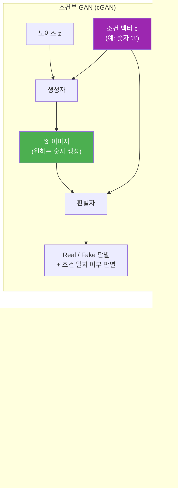

#### 개체 인식 불가능

기본 GAN은 이미지 내 객체의 세부 특성이나 위치를 인식하거나 조절하는 데 한계가 있다. 이를 극복하기 위한 확장 모델들이 개발되고 있다.

- **조건부 GAN(cGAN)**: 정답 레이블을 생성자·판별자 모두에게 함께 제공하여, 원하는 클래스의 이미지를 생성하도록 유도
- **텍스트-이미지 GAN**: 문장을 조건으로 입력하여 설명에 맞는 이미지를 생성

#### 학습의 불안정성

생성자와 판별자가 서로 경쟁하는 구조이므로, 둘 사이의 균형을 유지하는 것이 학습의 핵심이자 가장 어려운 부분이다.

**균형이 깨지는 두 가지 상황:**

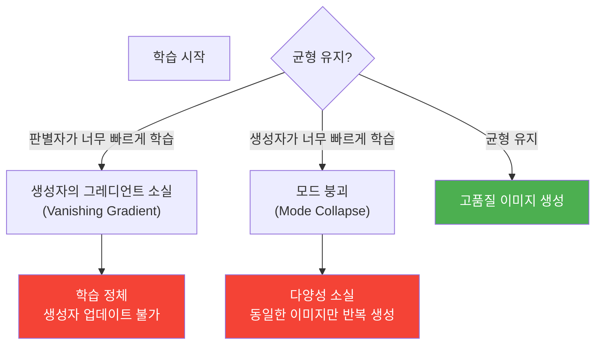

**모드 붕괴(Mode Collapse)란?**

생성자가 다양한 이미지를 생성하는 대신, **판별자를 가장 잘 속이는 소수의 패턴만 반복적으로 출력**하는 현상이다.

예시:

- MNIST 학습 중 생성자가 `1`만 계속 만들어냄
- 인물 이미지 학습 중 특정 얼굴 각도의 이미지만 반복 생성

모드 붕괴가 발생하면 생성자는 데이터셋의 다양한 분포를 학습하지 못하고, 실제 데이터에 존재하는 여러 패턴 중 극히 일부만 재현하게 된다.

| 항목        | 정상 학습             | 모드 붕괴             |
| ----------- | --------------------- | --------------------- |
| 생성 다양성 | 높음 (전체 분포 반영) | 낮음 (일부 패턴 반복) |
| 판별자 손실 | 점진적 감소           | 불규칙하게 진동       |
| 생성자 손실 | 점진적 감소           | 갑자기 낮아진 후 고착 |

**해결 방향**: 미니배치 판별(minibatch discrimination), Wasserstein GAN(WGAN), Spectral Normalization 등의 기법으로 완화할 수 있다.

---

#### Wasserstein GAN (WGAN)

기본 GAN의 판별자는 이진 분류(진짜/가짜)를 수행하므로, 학습이 어느 정도 진행되면 **판별자가 너무 강해져 생성자의 그레디언트가 소실**되는 문제가 발생한다.

WGAN은 손실 함수를 **Wasserstein Distance(Earth Mover's Distance)** 로 교체하여 이 문제를 해결한다.

**Wasserstein Distance란?**

두 확률 분포 $P_r$ (실제 데이터)과 $P_g$ (생성 데이터) 사이의 거리를 측정하는 지표로, 한 분포를 다른 분포로 변환하기 위해 필요한 **최소 이동 비용**으로 직관적으로 이해할 수 있다.

$$W(P_r, P_g) = \inf_{\gamma \in \Pi(P_r, P_g)} \mathbb{E}_{(x, y) \sim \gamma} [\|x - y\|]$$

기존 GAN의 손실 함수(Jensen-Shannon Divergence)는 두 분포가 겹치지 않으면 그레디언트가 `0`이 되어 학습이 멈추지만, Wasserstein Distance는 분포가 겹치지 않아도 **의미 있는 거리값과 그레디언트를 제공**한다.

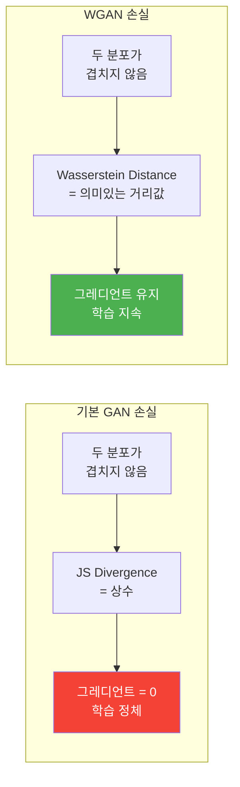

**WGAN의 핵심 변경점:**

| 항목        | 기본 GAN                  | WGAN                                   |
| ----------- | ------------------------- | -------------------------------------- |
| 판별자 역할 | 진짜/가짜 분류 (0~1 확률) | Critic — 실수값 점수 출력              |
| 손실 함수   | Binary Cross-Entropy      | Wasserstein Distance                   |
| 판별자 출력 | Sigmoid (0~1)             | 선형 (제한 없음)                       |
| 제약 조건   | 없음                      | **Weight Clipping** (가중치 범위 제한) |

판별자를 **Critic**이라 부르며, 이진 분류 대신 "얼마나 진짜 같은가"를 나타내는 실수값 점수를 출력한다.

```python
# WGAN 판별자(Critic) 손실 — 진짜 점수 최대화, 가짜 점수 최소화
def critic_loss(real_output, fake_output):
    return -(tf.reduce_mean(real_output) - tf.reduce_mean(fake_output))

# WGAN 생성자 손실 — Critic의 가짜 점수 최대화
def wgan_generator_loss(fake_output):
    return -tf.reduce_mean(fake_output)
```

---

#### Spectral Normalization

WGAN의 Weight Clipping은 구현이 단순하지만, 지나치게 제약이 강해 표현력이 낮아지는 부작용이 있다. **Spectral Normalization**은 이를 보완하는 더 정교한 정규화 기법이다.

**핵심 아이디어**: 판별자(또는 Critic)의 각 가중치 행렬을 **스펙트럼 노름(spectral norm)** 으로 나누어 정규화한다.

$$\hat{W} = \frac{W}{\sigma(W)}$$

여기서 $\sigma(W)$는 가중치 행렬 $W$의 최대 특이값(largest singular value)이다.

**왜 효과적인가?**

신경망이 립시츠 연속성(Lipschitz continuity)을 만족해야 WGAN의 학습이 안정적으로 이루어진다. Spectral Normalization은 각 층의 립시츠 상수를 1로 제한함으로써 전체 네트워크가 1-Lipschitz 조건을 만족하게 한다.

| 방법                   | 원리                           | 장점                     | 단점                          |
| ---------------------- | ------------------------------ | ------------------------ | ----------------------------- |
| Weight Clipping        | 가중치를 $[-c, c]$ 범위로 강제 | 구현 단순                | 표현력 저하, $c$ 값 튜닝 필요 |
| Spectral Normalization | 스펙트럼 노름으로 정규화       | 표현력 유지, 안정적 학습 | 계산 비용 소폭 증가           |

```python
from tensorflow.keras.layers import Conv2D
import tensorflow as tf

# Spectral Normalization을 적용한 Dense 레이어 예시
class SpectralNormDense(tf.keras.layers.Layer):
    def __init__(self, units):
        super().__init__()
        self.units = units

    def build(self, input_shape):
        self.w = self.add_weight(shape=(input_shape[-1], self.units), initializer='glorot_uniform')
        self.u = self.add_weight(shape=(1, self.units), initializer='truncated_normal', trainable=False)

    def call(self, inputs):
        # 멱승법(Power Iteration)으로 최대 특이값 근사
        v = tf.math.l2_normalize(tf.matmul(self.u, tf.transpose(self.w)))
        u_hat = tf.math.l2_normalize(tf.matmul(v, self.w))
        sigma = tf.matmul(tf.matmul(v, self.w), tf.transpose(u_hat))
        w_norm = self.w / sigma  # 스펙트럼 노름으로 정규화
        return tf.matmul(inputs, w_norm)
```

**세 가지 안정화 기법 비교:**

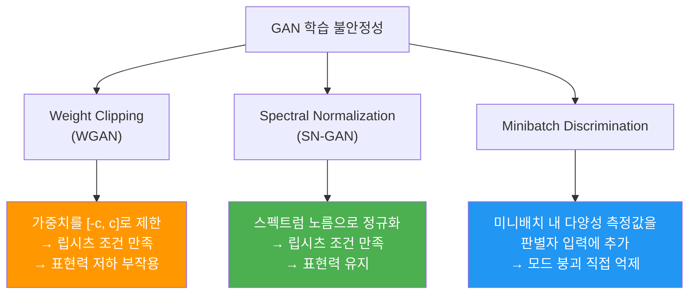

## 3.2 딥러닝을 활용한 이미지 처리

### 3.2.1 이미지 분류

이미지 분류(Image Classification)는 입력 이미지가 어떤 클래스에 속하는지를 예측하는 작업이다. 여기서는 CIFAR-10 데이터셋을 활용하여 다층 퍼셉트론(MLP)과 합성곱 신경망(CNN)으로 이미지 분류를 실습한다.

**CIFAR-10 데이터셋**

- 32×32 픽셀 컬러 이미지 60,000장
- 10개 클래스: 비행기, 자동차, 새, 고양이, 사슴, 개, 개구리, 말, 배, 트럭
- 훈련 50,000장 / 테스트 10,000장

#### 데이터 전처리

**모듈 불러오기**

```python
import matplotlib.pyplot as plt
from tensorflow.keras.datasets import cifar10
from tensorflow.keras.models import Sequential
from tensorflow.keras.layers import Dense, Flatten
from tensorflow.keras.callbacks import ModelCheckpoint, EarlyStopping
```

**데이터 불러오기 및 확인**

```python
(train_images, train_labels), (test_images, test_labels) = cifar10.load_data()

print(train_images.shape, train_labels.shape)
# (50000, 32, 32, 3) (50000, 1)
print(test_images.shape, test_labels.shape)
# (10000, 32, 32, 3) (10000, 1)

# 레이블은 0~9 정수
```

**데이터 정규화**

```python
train_images = train_images / 255.0
test_images  = test_images  / 255.0
```

> 정규화를 통해 입력 데이터 범위를 [0, 1]로 조정하면 경사 하강법이 더 빠르게 수렴하고 학습 안정성이 높아진다.

**데이터 분할 구조**

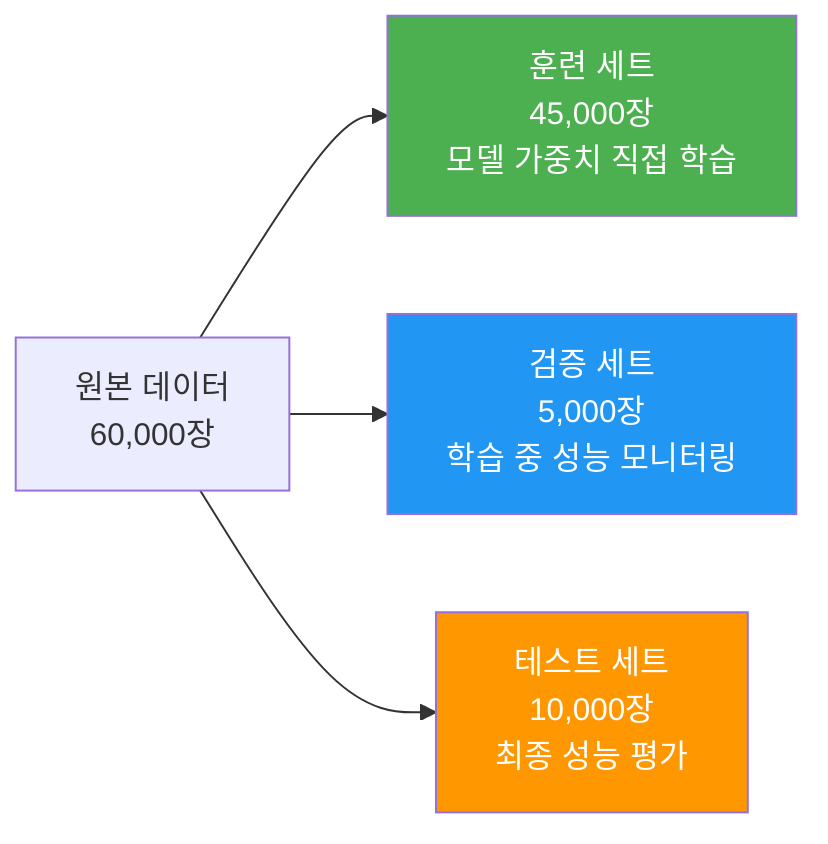

| 데이터셋    | 역할                      | 사용 시점          |
| ----------- | ------------------------- | ------------------ |
| 훈련 세트   | 모델 가중치 직접 학습     | `model.fit()`      |
| 검증 세트   | 학습 중간 과적합 모니터링 | 에포크마다         |
| 테스트 세트 | 최종 성능 평가            | `model.evaluate()` |

---

#### 다층 퍼셉트론(MLP)을 활용한 이미지 분류

**모델 구조**

```python
mlp_model = Sequential([
    Flatten(input_shape=(32, 32, 3)),
    Dense(512, activation='relu'),
    Dense(256, activation='relu'),
    Dense(128, activation='relu'),
    Dense(10, activation='softmax')
])
```

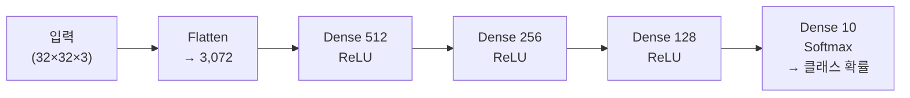

| 층                   | 역할                                                  |
| -------------------- | ----------------------------------------------------- |
| **입력층 (Flatten)** | 32×32×3 이미지를 3,072개의 1차원 벡터로 변환          |
| **은닉층 (Dense)**   | 비선형 관계 학습. 층이 깊을수록 복잡한 패턴 표현 가능 |
| **출력층 (Softmax)** | 10개 클래스 확률 출력 (합 = 1)                        |

**파라미터 수 계산**

$$\text{파라미터 수} = \text{입력 뉴런} \times \text{출력 뉴런} + \text{출력 뉴런(편향)}$$

첫 번째 Dense(512): $3{,}072 \times 512 + 512 = 1{,}573{,}376$ 개

**모델 컴파일 및 학습**

```python
mlp_model.compile(
    optimizer='adam',
    loss='sparse_categorical_crossentropy',
    metrics=['accuracy']
)
mlp_model.fit(train_images, train_labels, epochs=5, validation_data=(val_images, val_labels))
```

- `batch_size` 기본값: 32 → 45,000장 ÷ 32 = 에포크당 **1,407번** 이터레이션

**평가 결과**: 테스트 정확도 약 **46%**

**MLP의 이미지 처리 한계**

| 한계             | 설명                                                 |
| ---------------- | ---------------------------------------------------- |
| 고차원 비효율성  | 해상도 증가에 따라 가중치 수 폭발적 증가             |
| 공간 정보 손실   | 픽셀을 1차원으로 펼치는 과정에서 위치·형태 정보 소실 |
| 스케일 변형 취약 | 객체의 크기·방향·위치 변화에 민감하게 반응           |

---

#### 합성곱 신경망(CNN)을 활용한 이미지 분류

```python
from tensorflow.keras.layers import Conv2D, MaxPooling2D, Dropout
```

**모델 구조**

```python
cnn_model = Sequential([
    Conv2D(32, (3,3), padding='same', activation='relu', input_shape=(32, 32, 3)),
    MaxPooling2D((2, 2)),
    Conv2D(64, (3,3), padding='same', activation='relu'),
    MaxPooling2D((2, 2)),
    Conv2D(64, (3,3), padding='same', activation='relu'),
    Flatten(),
    Dropout(0.3),
    Dense(64, activation='relu'),
    Dropout(0.5),
    Dense(10, activation='softmax')
])
```

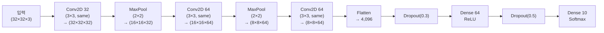

**Conv2D 파라미터 수 계산**

| 층              | 계산식                                 | 파라미터 수  |
| --------------- | -------------------------------------- | ------------ |
| Conv2D(32, 3×3) | $(3 \times 3 \times 3 + 1) \times 32$  | **896개**    |
| Conv2D(64, 3×3) | $(3 \times 3 \times 32 + 1) \times 64$ | **18,496개** |

- 가중치: 필터 크기(가로 × 세로) × 입력 채널 수
- 편향: 필터 1개당 1개

**콜백 정의**

텐서플로 콜백은 학습 중 특정 조건에 따라 동작을 자동 수행하는 핸들러다.

```python
from tensorflow.keras.callbacks import EarlyStopping, ModelCheckpoint

early_stopping = EarlyStopping(monitor='val_loss', patience=5)
save_best = ModelCheckpoint('best_cifar10_cnn_model.h5', save_best_only=True)
```

- `patience=5`: 검증 손실이 5 에포크 연속으로 감소하지 않으면 학습 중단

**평가 결과**: 테스트 정확도 약 **74.3%**

**MLP vs CNN 성능 비교**

| 항목          | MLP       | CNN             |
| ------------- | --------- | --------------- |
| 테스트 정확도 | ~46%      | ~74%            |
| 파라미터 수   | 매우 많음 | 상대적으로 적음 |
| 공간 정보     | 손실      | 유지            |
| 위치 불변성   | 낮음      | 높음 (풀링)     |

---

### 3.2.2 객체 인식

초기 객체 탐지는 특징 추출과 머신 러닝 기반 알고리즘을 활용했다. 대표적인 전통 기법인 **하르 캐스케이드(Haar Cascade)** 와 이를 뒷받침하는 **에이다부스트(AdaBoost)** 앙상블 학습에 대해 설명한다.

#### 하르 캐스케이드

2001년 폴 비올라(Paul Viola)와 마이클 존스(Michael Jones)가 제안한 객체 탐지 알고리즘이다. 효과적인 특징 추출과 에이다부스트(AdaBoost) 알고리즘을 결합하여, 복잡하고 다양한 이미지 데이터에서도 얼굴 같은 객체를 실시간으로 탐지할 수 있게 했다.

**특징 추출**

하르 캐스케이드는 합성곱 신경망의 학습된 필터가 아닌, **고정된 하르(Haar) 특징 필터**를 사용한다. 흰색과 검은색 직사각형 영역의 픽셀 강도 차이를 계산하여 특징값을 추출한다.

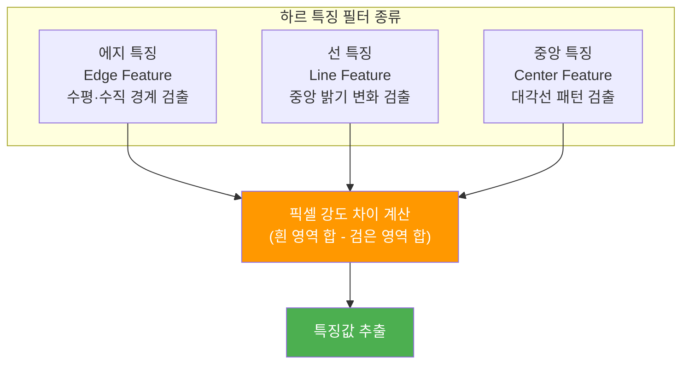

**하르 캐스케이드 특징의 스케일과 위치**

이미지 내 객체는 크기와 위치가 다양하므로, 탐지 알고리즘은 다양한 스케일과 위치를 모두 검색해야 한다.

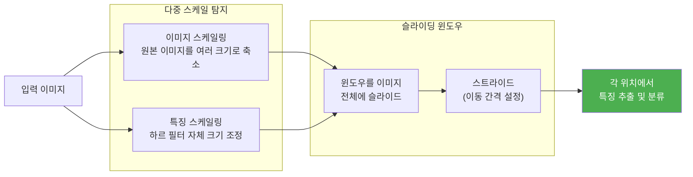

| 기법            | 설명                                                             |
| --------------- | ---------------------------------------------------------------- |
| 이미지 스케일링 | 원본 이미지를 여러 크기로 재조정하여 다양한 크기의 객체 탐지     |
| 특징 스케일링   | 하르 필터 자체의 크기를 조절하여 다양한 크기의 패턴 검출         |
| 슬라이딩 윈도우 | 지정 크기 윈도우를 이미지 전체에 걸쳐 이동하며 특징 추출         |
| 스트라이드      | 슬라이딩 윈도우의 이동 간격 — 작을수록 정밀하지만 연산 비용 증가 |

---

#### 에이다부스트

에이다부스트(AdaBoost, Adaptive Boosting)는 머신 러닝의 **앙상블 부스팅** 기법으로, 성능이 낮은 여러 **약한 학습기(Weak Learner)** 를 순차적으로 결합하여 하나의 강력한 **강한 학습기(Strong Learner)** 를 만든다.


**1단계: 데이터 가중치 초기화**

$N$개의 샘플에 대해 초기 가중치를 균등하게 부여한다.

$$w_i^{(1)} = \frac{1}{N}, \quad i = 1, 2, \ldots, N$$

어떤 샘플이 중요한지 아직 알 수 없으므로 모든 샘플을 동등하게 대우한다.

**2단계: 반복 학습**

$t$번째 반복에서 약한 학습기 $h_t$를 현재 가중치로 학습한 뒤, 가중 오차율을 계산한다.

$$\varepsilon_t = \frac{\displaystyle\sum_{i=1}^{N} w_i^{(t)} \cdot \mathbf{1}[y_i \neq h_t(x_i)]}{\displaystyle\sum_{i=1}^{N} w_i^{(t)}}$$

학습기의 기여도(가중치) $\alpha_t$를 오차율로부터 계산한다. 오차가 낮을수록 $\alpha_t$가 커져 최종 분류에 더 큰 영향을 미친다.

$$\alpha_t = \frac{1}{2} \ln\!\left(\frac{1 - \varepsilon_t}{\varepsilon_t}\right)$$

샘플 가중치를 업데이트한다. 오분류된 샘플의 가중치는 증가하고, 정분류된 샘플의 가중치는 감소하여 다음 학습기가 어려운 샘플에 집중하게 한다.

$$w_i^{(t+1)} = \frac{w_i^{(t)} \cdot \exp\!\left(-\alpha_t \cdot y_i \cdot h_t(x_i)\right)}{Z_t}$$

여기서 $Z_t$는 가중치 합이 1이 되도록 하는 정규화 상수다.

**3단계: 결합**

모든 약한 학습기를 가중 다수결로 결합하여 최종 분류기를 생성한다.

$$H(x) = \text{sign}\!\left(\sum_{t=1}^{T} \alpha_t \cdot h_t(x)\right)$$

**에이다부스트 구성 요소 요약**

| 구성 요소         | 설명                                                            |
| ----------------- | --------------------------------------------------------------- |
| 약한 학습기 $h_t$ | 무작위 예측보다 조금 나은 단순 분류기 (예: 단일 결정 트리)      |
| 가중치 $\alpha_t$ | 학습기의 정확도가 높을수록 크게 설정됨                          |
| 샘플 가중치 $w_i$ | 오분류될수록 증가 → 다음 학습기가 어려운 샘플에 집중하도록 유도 |
| 최종 분류 $H(x)$  | 모든 학습기의 가중 합산 후 부호로 결정                          |

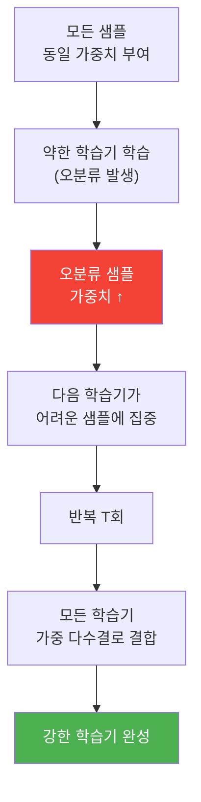
