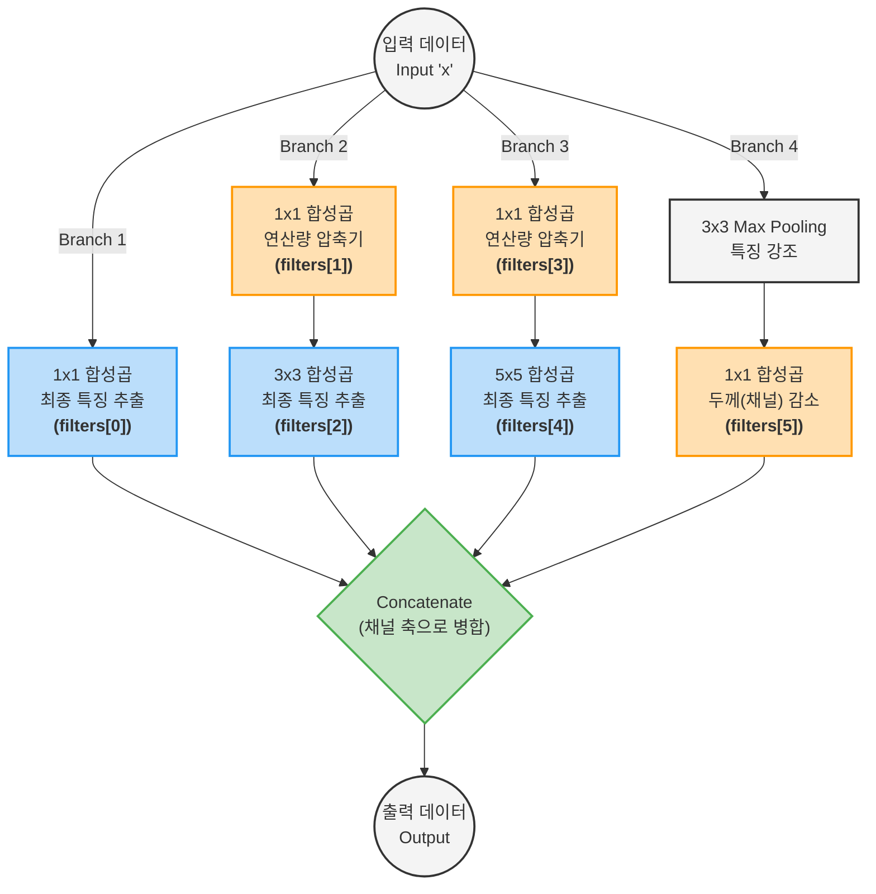
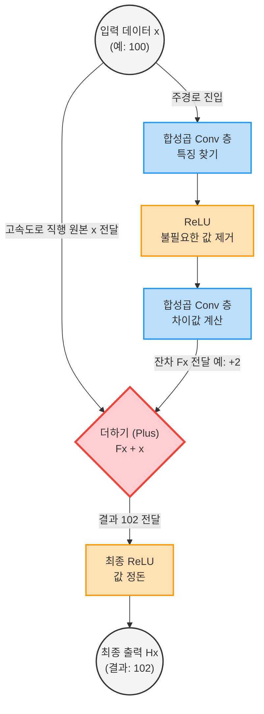

# 4. 이미지 분류

## 4.1 구글넷과 레즈넷

### 4.1.1 초기 신경망 모델

> 다양한 이미지 분류 모델을 설명

#### 이미지넷

> 이미지넷은 컴퓨터 비전 분야에서 널리 알려진 대규모 데이터 세트. 120만 개 이상의 데이터와 2만 개 이상의 레이블로 구성되어 있음. 이미지넷은 주로 이미지 인식 및 분류 모델을 훈련하는 데 사용됨.
> 해당 데이터 세트를 활용하여 모델의 성능을 측정하는 ILSVRC(ImageNet Large Scale Visual Recognition Challenge) 대회가 있는데, 2012년부터는 다음에 살펴볼 알렉스넷이 1위를 차지하기 시작하면서 딥러닝 모델이 지속적으로 우승을 차지함. 현재는 더이상 이 대회는 열리지 않음. 이미 거의 최고 수준의 분류 모델이 나왔기 때문에

#### 알렉스넷

> 알렉스 크리제브스키, 일리야 서츠케버, 제프리 힌튼이 개발한 알렉스넷은 앞서 말한 것처럼 2012년 ILSVRC에서 top-5 오차율 15.35%를 기록하여 2위와 10%p가 넘는 압도적인 성능 차이로 우승함.

> 알렉스넷의 우승 이후, 딥러닝은 이미지 처리에서 딥러닝이 기존 방법보다 뛰어난 것을 입증하며, 인공지능 연구의 최전선에 서게 됨. 또한 이미지 분류 작업에 대한 CNN의 잠재력을 보여주어 합성곱 신경망이 널리 확산되는 계기가 되었음

1. 데이터 증강

   > 레이블 값을 변화시키지 않고 원 데이터만 변형하는 방식으로 데이터 양을 늘리는 기법. 좌우 반전, 이미지 랜덤 추출, 색상 채널 임의 변경 등의 기법을 적용하여 데이터를 증강함

2. ReLU 함수
3. 드롭아웃

#### 알렉스 넷의 한계

1. 매우 큰 11x11 필터

   > 많은 계산량을 필요로 함. 학습 시간과 메모리 사용량 증가로 이어짐. 모든 픽셀에 동일한 중요도를 부여하고, 많은 매개변수를 가지고 있어 과적합 간으성이 높아짐

2. 충분하지 않은 깊이

   > 알렉스넷 신경망의 층은 8개에 불과함. 따라서 저수준 특성을 잘 추출하지만, 복잡한 문제에서 요구되는 고수준 특성을 추출하는 데는 한계가 있음. 따라서 모델의 표현력이 떨어져 정확도가 제한도미. 이후 등장한 네트워크 구조들은 이러한 고수준 특성을 더 잘 학습하는 방법을 제시하여 100개 이상의 층을 사용함.

3. 세 개의 최종 완결 연결층
   > 세 개의 최종 완전 연결 층에는 2,600만 개의 학습 가능 가중치가 있음. 이는 모든 합성곱층을 합친 것보다 많은 숫자임. 완전 연결층은 이미지의 공간 정보를 고려하지 않기 때문에 과적합 가능성이 높아짐.

#### VGG

> VGG는 3x3 필터만으로 최대 19개의 깊은 층을 쌓아 아키텍처를 구성하여 문제를 해결합니다.
> VGG 모델은 작은 사이즈의 커널(3x3)을 사용하는 여러 층의 합성곱 층으로 구성되어 있습니다. 이러한 구조는 네트워크의 깊이를 증가시키면서도 매개변수의 수를 효율적으로 관리할 수 있게 합니다.

> VGG는 각각 신경망 층이 16개로 구성되어 있는지, 아니면 19개의 층으로 구성되어 있는지에 따라 VGG16, VGG19로 나뉩니다. 활성화 함수로는 은닉층에서는 ReLU, 출력층에서는 소프트맥스를 사용합니다.

> VGG는 알렉스넷에 비해 층수가 많고 매개변수가 더 많지만, 알렉스넷보다 더 빨리 수렴합니다. VGG가 작은 사이즈의 합성곱 필터(주로 3x3)를 사용하여 네트워크의 깊이를 늘리면서도 매개변수의 총 수를 효율적으로 관리하고, 더 깊은 네트워크를 통해 더 복잡한 특징을 학습할 수 있게 설계되었기 때문. 작은 합성곱 필터를 사용함으로써, 각 층에서의 학습이 더 효율적이며, 여러 층을 거치며 더 세밀한 특징을 추출할 수 있음. 이는 더 빠른 수렴 속도와 더 나은 성능으로 이어짐. 또한 VGG는 균일한 아키텍처를 사용하여 각 층에서 비슷한 계산을 반복함으로써 학습 과정을 더욱 최적화하고 안정화시킴. 이러한 설계 방식은 깊은 네트워크의 학습을 용이하게 하여 알렉스넷보다 더 빨리 수렴하게 함.

> 하지만 이 간단한 구조는 VGG를 대표로 하는 초기 모델의 한계이기도 함. 초기 이미지 분류 모델의 개발은 주로 모델의 깊이, 즉 층(layer)의 수를 늘리는 방향으로 진행되었음. 이러한 추세는 모델의 성능 향상에 큰 기여를 했으나, 동시에 '그레이더언트 소실(Vanishing Gradient)' 문제와 같은 새로운 도전 과제를 만들어 냈음. 층이 깊어질수록 학습 과정에서 초기 층으로의 그레디언트 전파가 약해져 모델 학습이 제대로 이뤄지지 않는 현상이 발생함.

### 4.1.2 구글넷

> 2014년에 구글의 연구자들이 개발했으며, 그해 ILSVRC 2014 대회에서 우승을 차지함. 구글넷은 이전 모델들과 비교하여 훨씬 더 깊은 네트워크 구조를 가지고 있으면서도, 모델 파라미터의 수를 효율적으로 줄여 계산 비용을 낮추는 것이 특징임. 구글넷은 당시 2년 전 우승한 알렉스넷보다 12배 적은 모델 파라미터를 사용하면서도 훨씬 더 정확한 결과를 얻을 수 있음

> 구글넷은 9개의 인셉션 모듈을 포함하고 총 22개의 층으로 구성되어 있고, 풀링 층까지 포함하면 27개의 층으로 구성되어 있습니다.

> 기존 모델에 비해 적은 파라미터로 더 깊은 모델을 만들 수 있었던 핵심 아이디어는 '인셉션 모듈(inception module)' 이라 불리는 구조를 도입한 것입니다. 일반적으로 네트워크의 사이즈가 증가하면 사이즈에 걸맞은 학습 데이터를 만드는 문제와 컴퓨터 리소스 사용량이 증가하는 등의 문제가 있었습니다. 인셉션은 이 문제를 해결하기 위해 완전히 연결된 아키텍처가 아닌 간헐적으로 연결된 아키텍처를 사용합니다. 인셉션 모듈은 여러 사이즈의 필터(1x1, 3x3, 5x5)를 동시에 적용하고, 그 결과를 병합하는 방식으로 구성되어 있습니다. 이를 통해 다양한 스케일의 특징을 효과적으로 추출할 수 있게 됩니다.

> 인셉션 모듈에서는 입력으로 주어진 이미지에 대해 여러 가지 사이즈의 필터를 동시에 사용하여 다양한 사이즈의 특징 맵을 생성합니다. 이를 통해 네트워크는 다양한 사이즈에서 추상화된 특징을 학습할 수 있습니다.

> 하나의 인셉션 모듈에서는 3x3, 5x5 합성곱 층과 3x3 최대 풀링 층을 사용합니다. 모든 층의 출력은 채널 축을 따라 합쳐서(concatenation) 모듈 내부의 최종 출력을 생성해 다음 층으로 전달합니다. 따라서 인셉션 모듈은 입력 데이터에 대해 다양한 사이즈와 깊이의 필터를 사용하여 병렬로 연산할 수 있습니다. 이는 인셉션 모듈이 다양한 사이즈의 특징을 동시에 학습하여 네트워크의 성능을 향상시키는 데 도움을 줍니다.

> 인셉션 모듈에서 남아 있는 문제점은 5x5 합성곱 층이 학습에 큰 비용을 차지한다는 점입니다. 또한 풀링 층의 출력과 합성곱 층의 출력이 병합하여 출력 수를 증가시킵니다. 결과적으로 매우 비효율적으로 처리가 되며 계산 폭증으로 이어집니다. 이때 학습 비용을 줄이기 위하여 합성곱 층 앞에 1x1 합성곱 층을 배치합니다.

#### 1x1 합성곱

> 1x1 컨볼루션, 종종 '포인트와이즈(pointwise) 컨볼루션'이라고 불리는 이 기술은 합성곱 신경망에서 깊이 차원을 조절하는 데 효과적인 방법입니다. 처음 보기에는 그저 하나의 픽셀만을 가지고 연산을 수행하는 것처럼 단순하고 무의미하게 보일 수 있지만, 실제로는 다음과 같은 여러 중요한 역할과 효과가 있습니다.

1. 차원 축소

   > 1x1 합성곱은 특성 맵의 깊이를 줄이는 데 사용될 수 있습니다. 예를 들어, 입력 특성 맵이 256개의 채널을 가지고 있고, 1x1 합성곱 필터가 64개의 출력 채널로 구성된 경우, 이는 깊이를 256에서 64로 줄이는 효과를 가지며, 이는 모델의 파라미터 수와 계산량을 줄이는 데 도움이 됩니다.

2. 특성 조합

   > 1x1 합성곱은 깊이 방향으로 채널 간의 정보를 효과적으로 결합할 수 있습니다. 이는 각 위치에서 모든 입력 채널을 통해 정보를 집계하고, 새로운 특성을 생성하여 더 복잡하거나 고차워의 특성 표현을 학습하는 데 도움을 줍니다.

3. 계산 효율성 향상

   > 특히 깊은 네트워크에서는 구글넷에서의 인셉션 모듈에서와 같이 1x1 합성곱을 통해 차원을 축소하고 다시 확장하는 방법으로 계산량을 크게 줄일 수 있습니다. 이는 모델의 효율성을 높이고, 과적합을 방지하는 데도 도움이 됩니다.

4. 네트워크 내 비선형성 증가
   > 1x1 합성곱 연산 뒤에 비선형 활성화 함수(ex. ReLU)를 적용함으로써, 모델의 표현력을 높이고 복잡한 함수를 학습할 수 있습니다. 이는 모델이 더 복잡한 패턴과 관계를 학습하는 데 필수적입니다.

1x1 합성곱 층 유무 비교

- 1x1 conv 미사용
  - 28 x 28 x 192 -> Conv (5x5x32) -> 28 x 28 x 32
  - 매개변수 : 28 x 28 x 32 x 5 x 5 x 192 = 120M
- 1x1 conv 사용
  - 28 x 28 x 192 -> Conv(1x1x16) 28 x 28 x 16 -> Conv (5x5x32) -> 28 x 28 x 32
  - 매개변수 : 28 x 28 x 16 x 1 x 1 x 192 + 28 x 28 x 32 x 16 x 5 x 5 = 12.4M

#### 인셉션 모듈 구현

> 다음 에시 코드는 텐서플로를 활용하여 구현한 구글넷의 인셉션 모듈입니다.

```python
from tensorflow.keras import layers, models

def inception_module(x, filters):
    branch1x1 = layers.Conv2D(filters[0], kernel_size=1, activation='relu')(x)
    branch3x3 = layers.Conv2D(filters[1], kernel_size=1, activation='relu')(x)
    branch3x3 = layers.Conv2D(filters[2], kernel_size=3, padding='same', activation='relu')(branch3x3)

    branch5x5 = layers.Conv2D(filters[3], kernel_size=1, activation='relu')(x)
    branch5x5 = layers.Conv2D(filters[4], kernel_size=5, padding='same', activation='relu')(branch5x5)

    branch_pool = layers.MaxPooling2D(pool_size=3, strides=1, padding='same')(x)
    branch_pool = layers.Conv2D(filters[5], kernel_size=1, activation='relu')(branch_pool)

    outputs = layers.concatenate([brach1x1, branch3x3, branch5x5, branch_pool], axis=-1)
    return outputs
```



#### functional API

> 해당 코드에서는 functional API를 사용해 인셉션 모듈 정의. 기존에 사용되던 sequential API와 달리 다양한 네트워크 아키텍처를 더 유연하게 구성할 수 있음.
> sequential API는 층들을 순차적으로 쌓아나갈 수 있는 반면, functional API는 층들을 그래프 형태로 연결하여 다중 입력, 다중 출력 네트워크를 설계할 수 있음.

1. sequential API를 사용한 방법
   > 다음은 지금까지 다룬 예제 코드들에서 모델을 만들었던 방법

```python
mlp_model = Sequential()
mlp_model.add(Flatten(input_shape=(32, 32, 3)))
mlp_model.add(Dense(128, activation='relu'))
mlp_model.add(Dense(10, activation='softmax'))
```

2. functional API를 사용한 방법
   > functional API는 Input 객체로 모델의 입력을 정의하고, 다른 층들을 연결하여 모델을 구성합니다. 다음 예시 코드에서는 Input 객체를 이용해 입력 데이터의 모양을 정의합니다.

```python
inputs = Input(shape=(32, 32, 3))
x = Flatten()(inputs)
x = Dense(128, activation='relu')(x)
outputs = Dense(10, activation='softmax')(x)
mlp_model = Model(inputs=inputs, outputs=outputs)
```

> 그 다음 Flatten 층을 호출하고 입력을 해당 층에 전달합니다. 호출된 층은 입력을 신경망에 통과시킵니다. 이때 중요한 점은 층이 함수처럼 호출되면서, 이전 층의 출력을 입력으로 받는다는 것입니다. 같은 방식으로 밀집층들을 호출하여 이전 층의 출력을 입력으로 사용하고, 생성된 반환 값은 다음 층의 입력으로 사용됩니다. 마지막으로 Model 객체를 생성하여 입력과 출력을 제공하면, 모델이 생성됩니다.

#### 텐서플로를 활용한 구글넷 구현

> 구글넷 모델의 전체 코드를 살펴보겠습니다. 먼저 다음과 같이 구글넷 모델을 구성하기 위한 모듈과 신경망 층 구성 요소를 불러옵니다.

```python
import tensorflow as tf
from tensorflow.keras import Model, regularizers
from tensorflow.keras.layers import Flatten, Dense, Dropout, Conv2D, MaxPool2D, BatchNormalization, Activation, Input, AveragePooling2D, concatenate
from tensorflow.keras.callbacks import ReduceR0nPlateau
import matplotlib.pyplot as plt
```

다음과 같이 학습에 필요한 몇 가지 주요 하이퍼파라미터를 설정합니다.

```python
image_size = (32, 32)
batch_size = 64
weight_decay = 5e-4
learning_rate = 1e-2
epochs = 40
```

> cifar10은 가로 세로 사이즈가 각 32픽셀인 작은 이미지 데이터 세트입니다. 이 이미지를 배치 하나에 64개씩 묶어 학습합니다. weight_decay는 가중치 규제를 위한 L2 규제 계수를 의미합니다. 학습률은 0.01로 설정하였으며 학습은 전체 데이터를 40회 순회합니다.

> 인셉션 모듈을 구현해보겠습니다. 이 모듈의 구조는 앞서 제시한 예시 코드와 유사하지만, 몇 가지 차이점이 있습니다. 먼저 다음 코드에서 인셉션 모듈을 구성하는 합성곱 블록인 `conv2d_bn_relut` 부터 살펴보겠습니다.

```python
def conv2d_bn_relu(x, filters, kernel_size, weight_decay=.0, stride=1):
    x = Conv2D(filters=filters,
        kernel_size=kernel_size,
        strides=strides,
        padding='same',
        kernel_regularizer=regularizers.l2(weight_decay))(x)
    x = BatchNormalization(scale=False, axis=3)(x)
    x = Activation('relu')(x)
    return x
```

> 인셉션 모듈에서는 합성곱 블록은 입력 데이터 x를 합성곱 층에 통과시킨 뒤, 이어서 배치 정규화 층과 ReLU 활성화 함수 층을 거치게 합니다. 이 블록은 구글넷뿐만 아니라 여러 합성곱 신경망에서 살펴볼 수 있는 패턴으로, 모델이 이미지 데이터의 다양한 표현력을 빠르게 학습할 수 있다는 특징을 갖습니다. 합성곱 층 중간에 삽입되는 L2 규제는 모델의 과적합을 방지합니다.

> 참조
> 텐서플로(TensorFlow)는 기본적으로 데이터를 4차원 상자(N, H, W, C) 형태로 다룹니다.

- 0축 (N - Batch): 사진의 장수 (예: 64장)
- 1축 (H - Height): 세로 픽셀 (예: 32)
- 2축 (W - Width): 가로 픽셀 (예: 32)
- 3축 (C - Channel): 두께/채널 (예: 빨/초/파 3색, 또는 Conv가 뽑아낸 192개의 특징)
  👉 axis=3의 의미:
  "사진 전체를 다 뭉뚱그려서 평균을 내지 말고, '3축(채널)'을 기준으로 각 채널(특징)마다 따로따로 정돈해라!" 라는 뜻입니다.
  예를 들어 192개의 채널이 있다면, 1번 채널의 평균과 분산, 2번 채널의 평균과 분산을 독립적으로 192번 계산합니다. (빨간색 물감은 빨간색끼리, 파란색은 파란색끼리 농도를 맞추는 것과 같습니다.)

BatchNormalization(scale=False, axis=3)(x) 코드는 앞서 비유했던 **'규격화 담당자'**가 실제로 공장(메모리) 안에서 어떻게 움직이는지를 지시하는 정밀한 명령서입니다.
이 한 줄의 코드가 내부적으로 어떻게 4단계에 걸쳐 데이터를 가공하는지, 그리고 왜 하필 scale=False와 axis=3이라는 옵션을 주었는지 아주 쉽게 분해해 드리겠습니다.
1단계: 어디를 기준으로 정돈할 것인가? (axis=3)
우선 컴퓨터가 이미지 데이터를 처리할 때의 형태를 알아야 합니다. 텐서플로(TensorFlow)는 기본적으로 데이터를 4차원 상자(N, H, W, C) 형태로 다룹니다.
0축 (N - Batch): 사진의 장수 (예: 64장)
1축 (H - Height): 세로 픽셀 (예: 32)
2축 (W - Width): 가로 픽셀 (예: 32)
3축 (C - Channel): 두께/채널 (예: 빨/초/파 3색, 또는 Conv가 뽑아낸 192개의 특징)
👉 axis=3의 의미:
"사진 전체를 다 뭉뚱그려서 평균을 내지 말고, '3축(채널)'을 기준으로 각 채널(특징)마다 따로따로 정돈해라!" 라는 뜻입니다.
예를 들어 192개의 채널이 있다면, 1번 채널의 평균과 분산, 2번 채널의 평균과 분산을 독립적으로 192번 계산합니다. (빨간색 물감은 빨간색끼리, 파란색은 파란색끼리 농도를 맞추는 것과 같습니다.)

> 2단계: 평균을 0으로 맞추기 (이동)
> 이제 각 채널별로 데이터를 정돈합니다.
> 먼저 이번 배치(64장의 사진)에서 해당 채널이 가진 숫자들의 **평균(Mean)**을 구합니다.
> 그리고 모든 데이터에서 그 평균값을 빼버립니다.

> 3단계: 분산을 1로 맞추기 (압축/팽창)
> 영점으로 모이긴 했지만, 어떤 데이터는 -100 ~ 100까지 퍼져있고, 어떤 데이터는 -0.1 ~ 0.1로 너무 좁게 모여있을 수 있습니다.
> 그래서 **분산(Variance, 데이터가 퍼진 정도)**을 구한 뒤, 그 값으로 나누어 줍니다.
> 효과: 넓게 퍼진 데이터는 압축하고, 좁게 모인 데이터는 늘려서 모든 데이터의 퍼짐 정도(표준편차)가 딱 '1'이 되도록 규격화합니다.

> 4단계: scale=False의 비밀 (스케일링 생략)
> 원래 완벽한 배치 정규화는 위 3단계(평균 0, 분산 1)를 마친 후, 모델이 스스로 학습하는 두 가지 마법의 변수를 곱하고 더해줍니다.

1. γ (감마, Scale): 1로 맞춰진 폭을 다시 자기 맘대로 늘리거나 줄임 (곱하기)
2. β (베타, Shift): 0으로 맞춰진 중심을 자기 맘대로 좌우로 이동시킴 (더하기)
   👉 그런데 코드에서 scale=False를 주었습니다!
   이 말은 "1번 감마(γ) 곱하기(크기 조절)는 하지 말고 무조건 폭을 1로 고정해! 중심 이동(베타 β)만 허락해 줄게!" 라는 뜻입니다.
   🤔 왜 굳이 크기 조절(Scale)을 꺼버렸을까요?
   바로 다음 층이 Activation('relu')이기 때문입니다.
   ReLU는 "0보다 크면 통과, 0 이하면 버림"이라는 규칙을 가집니다. 여기서 데이터의 '폭(크기)'을 늘리거나 줄이는 것은 ReLU의 결과 형태에 큰 영향을 주지 못합니다. 어차피 다음 층의 합성곱(Conv) 가중치들이 그 폭을 다시 조절할 수 있거든요.
   따라서 굳이 계산할 필요 없는 γ(감마) 변수를 없애버림으로써, 모델의 매개변수(메모리)를 아끼고 계산을 더 가볍게 만든 아주 똑똑한 최적화 기법

> 이제 인셉션 모듈 함수를 살펴보겠습니다.

```python
def inception_module(x, filters_num_array, weight_decay=.0):
    (br0_filters, br1_filters, br2_filters, br3_filters) = filters_num_array
    br0 = conv2d_bn_relu(x, filters=br0_filters, kernel_size=1, weight_decay=weight_decay)
    br1 = conv2d_bn_relu(x, filters=br1_filters[0], kernel_size=1, weight_decay=weight_decay)
    br1 = conv2d_bn_relu(br1, filters=br1_filters[1], kernel_size=3, weight_decay=weight_decay)
    br2 = conv2d_bn_relu(x, filters=br2_filters[0], kernel_size=1, weight_decay=weight_decay)
    br2 = conv2d_bn_relu(br2, filters=br2_filters[1], kernel_size=5)
    br3 = MaxPool2D(pool_size=3, strides=(1, 1), padding='same')(x)
    br3 = conv2d_bn_relu(br3, filters=br3_filters, kernel_size=1, weight_decay=weight_decay)
    x = concatenate([br0, br1, br2, br3], axis=3)
    return x
```

> 앞서 설명된 모듈의 구조와 비슷하게, 모듈은 입력 데이터를 받아 이를 네 개의 합성곱 블록에서 병렬적으로 처리합니다. br0 블록에서는 1x1 합성곱 층이, br1에서는 3x3 합성곱 층이, br2에서는 5x5 합성곱 층이 내재되어 있습니다. br3에서는 최대 풀링 후 1x1 합성곱 층을 통해 채널 수를 조정합니다. 마지막으로 concatenate 함수를 사용해 이들을 결합하며, 결합 방향을 채널 방향인 axis=3으로 설정합니다. 함수의 인수 중 filters_num_array는 각 블록마다 적용될 필터의 수를 담은 배열로, 총 네 개의 값을 요구합니다.

> 다음은 구글넷 아키텍처를 구축하기 위한 함수입니다. 다만 이번 실습 때는 사이즈가 작은 이미지를 사용하기 때문에 모델의 구조가 원본과는 다소 다르게 조정되었음을 알립니다.

```python
def googlenet(input_shape, classes, weight_decay=.0):
    input = Input(shape=input_shape)
    x = input
    x = conv2d_bn_relu(x, filters=64, kernel_size=1, weight_decay=weight_decay)
    x = conv2d_bn_relu(x, filters=192, kernel_size=3, weight_decay=weight_decay)
    x = MaxPool2D(pool_size=3, strides=2, padding='same')(x)
    x = inception_module(x, (64, (96, 128), (16, 32), 32), weight_decay=weight_decay)
    x = inception_module(x, (128, (128, 192), (32, 96), 64), weight_decay=weight_decay)
    x = MaxPool2D(pool_size=2, strides=2, padding='same')(x)
    x = inception_module(x, (192, (96, 208), (16, 48), 64), weight_decay=weight_decay)
    x = inception_module(x, (160, (112, 224), (24, 64), 64), weight_decay=weight_decay)
    x = inception_module(x, (128, (128, 256), (24, 64), 64), weight_decay=weight_decay)
    x = inception_module(x, (112, (144, 288), (32, 64), 64), weight_decay=weight_decay)
    x = inception_module(x, (256, (160, 320), (32, 128), 128), weight_decay=weight_decay)
    x = MaxPool2D(pool_size=2, strides=2, padding='same')(x)
    x = inception_module(x, (256, (160, 320), (32, 128), 128), weight_decay=weight_decay)
    x = inception_module(x, (384, (192, 384), (48, 128), 128), weight_decay=weight_decay)
    x = AveragePooling2D(pool_size=4, strides=1, padding='valid')(x)
    x = Flatten()(x)
    output = Dense(classes, activation='softmax')(x)
    model = Model(input, output)
    return model
```

#### 4.1.3 레즈넷

> 딥러닝 모델은 깊이가 깊어질수록 표현할 수 있는 능력이 향상되어 성능이 증가하지만 모델이 특정 깊이 이상으로 너무 깊어지게 되면 성능이 증가하지 않거나 심지어 감소(degradation)하는 경향이 있습니다. 인셉션 모듈을 활용한 구글넷처럼 이 문제를 해결하는 창의적인 아이디어를 제시한 모델 중 하나가 바로 레즈넷 모델입니다.

> 레즈넷은 앞선 모델들과 비교했을 때 훨씬 깊은 신경망을 구축합니다. 이전의 VGG 네트워크보다 무려 8배 더 깊은 최대 152개의 층으로 구성되어 있습니다. 하지만 오히려 더 적은 수의 학습 가능한 매개변수를 가지며 깊은 신경망에서 더 높은 정확도를 보입니다.

> 이렇게 심층적인 네트워크의 훈련을 용이하게 돕는 것이 바로 잔차 연결(residual connection)입니다. 잔차 연결은 입력과 출력 간의 차원이 다른 경우에도 정보를 잃지 않고 전달할 수 있게 해줍니다. 이를 통해 네트워크가 층을 깊게 쌓는 것이 더 쉬워지고, 기울기 소실과 팽창 문제를 완화할 수 있습니다.

> 잔차 연결은 입력과 출력 사이를 건너뛰는 형태로 구성됩니다. 입력은 합성곱 층을 통과한 후 출력과 더해집니다. 이렇게 작업을 수행함으로써 잔차 연결은 층을 건너뛰기 때문에 기존의 깊은 네트워크에서 발생할 수 있는 문제를 개선합니다.



## 4.2 최적화된 모델 살펴보기

### 4.2.1 레즈넷 이후의 모델들

#### 스퀴즈넷

> 경량화된 신경망 아키텍처. 메모리가 효율적인 모델을 만드는데 집중함

- 효율적인 메모리

  > 알렉스넷과 비교하여 비슷한 수준의 이미지넷 정확도를 기록함과 동시에 학습된 모델에 모든 매개변수를 저장하는 데 필요한 바이트 수인 모델 사이즈는 240MB인 알렉스넷이 비교하여 4.8MB로 1/50에 불과함

- 발화모듈
  > 스퀴즈넷은 발화 모듈(fire module)이라고 불리는 특별한 구조를 가지고 있음. 입력 특징 맵을 압축하는 효과적인 방법을 제공함. 발화 모듈은 작은 모델 사이즈와 빠른 속도를 제공하면서도 일정 수준의 성능을 유지할 수 있는 효율적인 설계 요소임.

> 발화 모듈은 다음처럼 압착(squeeze)과 팽창(expand) 두 부분으로 이루어져 있음.

- 압착 : 입력 데이터를 작은 사이즈의 특징 맵으로 압축하는 역할 수행. 1x1 합성곱 필터를 사용함.
- 팽창 : 압축된 특징 맵을 더 넓은 범위의 특징으로 확장함. 1x1 함성곱 필터와 3x3 합성곱 필터를 사용하여 이 작업을 수행함. 1x1 합성곱 필터는 채널 수를 늘리기 위해 사용되고, 3x3 합성곱 필터는 공간적으로 특징을 확장하는 역할을 함. 이 과정을 통해 다양한 사이즈의 필터를 사용하지 않고도 여러 가지 복잡한 표현을 할 수 있음

#### 나스넷

> 나스넷은 직접 모델 아키텍처를 학습하는 방법을 연구함.
> 나스넷은 Neural Architecture Search Network의 준말로, 신경망 구조 탐색을 자동화하는 기술. 이 기술은 머신 러닝을 통해 최적의 신경망 구조를 찾아내는 것을 목표로 함.

> 나스넷은 신경망 아키텍처의 구조를 자동으로 탐색하고 최적의 구조를 찾아내기 위해 강화학습과 경사도 기반 최적화를 조합함.

## 4.3 비전 트랜스포머
